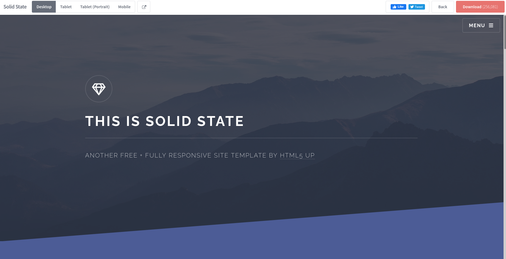
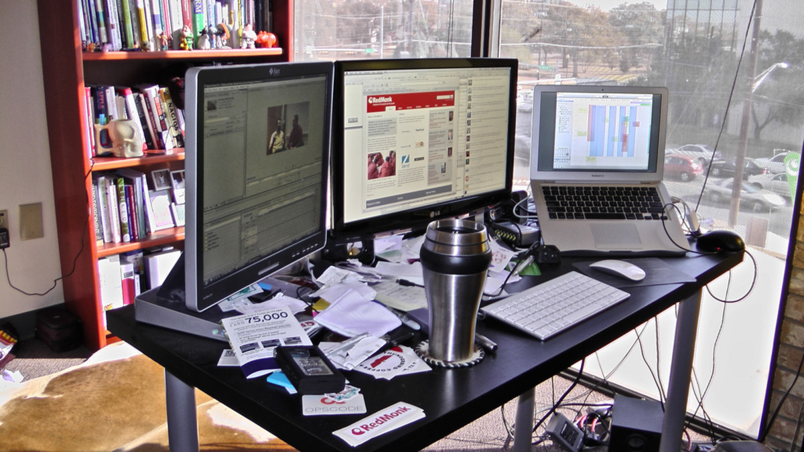

# How Did I Trick Myself in the first place?

Testing to see if this auto build works

All I wanted to do was make a cool looking personal website that I can post my rants and ramblings up to.

It started off with a static website, then I wanted password locking on my HackTheBox articles, which eventuated to developing a Content Management System (CMS) that self organises these articles, renders markdown to a sexy template for Flask that has a fancy network animation in the background. All hosted by Azure. Yeah I went down a bit of a slippery slope when adding features for this project.

If you are interested you can read below about my descent into web development and madness.

---
## Why Did I Put Myself Through This Misery?

You are probably reading this and thinking something along the lines of

"Why on earth is this monga not just using a pre-existing CMS or an easier framework like Django?'

The short and simple answer is that I hate myself and want to suffer... *just kidding.*

The actual answer is that I wanted to learn more about web development and services on Azure. I felt like just using a pre-made CMS takes an aspect of the fun away from creating your own website. I only had a few goals that I wanted to achieve:

* Have a *dank* website to post my ramblings to.
* Make it super easy to write articles.
* Automatically sort articles into blog or write up posts and into categories.
* Password protect my HackTheBox write ups of machines until they are retired.
* Super easy deployment of any changes or new articles.

Seems pretty simple huh?

**NOPE!**

Turns out a tonne of tiny things can go wrong when developing a CMS yourself, causing me to spend several hours of debugging minuscule bugs since I suffer from crippling perfectionism. In the end I was able to make something that I am pretty happy with and looks pretty cool.

---
## How To Make A Pretty Static Website (The Laziest Way Possible)

Here are the *'simple'* steps that I did to style my fashionable website to how I wanted it to look.

#### Step 1: <s>Steal</s> Use A Template From HTML5 UP

Although I am making a website, I wanted to minimise the amount of work writing HTML documents, CSS style sheets and JavaScript files. Mainly because all three of these languages combined is one of the core reasons why most Web Developers suffer from chronic self loathing.

Instead, I decided to stand on top of the misfortunes of other web developers and use a template from the website [HTML5 UP](https://html5up.net/). HTML5 UP has a range of seductive HTML5 templates that are licensed under creative commons, meaning that you can use them for free! For this website I chose the [Solid State](https://html5up.net/solid-state) template that was created by [ajlkn](https://twitter.com/ajlkn).



#### Step 2: Customise the Templates to Your Liking Using CSS

To hide the fact that I just took a template from HTML5 UP, I modified the CSS style sheets to change the visual look of the HTML pages. This was not difficult to do since it mainly required changing a few style properties.

**WARNING!**

You can easily get carried away at this point by continually fiddling with the settings in your style sheets. *Learn from my mistakes and give up as soon as you are close enough to the look you want*.

#### (Optional) Step 3: Get a Dope Particle Background On Your Page

Now I really *REALLY* wanted a super cool hacker network particle animation in the background of this website. Only problem is JavaScript is *ewwww*.

Fortunately for me there is another solution, and that is to use the Open Source JavaScript library [Particles.Js](https://github.com/VincentGarreau/particles.js/) by Vincent Garreau. It is extremely simple to add onto any website you are making!

First you will need to chuck either the `particles.js` or `particles.min.js` file into the folder where you are housing script files and then just add following code at the bottom of your HTML files.

```html
<div id="particles-js"></div>

<script src="particles.js"></script>
<script>
  particlesJS.load('particles-js', '/assets/particles.json', function() {
    console.log('callback - particles.js config loaded');
  });
</script>
```

The `particles.json` file is the configuration file that specifies how you want the particles to function. Normally this would take hours of tweaking different parameters, but our lord and saviour, Vincent Garreau, [has created a page for automatically creating the config file based on your preferences](https://vincentgarreau.com/particles.js/).

Vincent if you ever read this, I have a secret crush on you because you created such a wonderful JavaScript library.


To have the particles in the background like on this site, you need to do some tweaking with your style sheets again (sorry to bring back past trauma). You need to remove the pre-existing background from your style sheet and add the following code below.

```css
#particles-js {
    background-color: #0f0f15;
    position: fixed;
    top: 0;
    width: 100vw;
    height: 100vh;
    left: 0;
    z-index: -1;
}
```

This will keep the particle animation location fixed to the background, but if you don't want that then you can fiddle around with the `position` attribute.

---
## Flask Gang For Life

Now we got all of that pesky front end work out of the way, let's get to the juicy part of this project. The web framework I chose was Flask because it is in Python and not PHP. If you want to tell me to use a different web framework, please contact me at idontcare@fakeemail.com.

You can use Flask to render HTML templates, using the Jinja templating language. To simply explain what Jinja is, it is a much better version of HTML that can be used to create dynamic web pages. You can also parse variables that can be processed using the template. For an example, the Jinja templates below express the base template of this website and my index page template for showing my latest articles.

*base.html*
```HTML
<html>
	<head>
		<title>GhostCcamm's Cyber Misadventures</title>
		<meta charset="utf-8" />
		<meta name="viewport" content="width=device-width, initial-scale=1, user-scalable=no" />
		<link rel="stylesheet" href="/assets/css/main.css" />
		<noscript><link rel="stylesheet" href="/assets/css/noscript.css" /></noscript>
	</head>
	<body class="is-preload">

		<!-- Page Wrapper -->
			<div id="page-wrapper">

			<!-- Header -->
				<header id="header" class="alt">
					<h1><a href="index.html">GhostCcamm's Cyber Misadventures</a></h1>
					<nav>
						<a href="#menu">Menu</a>
					</nav>
				</header>

			<!-- Menu -->
				<nav id="menu">
					<div class="inner">
						<h2>Menu</h2>
						<ul class="links">
							<li><a href="/">Home</a></li>
							<li><a href="/blog">Blog</a></li>
							<li><a href="/writeups">Write Ups</a></li>
						</ul>
						<a href="#" class="close">Close</a>
					</div>
				</nav>

			<!-- Banner -->
		    <section id="banner">
		      <div class="inner">
		        <div class="logo"><div class="image"></div></div>
		        <h2></h2>
						<p class="date"></p>
		        <p></p>
		      </div>
		    </section>

      
    	</div>

    <!-- Footer -->
      

	<!-- Particles -->
		<div id="particles-js"></div>

	<!-- Scripts -->
		<script src="/assets/js/jquery.min.js"></script>
		<script src="/assets/js/jquery.scrollex.min.js"></script>
		<script src="/assets/js/browser.min.js"></script>
		<script src="/assets/js/breakpoints.min.js"></script>
		<script src="/assets/js/util.js"></script>
		<script src="/assets/js/particles.min.js"></script>
		<script src="/assets/js/main.js"></script>
      
	</body>
</html>
```

*index.html*
```HTML


GhostCcamm's Cyber Misadventures
My Blog About Cyber Security and Computer Science Shenanigans



  <!-- Wrapper -->
    <section id="wrapper">
      <!-- One -->
        <section id="one" class="wrapper spotlight style1">
          <div class="inner">
            <div class="main_image"></div>
            <div class="content">
              <h2 class="major">About Me</h2>
              <p>I am a broke ass Masters of Software Engineering student that has nothing better to do than to complain about guessy CTF challenges and rant about nerdy stuff that only a small demographic actually cares about.</p>
              <p>If you came here for a good time I cannot make any guarantees, but I will give it shot with my ramblings!</p>
            </div>
          </div>
        </section>

      <!-- Two -->
        <section id="two" class="wrapper spotlight alt style2">
          <div class="inner">
            
              <a class="main_image" href={{ latest_writeup["url_loc"] }}></a>
            
            <div class="content">
              <a href={{ latest_writeup["url_loc"] }}><h2 class="major">Latest Writup: {{ latest_writeup["page_name"] }}</h2></a>
              <p>{{ latest_writeup["desc"] }}</p>
              <a href="/writeups" class="special">Browse Other Writeups</a>
            </div>
          </div>
        </section>

      <!-- Three -->
        <section id="three" class="wrapper spotlight style3">
          <div class="inner">
            
              <a class="main_image" href={{ latest_blog["url_loc"] }}></a>
            
            <div class="content">
              <a href={{ latest_blog["url_loc"] }}><h2 class="major">Latest Blog: {{ latest_blog["page_name"] }}</h2></a>
              <p>{{ latest_blog["desc"] }}</p>
              <a href="/blog" class="special">Browse Other Articles</a>
            </div>
          </div>
        </section>
      </section>

```

Pretty neat template right? I can now easily render my index page using the following code.

```python
from flask import Flask, render_template
from blog import blog_blueprint, blog_controller
from writeups import writeups_blueprint, writeups_controller

app = Flask(__name__, static_url_path='')
app.register_blueprint(blog_blueprint)
app.register_blueprint(writeups_blueprint)

@app.route('/')
def index():
    return render_template(
        "index.html",
        latest_writeup=writeups_controller.most_recent_article,
        latest_blog=blog_controller.most_recent_article
    )
```

You might of noticed that I import `blog_controller` and `writeups_controller` in the above code snippet that I use to grab the latest articles I publish. They are actually instances of a controller class that I developed to dynamically control and organise my articles on this website that I will discuss in the next section.

---

## Writing Software To Organise My Website Since I Cannot Be Stuffed To Do It Myself

Now I am going to make a confession, I am definitely not the best when it comes to organisation. For an example, my computer desk looks something like the picture below, but with more coffee mugs.



Unlike in the physical realm, I can write software that will manage all the logistics for future me. For this website I wrote three controller modules:

* `fileparser.py`: The lowest level of control for reading and writing files.
* `markdownparser.py`: Parses my articles that I write in markdown into a sexy Jinja template.
* `pagecontrol.py`: Responsible for access control to pages and sorting articles into categories and release date.

The most interesting aspect from a design point of view is how I parse markdown documents to juicy Jinja templates.

#### Markdown To Beautiful Web Pages

I used the [markdown](https://python-markdown.github.io/) Python library to parse my articles that I write using markdown notation to HTML. However, this parsing capability by itself can only generate very basic HTML. That is when [BeautifulSoup](https://www.crummy.com/software/BeautifulSoup/bs4/doc/) comes in to make it extremely easy to modify attributes.

To demonstrate how easy it is to use both markdown and BeautifulSoup to automatically style pretty HTML documents from markdown, let us say that we want to parse the following markdown document.

*somestoof.md*
```md
# Hi There

How are ya going.
```

This will be parse to the following HTML.

*somestoof.html*
```HTML
<h1>Hi There</h1>
<p>How are ya going.</p>
```

This can be done with the following Python code.

``` python
import markdown

with open("somestoof.md", "r") as f:
    md_raw = f.read()

with open("somestoof.html", "w") as f:
    f.write(markdown.markdown(md_raw, extensions=["fenced_code", "codehilite"]))
```
*The `extensions` arguments are just for properly parsing code snippets into HTML which is not shown in this example.*

Now let's say we have made a cool styling class called 'sick_header' for `<h1>` tags, we can parse the text of the HTML document to BeautifulSoup to find all of the appropriate tags and add the attributes.

``` python
from bs4 import BeautifulSoup
import markdown

def modify_tag_attributes(tag_name, attrs, soup):
  """
  Automatically modifies the attributes for a given type of HTML tag.

  Parameters:
    tag_name: str
      the name of the type of HTML tag to modify

    attrs: dict
      a dictionary mapping the new attribute key value pairs.

    soup: bs4.BeautifulSoup
      the soup that we are cooking ;)
  """

  # Loops through all of the tags with the same tag name given, eg. 'h1'
  for tag in soup.find_all(tag_name):
      for attr_name, attr_value in attrs.items():
          tag[attr_name] = attr_value

with open("somestoof.md", "r") as f:
  md_raw = f.read()

html_raw = markdown.markdown(md_raw, extensions=["fenced_code", "codehilite"])
soup = BeautifulSoup(html_raw, "html.parser")

modify_tag_attributes("h1", {"class" : "sick_header"}, soup)

with open("somestoof.html", "w") as f:
    f.write(soup.prettify())
```

Now my `markdownparser` module is a bit more complex since it parses the markdown to a Jinja template and sorts the parsed HTML to the blocks used in my base template. However, this part of the markdown parsing has been left as an exercise for the reader.

#### Putting It All Together

Putting together my controllers, parsing files and Flask code I now have a super easy method for writing new articles and let my code do everything else for me. Within my repository I have a folder called `markdown_entries`, where I can write all of my articles in markdown and on each startup of the website it will check if I have made any updates and if so parses the article to a Jinja template. The folder structure for creating this blog post is shown below.

```
markdown_entries/
└── blog
    └── creating_site
        ├── content.md
        ├── images
        │   ├── facepunch.jpg
        │   ├── ilovevincent.png
        │   ├── messydesk.jpeg
        │   └── solid_state.png
        └── prop.yaml
```

`prop.yaml` is just a YAML configuration file that I use to specify article passwords, page names, description, categories, etc.

---

## How To Hack This Type Of Website Using Server Side Template Injection

If you are thinking right now that parsing markdown to Jinja templates is a really cool idea and you need to do it with your own web projects, **BE VERY CAREFUL WITH USER INPUTS**.

It is well documented that Jinja template rendering can be exploited to execute arbitrary Python code, which is called Server Side Template Injection (SSTI). There are a tonne of great articles out there about SSTI attacks, I will give a list of some of them below.

* [https://medium.com/@nyomanpradipta120/ssti-in-flask-jinja2-20b068fdaeee](https://medium.com/@nyomanpradipta120/ssti-in-flask-jinja2-20b068fdaeee)
* [https://blog.nvisium.com/p263](https://blog.nvisium.com/p263)

My CMS is *'vulnerable'* to SSTI, but requires a hacker to have write access to the source code of this website to exploit. At which point I would already be screwed so it is not a security issue for this site.

**HOWEVER**

If you, the reader, create your own method of markdown parsing and do it for inputs that users submit then **make sure you properly sanitise it!** You can do a quick check by submitting `{{ 7*7 }}` and if it evaluates to 49, then you are vulnerable to SSTI. This is not a complete check for SSTI though, since there could exist a method to bypass your input sanitation.

---

## Chucking The Flask Application Onto The Internet Using Azure DevOps and Web App Service

One of my favourite units that I have completed in my Master degree was Cloud Computing, because it taught me a variety of methods that can make me lazier working on my software development projects. One of the Cloud Service Providers I wanted to have more experience with is Azure and using their DevOps and Web App Services. Yes there are so many different services out there for this sort of thing, I am just using Azure because I wanted to learn more about it.

Azure App Service is application deployment minus all of the shenanigans when you try to deploy straight to infrastructure. It has got my thumbs up because I did not have to waste hours fiddling with configurations like I normally have to do. The concept of Continuous Integration and Deployment (CI/CD) using Azure Pipelines on DevOps just makes me moist thinking that I can just push commits to my repository and it will be automatically deployed.

I will give a broad overview of how I configured Azure DevOps for CI/CD and App Service for hosting my website. However, if you are really interested you should go and read [Azure's documentation](https://docs.microsoft.com/en-us/azure/app-service/quickstart-python?tabs=bash&pivots=python-framework-flask) on how to do this.

#### Step 1: Get an Azure account.

*You might need this to do the other steps...*

#### Step 2: Create a Resource Group

You use the resource group for organising all of the resources that you use for the same project.

1. On the Azure Portal search for 'resource groups'.
2. Add a new resource group in the location you want.

#### Step 3: Create a Web App Service

App Service is Azure's PaaS solution that will host our web application. In this step we will only setup the App Service and use Azure DevOps for deployment of software.

1. On the Azure Portal search for 'App Services' and add a new one.
2. Select your subscription, resource group, name, runtime stack (this website uses Python 3.8) and the region.
3. **CHANGE YOUR APP SERVICE PLAN!** Azure does this sneaky thing where it automatically sets the size to P1v2, which costs **$0.169 per hour**! If you are just creating a personal site like me, this size is overkill and the B1 size should be more than sufficient.
4. Review and Create your App Service.

#### Step 4: Creating a Repository and an Azure Pipeline on Azure for CI/CD on DevOps

Finally you will need to create a repository on DevOps and configure an Azure Pipeline to automatically deploy changes to your app service. The great thing about Azure Devops is that most of this process is fairly self-explanatory, but I will give the steps that I did

1. Create an Azure DevOps organisation, project and repository for housing your software.
2. Configure your local repository to push to Azure (there should be instructions on the repository page when you create it).
3. Go to Pipelines tab and create a new Pipeline of deployment. Select that your code is on Azure Repos Git and choose the repository of your project.
4. On Configure your pipeline, select 'Python to Linux Web App on Azure' (this might be different for you depending on your project). You will then need to select the App Service you created in the previous step.
5. Review the generated pipeline YAML configuration to ensure you have all of the settings that you want. Check that everything is correct inside. Especially if the repository branch you want to deploy from is listed as a `trigger` or else automatic deployment will not work.
6. Deploy and profit???? *(I haven't thought about monetisation yet so that will be a problem for later on)*

---

## Conclusion

So that was the extremely broad overview about how I made this website. For the sake of retaining what little sanity I have left, I omitted most of the finicky and frustrating details that comes packaged with web development.

Despite my overt sarcasm, I did really enjoy creating this site and learnt a lot about Flask, web development and Azure in the process. I have been wanting to complete this project for sometime now, but I unfortunately have not had the time until now.

If you somehow enjoyed reading this ramble, please stay tuned for more articles about my escapades in Cyber Security and Computer Science!
