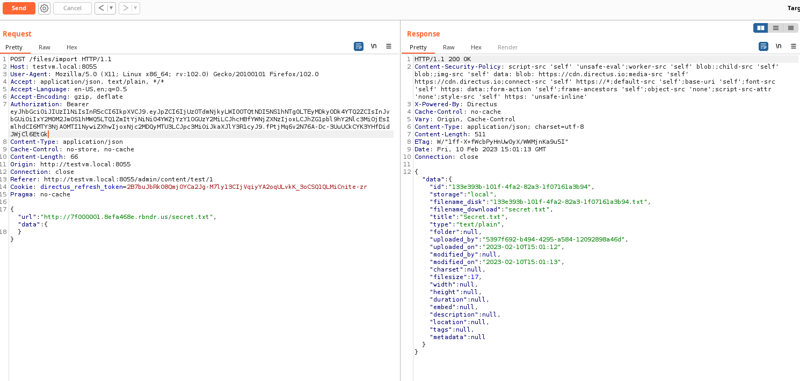
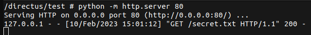

# Overview

[Directus](https://github.com/directus/directus) is a popular NodeJS API CMS, that had a fun Server-Side Request Forgery (SSRF) vulnerability. Directus had a *patched* SSRF vulnerability ([CVE-2022-23080](https://security.snyk.io/vuln/SNYK-JS-DIRECTUS-2934713)), but I realised that you could bypass the validations for CVE-2022-23080 to perform a **[DNS rebinding attack]**.

This vulnerability has been assigned with the CVE-ID of [**CVE-2023-26492**](https://cve.mitre.org/cgi-bin/cvename.cgi?name=CVE-2023-26492). I will explain how the vulnerability can be exploited and how developers at Directus patched it in more detail than in the [GitHub advisory](https://github.com/directus/directus/security/advisories/GHSA-j3rg-3rgm-537h).

A huge thank you to [Rijk van Zanten](https://github.com/rijkvanzanten) for coordinating the vulnerability patching and disclosure at Directus.

Now enjoy this short vulnerability disclosure.

[TOC]

---

# Disclosure Timeline

| Time | Event |
| ---- | ----- |
| 2023/02/10 03:03 | Reported the vulnerability using GitHub private disclosure (*very cool feature*) to Directus |
| 2023/02/10 04:04 | Rijk from Directus acknowledged my report and started working on a patch. |
| 2023/02/28 17:52 | Directus released [`v9.23.0`](https://github.com/directus/directus/releases/tag/v9.23.0) that patched this vulnerability. |
| 2023/03/03 18:22 | The [GitHub advisory](https://github.com/directus/directus/security/advisories/GHSA-j3rg-3rgm-537h) was published. | 

---

# The SSRF Vulnerability

The key issue for this vulnerability was that the route `/files/import` on Directus downloads and saves the response from a URL that is provided by the user. The original SSRF vulnerability ([CVE-2022-23080](https://security.snyk.io/vuln/SNYK-JS-DIRECTUS-2934713)) was exploiting this feature to download sensitive content from restricted IP addresses (eg. `127.0.0.1`). In response, Directus added a validation check for the `importOne` function in [`/api/src/services/file.ts`](https://github.com/directus/directus/blob/v9.22.4/api/src/services/files.ts) to reject all URLs that resolve to an IP address within a block list (setting `IMPORT_IP_DENY_LIST`). The following JavaScript code was the code snippet from `importOne` in version `v9.22.4`.

```js
let ip = resolvedUrl.hostname;

if (net.isIP(ip) === 0) {
    try {
        ip = (await lookupDNS(ip)).address;
    } catch (err: any) {
        logger.warn(err, `Couldn't lookup the DNS for url ${importURL}`);
        throw new ServiceUnavailableException(`Couldn't fetch file from url "${importURL}"`, {
            service: 'external-file',
        });
    }
}

if (env.IMPORT_IP_DENY_LIST.includes('0.0.0.0')) {
    const networkInterfaces = os.networkInterfaces();

    for (const networkInfo of Object.values(networkInterfaces)) {
        if (!networkInfo) continue;

        for (const info of networkInfo) {
            if (info.address === ip) {
                logger.warn(`Requested URL ${importURL} resolves to localhost.`);
                throw new ServiceUnavailableException(`Couldn't fetch file from url "${importURL}"`, {
                    service: 'external-file',
                });
            }
        }
    }
}

if (env.IMPORT_IP_DENY_LIST.includes(ip)) {
    logger.warn(`Requested URL ${importURL} resolves to a denied IP address.`);
    throw new ServiceUnavailableException(`Couldn't fetch file from url "${importURL}"`, {
        service: 'external-file',
    });
}
```

Simplifying what the above code does:

1. If the hostname is a domain it **resolves the IP address for the domain** (foreshadowing).
2. Checks if the resolved IP address is within a block list to prevent accessing restricted IPs (eg. `127.0.0.1`).
3. If the resolved IP address is allowed, then it will send a request using `axios` and saves the response.

The issue with this process is that domain names are **resolved twice**. The first time for validating the destination IP address and when **`axios` sends a request**. Therefore, we can bypass the SSRF validation by resolving a domain to an allowed address then resolving to a blocked IP address!

*But how on earth can you do that?*

## DNS Rebinding This Vulnerability

DNS rebinding is an attack method that manipulates the resolution of domains. Broadly explaining how it works, the attacker can configure a DNS server with a short time to live (TTL) record that prevents resolved domains being cached and switching the IP addresses.

For this vulnerability, an attacker can bypass the SSRF validation by resolving to an allowed IP address for the first DNS query then to a blocked one when `axios` sends a request to access sensitive content.

## The Exploit

I was way too lazy to configure my own DNS server. So I just used [`rebinder`](https://lock.cmpxchg8b.com/rebinder.html) that generates a domain that randomly resolves to two different IP addresses. For an example, `7f000001.8efa468e.rbndr.us` will resolve to either `142.250.70.142` or **`127.0.0.1`** randomly.

To demonstrate the vulnerability, I ran a static web server listening on `127.0.0.1` on my Directus server that had a *secret file* at `http://127.0.0.1/secret.txt`. Then spammed the following request with the domain `7f000001.8efa468e.rbndr.us` until I was lucky enough to have the domain resolve to `142.250.70.142` first then `127.0.0.1` to access `http://127.0.0.1/secret.txt`.



To confirm the SSRF bypass was successful, the following screenshot shows that request to `http://127.0.0.1/secret.txt` was sent by Directus (IP address `127.0.0.1`).



You can then download the response as a file from Directus to steal the sensitive data.

*Noice*

## A Note About Using Redirection to Bypass the SSRF Validation

Now some of you might of noticed that DNS rebinding was a *little bit overkill* for bypassing the SSRF validation check. Another method to bypass the SSRF vulnerability would be simply redirecting the `axios` request to the blocked IP address.

*Yes redirection would have bypassed the SSRF validation.*

However, I decided to demonstrate a DNS rebinding attack over redirection to reduce the risk that the patch would still have a bypass. If the developers just patched the redirection SSRF bypass, then there is a possibility that DNS rebinding could still work to bypass the SSRF validation. However, if the DNS rebinding method was prevented it would also prevent redirection attacks since a fix for DNS rebinding would also patch redirection attacks.

*Speaking of which...*

---

# How Directus Patched this Vulnerability

In my initial report, I recommended that Directus needs to also validate the resolved IP address after `axios` sends the request and explained the reasoning to fix the issue. 

When `axios` completes the request, the returned value has a `request` attribute that is an instance of `ClientRequest`. Reading the [NodeJS documentation for the `ClientRequest` class](https://nodejs.org/api/http.html#class-httpclientrequest), the `ClientRequest` has the `socket` attribute that is an instance of `net.Socket`. From the `socket` attribute, you can retrieve the final destination IP address from the `socket` attribute `remoteAddress`.

*Okay I went a bit technical there...*

The very simple explanation, when `axios` is done check that `fileResponse.request.socket.remoteAddress` is not a blocked IP address. This approach prevents both the DNS rebinding and redirection bypass methods for SSRF.

Rijk from Directus really liked this simple method for fixing the vulnerability, but noted that additional work would be needed fully fix the issue across the CMS. This is because the Webhooks and Request Operation for Workflows within Directus were also vulnerable to SSRF. However, they are not as severe as the `/files/import` route since you require administrator privileges to exploit.

After a few days, Rijk got back to me with a patch with a really neat fix ([commit ff53d3](https://github.com/directus/directus/commit/ff53d3e69a602d05342e15d9bb616884833ddbff)). A `responseInterceptor` was added to intercept `axios` results to verify that the final IP destination is not in the IP block list (code below).

```js
import type { AxiosResponse } from 'axios';
import { validateIP } from './validate-ip';

export const responseInterceptor = async (config: AxiosResponse<any, any>) => {
	await validateIP(config.request.socket.remoteAddress, config.request.url);
	return config;
};
```

The `validateIP` function just verifies that the final destination is not in the `IMPORT_IP_DENY_LIST` IP block list.

However, I did have two concerns with this patch.

Firstly if a user did not follow the recommended Dockerised deployment of Directus, then there was a possibility to bypass `localhost` checks by using alias IP addresses from the `/etc/hosts` configuration file. For an example, most debian hosts have the alias IP address `127.0.1.1` within the `/etc/hosts` configuration file that can access HTTP servers listening on `127.0.0.1`. However, Directus and I decided that since host deployment is not recommended the responsibility is on the user to ensure that the setting `IMPORT_IP_DENY_LIST` is properly configured for their environment.

Secondly, the patch that Rijk originally introduced only added a response interceptor to prevent saving responses from blocked destinations and did not prevent Directus from sending requests. This is known as blind SSRF and in my opinion not really a vulnerability (if anything a low severity vulnerability). The impact of SSRF vulnerabilities is from the ability to view the responses from internal systems. Blind SSRF is a nothing burger in most cases, since to cause any significant impact the blind SSRF needs to trigger a different vulnerability in an internal system (which is very unlikely).

However, I did recommend to Rijk that a request interceptor should be added to validate hostnames before requests are sent mitigate the exploitation of blind SSRF. It still means that DNS rebinding and redirection methods can be still exploit the blind SSRF vulnerability. However, the only way to way to completely eliminate the blind SSRF vulnerability would be to delete the request features in Directus, which is a bit silly since the risk level for blind SSRF is low. Rijk agreed with my recommendation and added the request interceptor in commit [6dce1a2](https://github.com/directus/directus/commit/6dce1a2f8a3c3c2fdb44e65704d5d985fa7d2e51).

---

# Conclusion

This was a nice little vulnerability and hope you enjoyed reading this article. I want to give a huge shot out to Rijk at Directus for patching this vulnerability quickly! I hope you learnt something new about SSRF vulnerabilities and have a deeper understanding about exploiting/preventing SSRF vulnerabilities.

*Thanks for reading this short vulnerability disclosure! If you are interested about my vulnerability disclosures or CTF write ups, [please watch my GitHub repository for new articles](https://github.com/Ccamm/ccamm.github.io). I will be back soon with a spicy disclosure for several vulnerabilities soon!*