# Overview

[Knex.js](https://github.com/knex/knex) has a **SQL injection** that can be exploited to modify a `WHERE` statement. The only prequisite is that the backend database management system is MySQL.

This vulnerability was brought to my attention by [Alok Menghrajani's](https://www.quaxio.com/) CTF challenge called [`xark`](https://squarectf.com/2022/xark.html).

NodeJS dynamically determines the type of user's input, so an attacker can modify the type of an input to alter the WHERE statement. The following payload performs SQLi by changing the input to an array and returning a row by index value.

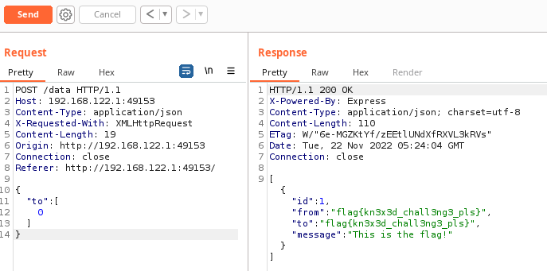

Otherwise, an attacker could also send an object and alter the WHERE statement to query using the value in a different column that was defined in the code.

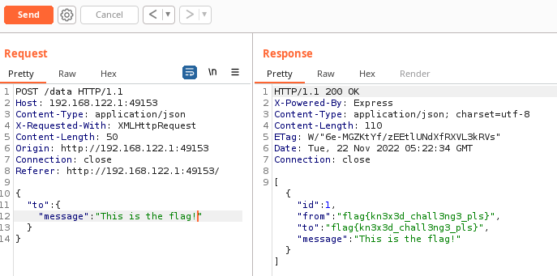

The vulnerability was [first reported over 6 years ago by the GitHub user TheThing](https://github.com/knex/knex/issues/1227), but is still exploitable for the latest version for Knex.js (2.3.0 at the time of writing this article).

After investigating the vulnerability, I found that using `where` from Knex.js is vulnerable to SQLi, even if parameter binding is used using the `raw` function.

---

## Introduction

*Before I begin, I do apologise for any grammar mistakes. I had COVID at the time of writing this article.*

Last weekend, I participated in the 2022 Square CTF event to satiate my crippling addiction hacking websites. It was a pretty fun CTF event and I enjoyed completing the web challenges.

[Alok Menghrajani's](https://www.quaxio.com/) challenge named [xark](https://squarectf.com/2022/xark.html) piqued my interest since it was a classic NodeJS sql injection vulnerability, *but the code did not look it was using `knex` insecurely (code snippet below)*.

```js
app.post('/data', async (req, res) => {
    if (req.body.to) {
        const crushes = await knex('crushes')
            .select()
            .where({
                to: req.body.to
            })
            .limit(50);
        res.send(crushes);
    } else {
        res.status(400).send({});
    }
});
```

Knex.js version 2.3.0 was used in the challenge that was the latest version for the module, and the last [SQL injection vulnerability for `knex` was reported for versions `<0.19.5`](https://security.snyk.io/package/npm/knex).

At first, I thought Alok snuck in a sneaky 0day into their CTF challenge. However, it turns out the vulnerability has been disclosed for **over 6 years**...

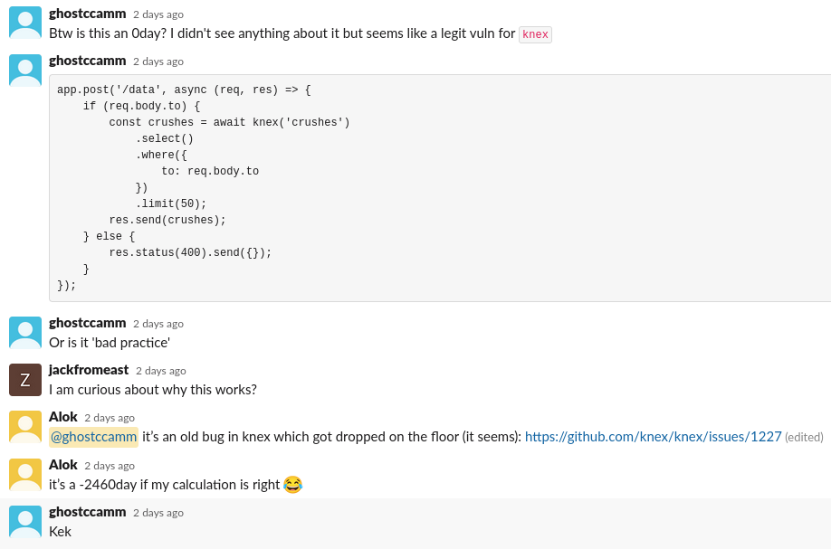

*[The vulnerability was first disclosed in February 2016](https://github.com/knex/knex/issues/1227)*
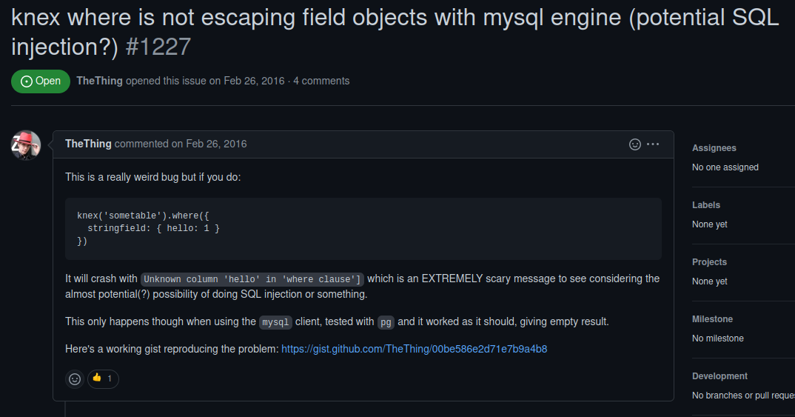

I was honestly shocked that the vulnerability was never been patched, especially considering that this would be classified as a critical vulnerability.

I felt compelled to write this article to raise awareness about the SQLi vulnerability in Knex.js. Developers using Knex.js need to know about this vulnerability ASAP to ensure their applications are not vulnerable and the developers for Knex.js need to apply a fix immediately. 

The vulnerability has already been publicly disclosed, so attention needs to be drawn to it to have it fixed. That's why I am skipping responsibly disclosing the vulnerability and going straight to public disclosure.

---

# Writeup for [xark](https://squarectf.com/2022/xark.html)

To explain the SQLi vulnerability in Knex.js, I will begin by doing a writeup for Alok's `xark` CTF challenge.

Starting the challenge, we are presented with a website for recording and viewing *anonymous crushes*.

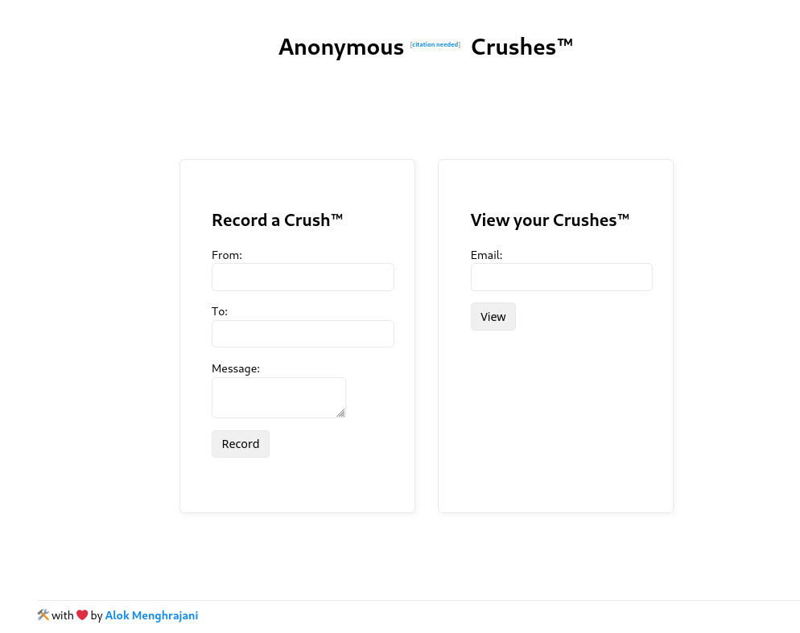

We were also provided with the following code snippet and can see the flag is inserted into the `crushes` table.

```js
const express = require('express');
require('express-async-errors');
config = require('config');

if (process.env.DATABASE_HOST !== null) {
    console.log(`Found custom database host: ${process.env.DATABASE_HOST}`);
    config.knex.connection.host = process.env.DATABASE_HOST;
}

const app = express();
const port = 3001;
const knex = require('knex')(config.get('knex'));

knex.schema.hasTable('crushes').then(function(exists) {
    if (!exists) {
        console.log("crushes table doesn't exist, initializing...");
        knex.schema.createTable('crushes', function(table) {
            table.increments('id').primary();
            table.string('from').notNullable();
            table.string('to').notNullable();
            table.string('message').notNullable();
            table.index(['to']);
        }).then();
        knex('crushes').insert({
            from: config.init.flag,
            to: config.init.flag,
            message: 'This is the flag!',
        }).then();
    }
});

app.use(express.static('html'));
app.use(express.json());
app.use(express.urlencoded({
    extended: false
}));

app.get('/debug', async (req, res) => {
    // poor man's clone
    const c = JSON.parse(JSON.stringify(config.get('knex')));
    if (c.connection.password) {
        c.connection.password = "*******";
    }
    res.status(200).send(c);
})


app.post('/record', async (req, res) => {
    if (req.body.from && req.body.to && req.body.message) {
        await knex('crushes').insert({
            from: req.body.from,
            to: req.body.to,
            message: req.body.message,
        });
        res.status(200).send({});
    } else {
        res.status(400).send({});
    }
});

app.post('/data', async (req, res) => {
    if (req.body.to) {
        const crushes = await knex('crushes')
            .select()
            .where({
                to: req.body.to
            })
            .limit(50);
        res.send(crushes);
    } else {
        res.status(400).send({});
    }
});

app.use((err, req, res, next) => {
    console.error(err);
    res.status(400).send({
        error: err.message
    });
});

app.listen(port, () => {
    console.log(`Listening on port ${port} in ${process.env.NODE_ENV}`);
});
```

So immediately I knew the goal was to exploit an SQL injection vulnerability to trick the web application to return the flag. First I researched vulnerabilities for Knex.js, but found that the last SQLi vulnerability was for an older version than 2.3.0. So at first I thought the entrypoint was not exploiting Knex.js.

However, the CTF challenge had such limited functionality the only way to retrieve the flag is exploiting an undisclosed SQLi vulnerability in Knex.js. I saw that the `express` web application also accepted the `application/json` content type, so I simply tried modifying the `to` POST parameter to an object.

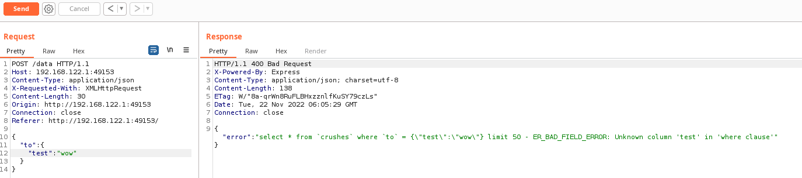


That error message was a **huge indicator that I could modify the WHERE statement of the SQL query built by Knex.js**. I knew from reading the source code that the flag was stored with a `message` of `'This is the flag!'`, so I simply modified my payload to inject querying using `message` column.


*Holy mackerel that is juicy vulnerability!*

After the CTF event was done, another competitor pointed out that you can also return a specific rows by index.

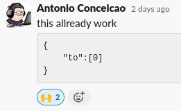

---

# How does the vulnerability work?

As noted in the [original Github issue](https://github.com/knex/knex/issues/1227), the vulnerability is only exploitable for MySQL Knex.js client and is not exploitable for other database management systems such as PostgreSQL. 

So let's see what the actual queries look like that are being sent to the MySQL database. I will continue using the `xark` challenge for explaining how the vulnerability works.

You can do this by using the `docker exec` on the database container for `xark` to start a `bash` shell as the root user and run the following script.

```bash
#!/bin/bash

mkdir -p /var/log/mysql;
if [ ! -f /var/log/mysql/all.log ]; then
    touch /var/log/mysql/all.log
fi

chmod 777 /var/log/mysql/all.log
mysql -u root -ppass -e "SET global log_output = 'FILE'; SET global general_log_file='/var/log/mysql/all.log'; SET global general_log = 1;"
```

Now all SQL queries will be logged at `/var/log/mysql/all.log`.

## SQLi Using a Different Column Works

Let's rerun the `{"to":{"message":"This is the flag!"}}` exploit, that logs the following MySQL query that Knex.js builds.

```sql
select * from `crushes` where `to` = `message` = 'This is the flag!' limit 50
```

Keys in the user input are wrapped with the `` ` `` character, which is a special character for defining quoted identifiers in MySQL queries. A quoted identifier is a way for wrapping a table, column or database name with quotes. Now the interesting thing with MySQL, is if you remove the quoted identifiers the query fails.

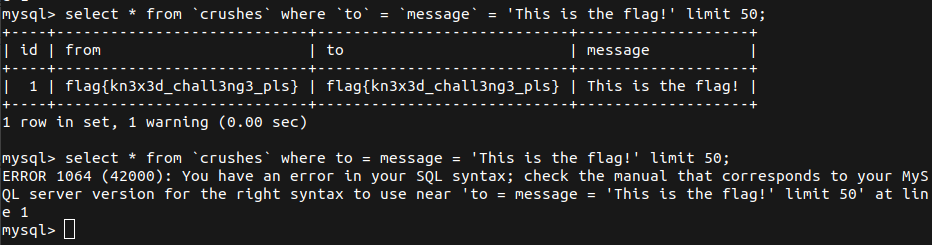

*Why does this MySQL query work with the quoted identifiers?*

To be honest, I don't have a good answer. I speculate it is because the quoted identifiers tells the MySQL server that `` `to` `` and `` `message` `` are column names not causing a syntax error. Also experimenting with how MySQL will handle the SQL query, it appears that the MySQL server will ignore `` `to`  =`` part of the WHERE statement resulting in the following equivalent SQL query:

```sql
select * from `crushes` where `message` = 'This is the flag!' limit 50
```

## SQLi Using Index Value

Now let's investigate how the payload `{"to":[0]}` works by analysing the resulting query that Knex.js builds.

```sql
select * from `crushes` where `to` = 0 limit 50
```

We can see in the source code for `xark` that the the table index is set to the `to` column.

```js
...
knex.schema.createTable('crushes', function(table) {
    table.increments('id').primary();
    table.string('from').notNullable();
    table.string('to').notNullable();
    table.string('message').notNullable();
    table.index(['to']);
}).then();
...
```

Since the `to` column is also the table index, we can query the `to` column using [**index values**](https://dev.mysql.com/doc/refman/8.0/en/mysql-indexes.html) as well as the string value.

It appears that Knex.js does *some filtering* on the user input. So payloads such as `{"to":[0]}` are rejected and trying to query for multiple index values causes a SQL syntax error.

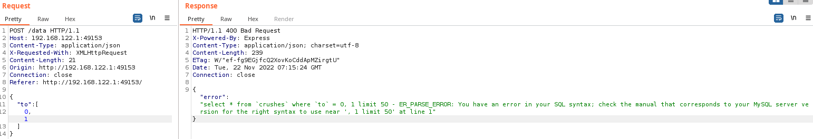

---

# But Wait, It Gets Worst

[Alok's `xark` challenge](https://squarectf.com/2022/xark.html) and the [original Github](https://github.com/knex/knex/issues/1227) issue all use the [object syntax for calling `where`](https://knexjs.org/guide/query-builder.html#where). There other methods for calling `where` that haven't been tested yet.

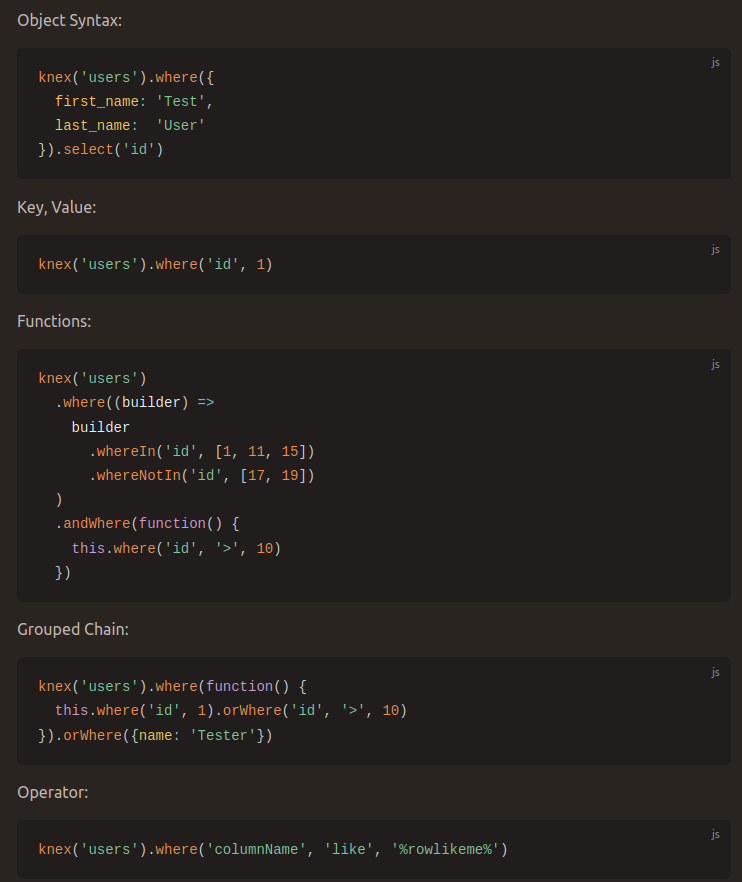

So I decided to modify source code of `xark` to test if the SQLi vulnerability is only exploitable if the input is an object or if the `where` method is vulnerable to SQLi no matter how `where` is used.

*Testing key value input*
```js
app.post('/data', async (req, res) => {
    if (req.body.to) {
        const crushes = await knex('crushes')
            .select()
            .where("to", req.body.to)
            .limit(50);
        res.send(crushes);
    } else {
        res.status(400).send({});
    }
});
```

*Testing using key value and operator*
```js
app.post('/data', async (req, res) => {
    if (req.body.to) {
        const crushes = await knex('crushes')
            .select()
            .where("to", "=", req.body.to)
            .limit(50);
        res.send(crushes);
    } else {
        res.status(400).send({});
    }
});
```

However, I was still able to exploit the SQLi vulnerability.

**Therefore, using `where` from `knex` is vulnerable to SQLi, no matter how you use it!**

It did pique my interest if `knex` does implement parameter binding that *should* prevent the SQLi vulnerabilities, because if so then this vulnerability would be an issue of bad documentation for explaining how to use `knex` securely.

[Turns out you can use parameter binding using `raw`, they even say in the documentation that it prevents SQLi.](https://knexjs.org/guide/raw.html#raw-parameter-binding)

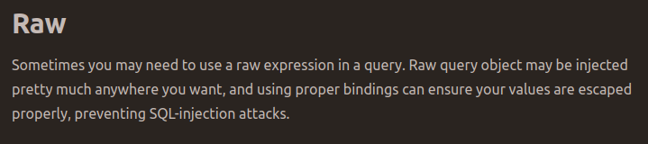

So let's see if I can still exploit the SQLi vulnerability even with prepared statements.

*Testing using prepared statements*
```js
app.post('/data', async (req, res) => {
    if (req.body.to) {
        const crushes = await knex('crushes')
            .select()
            .where(
                knex.raw("?? = ?", ["to", req.body.to])
            )
            .limit(50);
        res.send(crushes);
    } else {
        res.status(400).send({});
    }
});
```

**THIS IS STILL VULNERABLE TO SQLi!**

I even tried the following implementation to see if it would prevent SQLi. **It didn't...**

```js
app.post('/data', async (req, res) => {
    if (req.body.to) {
        const whereStatement = ":column: = :value"
        const crushes = await knex('crushes')
            .select()
            .where(knex.raw(
                whereStatement, {
                            column: "to", 
                            value: req.body.to
                        }
                    )
            )
            .limit(50);
        res.send(crushes);
    } else {
        res.status(400).send({});
    }
});
```

The only implementation that I found that was not exploitable was when the column name was hardcoded into the query string.

*Causes an SQL syntax error since the column name is not wrapped with quoted identifiers.*
```js
app.post('/data', async (req, res) => {
    if (req.body.to) {
        const crushes = await knex('crushes')
            .select()
            .where(
                knex.raw("to = ?", [req.body.to])
            )
            .limit(50);
        res.send(crushes);
    } else {
        res.status(400).send({});
    }
});
```

In conclusion...

**Knex.js is vulnerable to SQLi even if you use the raw parameter binding!**

---

# Recommendations

The key issue that enables exploiting the SQLi vulnerability is that Knex.js does not reject an input if it is an **`Array`** or an **`Object`**. [JavaScript is a dynamically typed language, so users can manipulate the type of inputs](https://cheatsheetseries.owasp.org/cheatsheets/Nodejs_Security_Cheat_Sheet.html#perform-input-validation).

So if you are either a maintainer of Knex.js or using the module in your project, **reject all inputs that will be inserted into a SQL that are an `Array` or `Object` type!**

For an example, you can use the [JavaScript operator `typeof`](https://developer.mozilla.org/en-US/docs/Web/JavaScript/Reference/Operators/typeof) to reject any unexpected input types. The below code snippet is an example for only allowing numbers, strings and booleans (**never allow `object`**).

```js
const allowedTypes = [
    "number",
    "string",
    "boolean"
]

if (!allowedTypes.includes(typeof userInput)) {
    throw "Invalid type detected!"
}
```

For an example, I added the above allow list to `xark`.

```js
...
app.post('/data', async (req, res) => {
    if (req.body.to) {
        const allowedTypes = [
            "number",
            "string",
            "boolean"
        ]
        
        if (!allowedTypes.includes(typeof req.body.to)) {
            return res.status(400).send({
                error: "Bugger off hacker!"
            });
        }

        const crushes = await knex('crushes')
            .select()
            .where({
                to: req.body.to
            })
            .limit(50);
        res.send(crushes);
    } else {
        res.status(400).send({});
    }
});
...
```

Now when I retry the SQLi exploit it gets rejected.

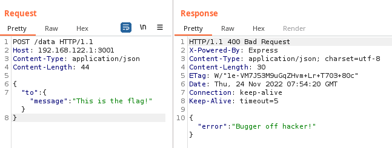

---

# Acknowledgements

A huge thank you to [Alok Menghrajani](https://www.quaxio.com/) for bringing this vulnerability to my attention and [TheThing](https://github.com/TheThing) for originally disclosing the vulnerability.

I wish all of the Knex.js maintainers the best for finding a suitable patch for this vulnerability <3.