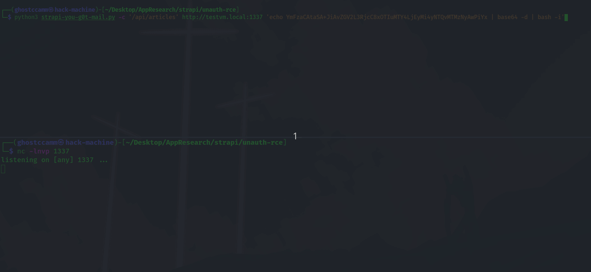

# Overview

**The Strapi story continues!**

After I did [my research into Strapi CMS earlier this year](https://www.ghostccamm.com/blog/multi_strapi_vulns/), it inspired a wizard Javascript developer ([Boegie19](https://github.com/Boegie19)) that was heavily involved in the Strapi development community to dig into issues I reported. They discovered that both Strapi and I missed an edge case that bypassed the filter protection to patch [CVE-2023-22894](https://www.ghostccamm.com/blog/multi_strapi_vulns/#cve-2023-22894-leaking-sensitive-user-information-by-filtering-on-private-fields-in-strapi-versions-471) by abusing *table aliases that were being inserted into queries.*

The purpose of this blog is to bring awareness about [Boegie19](https://github.com/Boegie19)'s cool finding that they found in Strapi, plus do my usual ramblings as I do a deep technical dive into the issue.

*So Strapi in again for another wild ride!*

**Table of Contents**

[TOC]

---

# Vulnerability Disclosure Timeline

*The following timeline was provided to me by Derrick Mehaffy at Strapi and was verified by Boegie19*

| Time                   | Event                                                                                                                                      |
|------------------------|--------------------------------------------------------------------------------------------------------------------------------------------|
| 2023/05/02 5:46pm GMT  | Report of the vulnerability received by the Strapi Security Team                                                                           |
| 2023/05/05 8:15am GMT  | Vulnerability report was accepted by the Strapi Team                                                                                       |
| 2023/05/05 11:27am GMT | The Strapi Engineering Team communicated to the reporter our planned changes to get their feedback                                         |
| 2023/05/07 5:30pm GMT  | The reporter acknowledged and agreed with our planned changes                                                                              |
| 2023/06/07 8:12am GMT  | An experimental release was made with the changes communicated previously for testing                                                      |
| 2023/06/07 3:42pm GMT  | GitHub issued CVE-2023-34235 per our request                                                                                               |
| 2023/06/07 1:08pm GMT  | Patch was released in Strapi version [v4.10.8](https://github.com/strapi/strapi/releases/tag/v4.10.8)                                      |
| 2023/06/07 3:00pm GMT  | Disclosure communication placed on hold due to internal requirements and other vulnerability work being performed                          |
| 2023/07/10 7:25pm GMT  | Initial warning email was sent out to all Strapi Enterprise and Cloud Customers including Strapi partners with active enterprise contracts |
| 2023/07/10 7:25pm GMT  | Mandatory waiting period of 2 weeks initiated                                                                                              |
| 2023/07/25 1:01pm GMT  | Released the full disclosure of the vulnerability and published GitHub Advisories                                                          |
| 2023/07/25 1:01pm GMT  | Disclosure email was sent out to all Strapi Enterprise and Cloud Customers, including Strapi partners with active enterprise contracts     |

---

# CVE-2023-34235: Bypass of CVE-2023-22894 by Abusing SQL Table Aliases

## CVE-2023-22894 Refresher

Before we jump into the juicy details about this vulnerability, we need todo a quick refresher about [CVE-2023-22894](https://www.ghostccamm.com/blog/multi_strapi_vulns/#cve-2023-22894-leaking-sensitive-user-information-by-filtering-on-private-fields-in-strapi-versions-471).

[CVE-2023-22894](https://www.ghostccamm.com/blog/multi_strapi_vulns/#cve-2023-22894-leaking-sensitive-user-information-by-filtering-on-private-fields-in-strapi-versions-471) abused Strapi's Object Relational Mapper (ORM) that was exposed by Strapi's REST API to query on sensitive fields. It enabled an unauthenticated attacker to be able to filter by the **password reset token of administrator users that create content on Strapi and highjack their account**! The attack was done by filtering by either the `createdBy` or `updatedBy` attribute that is a relational field to the corresponding administrator user entry. This enabled using either the `$startsWith` or `$contains` query operations to leak the full value of sensitive fields character by character.

For further details, [check out my previous blog article](https://www.ghostccamm.com/blog/multi_strapi_vulns/) or appreciate the pretty cool GIF chaining **CVE-2023-22894** and **CVE-2023-22621** together to achieve **unauthenticated RCE**.



It took Strapi over 2 months to update over 280+ files to patch this original vulnerability, that I verified fixed my *initial issue*.

*However, I made a grave mistake and missed an edge case scenario that bypassed the protections that Strapi implemented.*

---

## What did I miss during my previous vulnerability disclosure?

When I was verifying Strapi's patch for CVE-2023-22894, I tested what happened if I queried by a non-existent attribute for the user field. The following screenshot shows that it appeared that the patch for CVE-2023-22894 ignored trying to query by the relational fields `createdBy` and `updatedBy`.


However, I missed testing what occurred by a non-existent attribute **that was not a relational field**. For an example, if I queried by some non-existent attribute for my test `Article` collection I got a `500` response.


*Hmm, that is pretty whack.* Let's take a look at the error message on my server console.


*Hmmmmm*, we can see in that error message that the following SQL query fails to execute since `fakeattr` was not a valid column for the table named `articles`.

```sql
select "t0".* from "articles" as "t0" where (("t0"."fakeattr" like $1) and "t0"."published_at" is not null) limit $2
```

However, **what on earth is that `"t0"` table alias being whacked into query?**

This was what I missed when I originally verified Strapi's patch. [Boegie19](https://github.com/Boegie19) discovered that if a user had the `find` permission to a collection, then they can populate the other collection into the query and use the inserted **table alias to bypass Strapi's column filter to access sensitive column**.

Sounds a bit confusing, let's go through an example. Let's say that we have enabled public users to have the `find` permission for users of the user & permissions plugin. We can see from the resulting SQL query that we cannot directly filter user's by their `password` or `reset_password_token` (which was the original issue in my initial report), since now it is being stripped from the filter.

```sql
select "t0".* from "up_users" as "t0"
```

However, if we query by a column that does not exist in the `up_users` table we can see that it bypasses Strapi's filter gets inserted into the query.

```sql
select "t0".* from "up_users" as "t0" where ("t0"."fakecolumn" like $1)
```

Therefore, if we use the table alias `t0` to access the password column we can **access the `password` column** (REST API URL path `/api/users?filters[t0.password][$startsWith]=$2a$10$`). This is confirmed by checking the resulting query.

```sql
select "t0".* from "up_users" as "t0" where ("t0"."password" like $1)
```


*Woah that is pretty cool!*

However, this scenario was only exploitable since we had the `find` permission for viewing users. Let's explore other scenarios where this bypass works!

---

### `populateCreatorFields` Option being Enabled for Collections

So the key to this is bypass is that table with the sensitive columns needs to be included into the resulting SQL query. This only occurs had the `find` permission and data from the target table is **populated** in the result.

[Boegie19](https://github.com/Boegie19) pointed out that there is a funny little option called `populateCreatorFields` that populated the `createdBy` and `updatedBy` fields in the query even if the user does not have the `find` permission for the `admin_users` table! This can be enabled by modifying the `content-types/{collection-name}/schema.json` to include this option, as I did below for my `article` collection.

```json
{
  "kind": "collectionType",
  "collectionName": "articles",
  "info": {
    "singularName": "article",
    "pluralName": "articles",
    "displayName": "Article"
  },
  "options": {
    "draftAndPublish": true,
    "populateCreatorFields": true
  },
  "pluginOptions": {},
  "attributes": {
    "Title": {
      "type": "string"
    },
    "Body": {
      "type": "richtext"
    }
  }
}
```

Now let's see if we can access the `password` column by using `t0.password` and the `createdBy` and `updatedBy` attributes again.


*Hm okay we got a 500 response, let's check the resulting query.*

```sql
select distinct "t0".* from "articles" as "t0" left join "admin_users" as "t1" on "t0"."created_by_id" = "t1"."id" where ("t0"."password" like $1 and "t0"."published_at" is not null) limit $2
```

As we can see, the `admin_users` table is assigned the table alias `t1` instead of `t0` so we just need to change our payload to `t1.password` instead.

*Invalid attempt that should return an empty list since password hashes didn't start with `$2a$10X`*


*Response length is now 1 since password hashes do start with `$2a$10$`!*


*That is pretty cool, let's explore other scenarios where this bypass occurs.*

---

### Custom Relational Fields to the Admin Users on the Admin API

This bypass did not work on relational fields when you are using Strapi's publicly accessible API (`/api/*`) except if the `populateCreatorFields` option had been enabled for the collection. This is because relational mappings to the Strapi administrators were being ignored since my user did not have the `find` permission for administrator users. For an example, I created another collection name `WithUserRelation` that had a relational mapping to admin users named `admin_user` and I could not cause Strapi to filter by the sensitive field.

*Attempting to filter by the custom relational field `/api/with-user-relations?filters[$and][0][admin_user][t2.reset_password_token][$startsWith]=907`*


*Attempting to filter by using the `updatedBy` field `/api/with-user-relations?filters[$and][0][updatedBy][t1.reset_password_token][$startsWith]=907`*


We can confirm that the filters I was attempting to inject were being ignored as shown by the generated queries when I set the `DEBUG=knex:query` environment variable while running Strapi.


However, if I used the Strapi admin API the relational mapping to the admin users was **not** being ignored for custom relational fields! This can be confirmed by first trying to query for a non-existent attribute for my custom relational field and seeing that the 500 response returns.


Checking the console logs, the following SQL query was executed and failed.

```sql
select distinct "t0"."id", "t0".*, "t0"."id", "t0"."created_by_id", "t0"."updated_by_id" from "with_user_relations" as "t0" left join "with_user_relations_admin_user_links" as "t1" on "t0"."id" = "t1"."with_user_relation_id" left join "admin_users" as "t2" on "t1"."user_id" = "t2"."id" where ((("t2"."noattr" like $1))) order by "t0"."id" ASC limit $2
```

Notice the `left join "admin_users" as "t2"` in the generated query? This means we can use the table alias `t2` to access the sensitive columns in the `admin_users` table!

---

### Entity Service API

Let's say you are a cool hip JavaScript developer and you wanted to use Strapi for its content management, but write your own code for the REST API (eg. use the `POST` method instead of `GET`). You can use [Strapi's Entity Service API ](https://docs.strapi.io/dev-docs/api/entity-service) and write your own custom API code (as I did below in the following controller code for `/api/coolQuery`).

```js
'use strict';

module.exports = {
  queryArticles: async (ctx, next) => {
    try {
      let articles = await strapi.entityService.findMany('api::article.article',{
        filters: ctx.request.body.filters
      })
      ctx.body = articles;
    } catch (err) {
      ctx.body = {msg:"Yo something goofed!"};
    }
  }
};
```

You would think that using the `entityService` would prevent filtering by the `createdBy` and `updatedBy` attributes when the `populateCreatorFields` option has been disabled for the collection... *Right*?


The `entityService` is not provided the context of the user's permissions, **so it just allows querying by the relation anyway**!

*Returns a non-empty list since password hashes start with `$2a$10$`*


*Returns an empty list since password hashes do not start with `$2a$10X`*


*Jeez that ain't good*

---

## Scenarios Where the Bypass Occurred

To summarise, the scenarios where this bypass could occur are when:

- The user can access the REST API for a collection with the private fields.
- Using the REST API if the `populateCreatorFields` option has been manually set in a collection's `schema.json` file.
- Using a Strapi administrator account that has the `find` permission on other collections.
- Allowing unfiltered user inputs into the Entity Service API within custom API or plugin code.

This is an awesome finding by [Boegie19](https://github.com/Boegie19)! However, I could not help but ask *why on earth are those table aliases being inserted into those SQL queries*?

---

# Code Deep Dive

*Time for the technical deep dive into figuring out what is going on here.*

We begin by first looking at the source code for the `findMany` operation in the Entity Service API. For reference, I will be referring to Strapi v4.8.2 codebase in the following code snippets.

[`findMany` in `packages/core/strapi/lib/services/entity-service/index.js`](https://github.com/strapi/strapi/blob/v4.8.2/packages/core/strapi/lib/services/entity-service/index.js#L78-L90)
```js
  async findMany(uid, opts) {
    const { kind } = strapi.getModel(uid);

    const wrappedParams = await this.wrapParams(opts, { uid, action: 'findMany' });

    const query = transformParamsToQuery(uid, wrappedParams);

    if (kind === 'singleType') {
      return db.query(uid).findOne(query);
    }

    return db.query(uid).findMany(query);
  },
```

The `findMany` operation is a wrapper for directly accessing the `db` object that builds the query (`db.query(uid).findMany(query)`). Let's take a closer look at `db.query(uid)`.

[`query` in `packages/core/database/lib/index.js`](https://github.com/strapi/strapi/blob/v4.8.2/packages/core/database/lib/index.js#L46-L52)
```js
  query(uid) {
    if (!this.metadata.has(uid)) {
      throw new Error(`Model ${uid} not found`);
    }

    return this.entityManager.getRepository(uid);
  }
```

It now calls `getRepository` that is created by `createdEntityManager` (yeah get ready for a lot of jumping around source code). Jumping to [`packages/core/database/lib/entity-manager/index.js`](https://github.com/strapi/strapi/blob/v4.8.2/packages/core/database/lib/entity-manager/index.js#L171) we can see that `createEntityManager` is a function that returns an object containing database querying methods and `getRepository(uid)` targets these operations to a specific collection on the database. It's here that we can see that the `findMany` method is a wrapper around the method `createQueryBuilder`.

[`findMany` in `packages/core/database/lib/entity-manager/index.js`](https://github.com/strapi/strapi/blob/v4.8.2/packages/core/database/lib/entity-manager/index.js#L186-L194)
```js
    async findMany(uid, params) {
      const states = await db.lifecycles.run('beforeFindMany', uid, { params });

      const result = await this.createQueryBuilder(uid).init(params).execute();

      await db.lifecycles.run('afterFindMany', uid, { params, result }, states);

      return result;
    },
```

The interesting part in the above snippet is `this.createQueryBuilder(uid).init(params).execute()` that first creates a query builder, initialises the parameters then executes the query. Let's take a look at that [`createQueryBuilder` method in `packages/core/database/lib/query/query-builder.js`](https://github.com/strapi/strapi/blob/v4.8.2/packages/core/database/lib/query/query-builder.js#L9). It is here we see where the sneaky table aliases are being defined in `getAlias`.

[`getAlias` in `packages/core/database/lib/query/query-builder.js`](https://github.com/strapi/strapi/blob/v4.8.2/packages/core/database/lib/query/query-builder.js#L40-L46)
```js
  const getAlias = () => {
    const alias = `t${state.aliasCounter}`;

    state.aliasCounter += 1;

    return alias;
  };
```

*Now we are getting to the heart of the problem!*

In the same source code we can see that `execute` calls `getKnexQuery` which applies the table joins by calling `applyJoin`.

[`applyJoin` in `packages/core/database/lib/query/helpers/join.js`](https://github.com/strapi/strapi/blob/v4.8.2/packages/core/database/lib/query/helpers/join.js#L59-L87)
```js
const applyJoin = (qb, join) => {
  const {
    method = 'leftJoin',
    alias,
    referencedTable,
    referencedColumn,
    rootColumn,
    rootTable = qb.alias,
    on,
    orderBy,
  } = join;

  qb[method](`${referencedTable} as ${alias}`, (inner) => {
    inner.on(`${rootTable}.${rootColumn}`, `${alias}.${referencedColumn}`);

    if (on) {
      for (const key of Object.keys(on)) {
        inner.onVal(`${alias}.${key}`, on[key]);
      }
    }
  });

  if (orderBy) {
    Object.keys(orderBy).forEach((column) => {
      const direction = orderBy[column];
      qb.orderBy(`${alias}.${column}`, direction);
    });
  }
};
```

There we are at the end of this source code chain to find where the joins were occurring. We can see that Strapi's own query builder on top of Knex.js inserts the table aliases and the fact that you could query by non-existing attributes made this bypass possible.

---

# How did Strapi patch this vulnerability?

Jumping to Strapi v4.10.8 when this patch was released, we can run Strapi using a debugger and track when the invalid fields are being stripped from the filter. In the `findMany` method within the Entity Service API, we can see that our filter input is being stripped by `transformParamsToQuery`.

*After `transformParamsToQuery` is called the result `query` no longer contains our filter.*


The source code for `transformParamsToQuery` shows that if the `filters` parameter is non-empty, then it calls `convertFiltersQueryParams(filters, schema)` where `schema` is the schema of the model that is being queried.

[`transformParamsToQuery` in `packages/core/utils/lib/convert-query-params.js`](https://github.com/strapi/strapi/blob/v4.10.8/packages/core/utils/lib/convert-query-params.js#L526-L575)
```js
const transformParamsToQuery = (uid, params) => {
  // NOTE: can be a CT, a Compo or nothing in the case of polymorphism (DZ & morph relations)
  const schema = strapi.getModel(uid);

  const query = {};

  const { _q, sort, filters, fields, populate, page, pageSize, start, limit } = params;

  if (!isNil(_q)) {
    query._q = _q;
  }

  if (!isNil(sort)) {
    query.orderBy = convertSortQueryParams(sort);
  }

  if (!isNil(filters)) {
    query.where = convertFiltersQueryParams(filters, schema);
  }

  if (!isNil(fields)) {
    query.select = convertFieldsQueryParams(fields);
  }

  if (!isNil(populate)) {
    query.populate = convertPopulateQueryParams(populate, schema);
  }

  validatePaginationParams(page, pageSize, start, limit);

  if (!isNil(page)) {
    query.page = convertPageQueryParams(page);
  }

  if (!isNil(pageSize)) {
    query.pageSize = convertPageSizeQueryParams(pageSize, page);
  }

  if (!isNil(start)) {
    query.offset = convertStartQueryParams(start);
  }

  if (!isNil(limit)) {
    query.limit = convertLimitQueryParams(limit);
  }

  convertPublicationStateParams(schema, params, query);

  return query;
};
```

Looking at `convertFiltersQueryParams` function, we can see that the filter is sanitised by a method named `convertAndSanitizeFilters`.

[`convertFiltersQueryParams` in `packages/core/utils/lib/convert-query-params.js`](https://github.com/strapi/strapi/blob/v4.10.8/packages/core/utils/lib/convert-query-params.js#L414-L425)
```js
const convertFiltersQueryParams = (filters, schema) => {
  // Filters need to be either an array or an object
  // Here we're only checking for 'object' type since typeof [] => object and typeof {} => object
  if (!isObject(filters)) {
    throw new Error('The filters parameter must be an object or an array');
  }

  // Don't mutate the original object
  const filtersCopy = cloneDeep(filters);

  return convertAndSanitizeFilters(filtersCopy, schema);
};
```

The code for `convertAndSanitizeFilters` is shown below.

[`convertAndSanitizeFilters` in `packages/core/utils/lib/convert-query-params.js`](https://github.com/strapi/strapi/blob/v4.10.8/packages/core/utils/lib/convert-query-params.js#L427-L501)
```js
const convertAndSanitizeFilters = (filters, schema) => {
  if (Array.isArray(filters)) {
    return (
      filters
        // Sanitize each filter
        .map((filter) => convertAndSanitizeFilters(filter, schema))
        // Filter out empty filters
        .filter((filter) => !isObject(filter) || !isEmpty(filter))
    );
  }

  // This must come after check for Array or else arrays are not filtered
  if (!isPlainObject(filters)) {
    return filters;
  }

  const removeOperator = (operator) => delete filters[operator];

  // Here, `key` can either be an operator or an attribute name
  for (const [key, value] of Object.entries(filters)) {
    const attribute = get(key, schema?.attributes);
    const validKey = isOperator(key) || isValidSchemaAttribute(key, schema);

    if (!validKey) {
      removeOperator(key);
    }
    // Handle attributes
    else if (attribute) {
      // Relations
      if (attribute.type === 'relation') {
        filters[key] = convertAndSanitizeFilters(value, strapi.getModel(attribute.target));
      }

      // Components
      else if (attribute.type === 'component') {
        filters[key] = convertAndSanitizeFilters(value, strapi.getModel(attribute.component));
      }

      // Media
      else if (attribute.type === 'media') {
        filters[key] = convertAndSanitizeFilters(value, strapi.getModel('plugin::upload.file'));
      }

      // Dynamic Zones
      else if (attribute.type === 'dynamiczone') {
        removeOperator(key);
      }

      // Password attributes
      else if (attribute.type === 'password') {
        // Always remove password attributes from filters object
        removeOperator(key);
      }

      // Scalar attributes
      else {
        filters[key] = convertAndSanitizeFilters(value, schema);
      }
    }

    // Handle operators
    else if (['$null', '$notNull'].includes(key)) {
      filters[key] = parseType({ type: 'boolean', value: filters[key], forceCast: true });
    } else if (isObject(value)) {
      filters[key] = convertAndSanitizeFilters(value, schema);
    }

    // Remove empty objects & arrays
    if (isPlainObject(filters[key]) && isEmpty(filters[key])) {
      removeOperator(key);
    }
  }

  return filters;
};
```

We can see that for each key in the filter, the following line of code is executed that checks if either the key is an operator or within the schema of the model.

```js
const validKey = isOperator(key) || isValidSchemaAttribute(key, schema);
```

Looking at the source code for `isValidSchemaAttribute`, we can see that Strapi now checks if the key in the filter is actually an attribute of the model schema by executing `Object.keys(schema.attributes).includes(key)`.

[`isValidSchemaAttribute` in `packages/core/utils/lib/convert-query-params.js`](https://github.com/strapi/strapi/blob/v4.10.8/packages/core/utils/lib/convert-query-params.js#L402-L412)
```js
const isValidSchemaAttribute = (key, schema) => {
  if (key === 'id') {
    return true;
  }

  if (!schema) {
    return false;
  }

  return Object.keys(schema.attributes).includes(key);
};
```

We can confirm that this `isValidSchemaAttribute` validation check by going back to Strapi v4.8.2 and seeing that there was no check if an attribute was in the schema for a model.

[The validation check is missing in `convertAndSanitizeFilters` in Strapi v4.8.2](https://github.com/strapi/strapi/blob/v4.8.2/packages/core/utils/lib/convert-query-params.js#L423)


---

# Potential Impact to Other Object Relational Mappers

When [Boegie19](https://github.com/Boegie19) first told me about this bypass that they discovered, my spidey senses were tingling thinking about the potential impact to other Object Relational Mappers (ORMs).


This bypass method would work against other ORMs that performed a string comparison to validate that private fields aren't being queried if:

1. The ORM allows querying by non-existing attributes for a model.
2. The ORM inserts table aliases into the query.

However, I haven't had the time to fully explore this issue in other software. This is why I wanted to share this knowledge with the world that table alias can be a potential vector to bypass private attribute filters in ORMs. 


---

# Indicators of Compromise for CVE-2023-34235

To help with performing incident response, I have modified the previous regex pattern for searching for Indicators of Compromise to account for the `t\d+` table prefix.

```js
/filters.*(\[|%5B)\s*t\d+\.(email|password|reset_password_token|resetPasswordToken)\s*(\]|%5D)/
```

---

# Conclusion

*What an awesome bypass!*

I am proud that my previous research into Strapi helped [Boegie19](https://github.com/Boegie19) identify this bypass in Strapi's patch of [CVE-2023-22894](https://www.ghostccamm.com/blog/multi_strapi_vulns/#cve-2023-22894-leaking-sensitive-user-information-by-filtering-on-private-fields-in-strapi-versions-471). Security is an iterative process and I am a firm believer that we should share what we know to continually improve the security of systems.

However, what I am even more proud of is observing the shift in culture regarding security among Strapi developers and its community. [Boegie19](https://github.com/Boegie19) was a huge success story in my eyes, who was a passionate JavaScript developer in the Strapi community that is now going through the CMS with a finer tooth comb than I did and reporting vulnerabilities to Strapi (*stay tuned for more wild stuff from [Boegie19](https://github.com/Boegie19) in the future*). I also talked with Derrick Mehaffy at Strapi who mentioned that since my previous report they have now started biweekly security training sessions and are eager to dig into cool vulnerability reports.

I am glad to be a part of this journey with Strapi. Thank you for reading and learning about this cool bypass technique that [Boegie19](https://github.com/Boegie19) discovered.