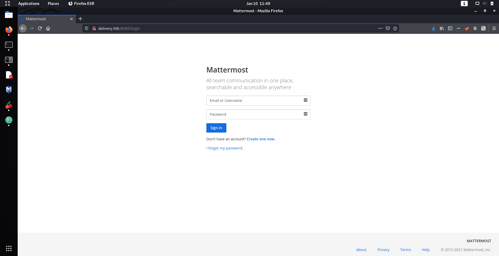
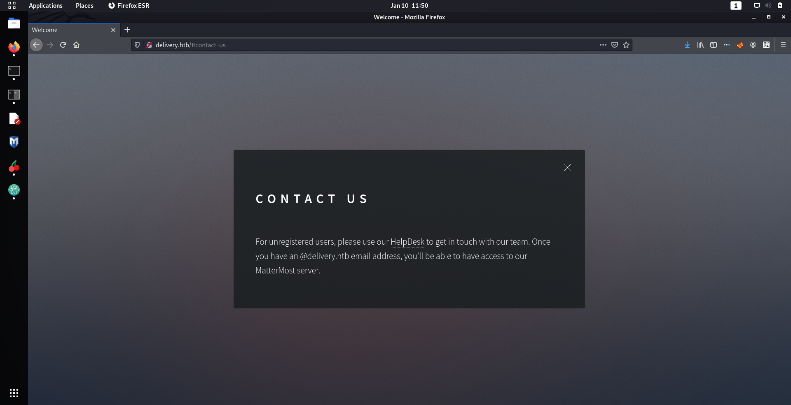
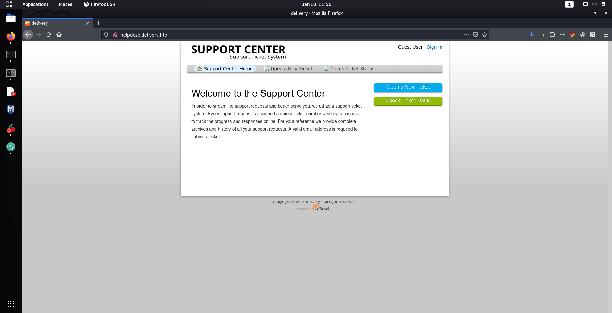
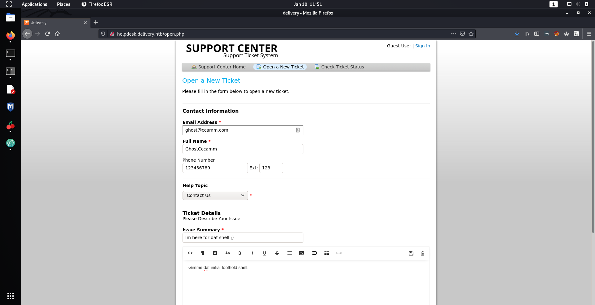
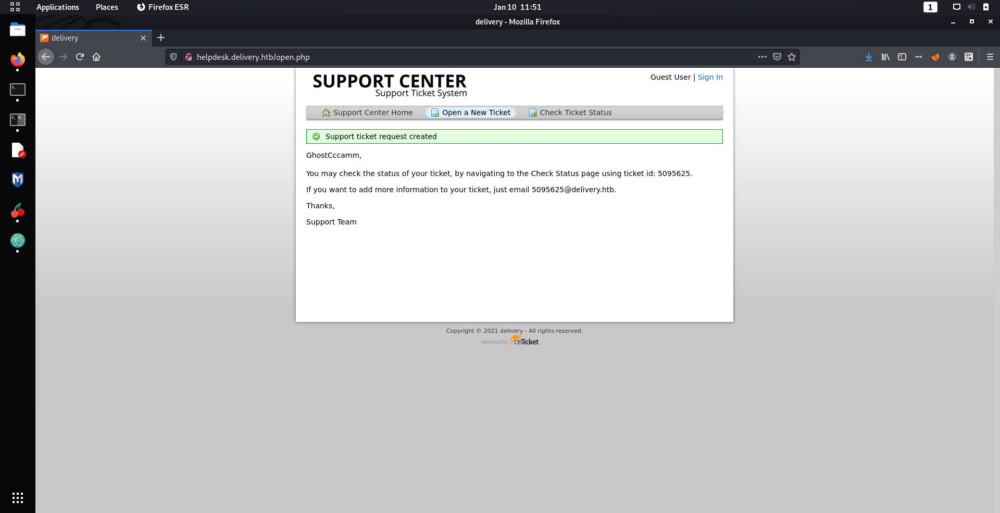
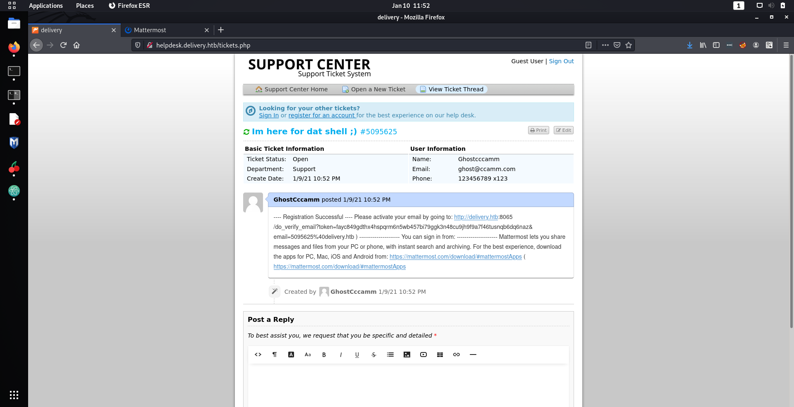
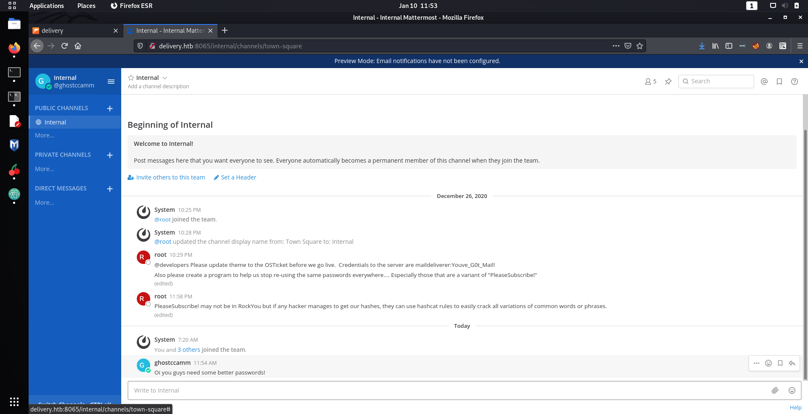
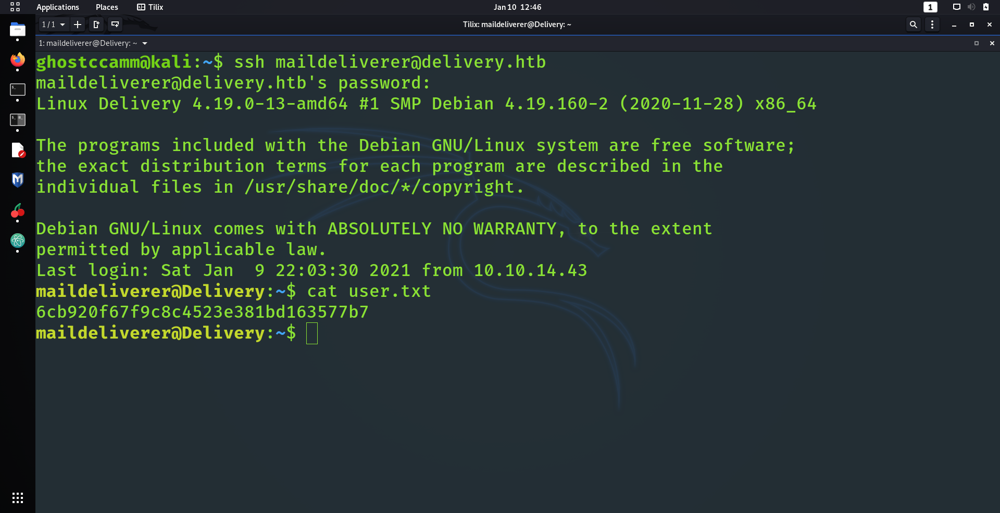
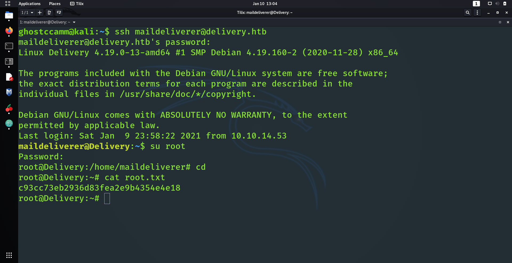

## Overview

This was such a fun sweet box created by the man, the myth, the legend **ippsec**.

It was great to have an *actually easy* 'Easy' box being released that was not the stock standard *find the right CVE* that I have seen in most easy boxes lately. All it required to complete was a bit of reading, head banging in frustration and more reading to complete this box.

---

## User

Since I am no edge lord that purely uses `masscan` for network enumeration, I fired up Nmap to see what services were running on the box.

```
Starting Nmap 7.91 ( https://nmap.org ) at 2021-01-10 08:26 AWST
Nmap scan report for delivery.htb (10.10.10.222)
Host is up (0.061s latency).

PORT     STATE SERVICE VERSION
22/tcp   open  ssh     OpenSSH 7.9p1 Debian 10+deb10u2 (protocol 2.0)
| ssh-hostkey:
|   2048 9c:40:fa:85:9b:01:ac:ac:0e:bc:0c:19:51:8a:ee:27 (RSA)
|   256 5a:0c:c0:3b:9b:76:55:2e:6e:c4:f4:b9:5d:76:17:09 (ECDSA)
|_  256 b7:9d:f7:48:9d:a2:f2:76:30:fd:42:d3:35:3a:80:8c (ED25519)
80/tcp   open  http    nginx 1.14.2
|_http-server-header: nginx/1.14.2
|_http-title: Welcome
8065/tcp open  unknown
| fingerprint-strings:
|   GenericLines, Help, RTSPRequest, SSLSessionReq, TerminalServerCookie:
|     HTTP/1.1 400 Bad Request
|     Content-Type: text/plain; charset=utf-8
|     Connection: close
|     Request
|   GetRequest:
|     HTTP/1.0 200 OK
|     Accept-Ranges: bytes
|     Cache-Control: no-cache, max-age=31556926, public
|     Content-Length: 3108
|     Content-Security-Policy: frame-ancestors 'self'; script-src 'self' cdn.rudderlabs.com
|     Content-Type: text/html; charset=utf-8
|     Last-Modified: Sat, 09 Jan 2021 19:00:51 GMT
|     X-Frame-Options: SAMEORIGIN
|     X-Request-Id: i3xa8qsmtiyoum5gfzo5bp6h8c
|     X-Version-Id: 5.30.0.5.30.1.57fb31b889bf81d99d8af8176d4bbaaa.false
|     Date: Sun, 10 Jan 2021 00:26:57 GMT
|     <!doctype html><html lang="en"><head><meta charset="utf-8"><meta name="viewport" content="width=device-width,initial-scale=1,maximum-scale=1,user-scalable=0"><meta name="robots" content="noindex, nofollow"><meta name="referrer" content="no-referrer"><title>Mattermost</title><meta name="mobile-web-app-capable" content="yes"><meta name="application-name" content="Mattermost"><meta name="format-detection" content="telephone=no"><link re
|   HTTPOptions:
|     HTTP/1.0 405 Method Not Allowed
|     Date: Sun, 10 Jan 2021 00:26:57 GMT
|_    Content-Length: 0
1 service unrecognized despite returning data. If you know the service/version, please submit the following fingerprint at https://nmap.org/cgi-bin/submit.cgi?new-service :
SF-Port8065-TCP:V=7.91%I=7%D=1/10%Time=5FFA49B4%P=x86_64-pc-linux-gnu%r(Ge
SF:nericLines,67,"HTTP/1\.1\x20400\x20Bad\x20Request\r\nContent-Type:\x20t
SF:ext/plain;\x20charset=utf-8\r\nConnection:\x20close\r\n\r\n400\x20Bad\x
SF:20Request")%r(GetRequest,DF3,"HTTP/1\.0\x20200\x20OK\r\nAccept-Ranges:\
SF:x20bytes\r\nCache-Control:\x20no-cache,\x20max-age=31556926,\x20public\
SF:r\nContent-Length:\x203108\r\nContent-Security-Policy:\x20frame-ancesto
SF:rs\x20'self';\x20script-src\x20'self'\x20cdn\.rudderlabs\.com\r\nConten
SF:t-Type:\x20text/html;\x20charset=utf-8\r\nLast-Modified:\x20Sat,\x2009\
SF:x20Jan\x202021\x2019:00:51\x20GMT\r\nX-Frame-Options:\x20SAMEORIGIN\r\n
SF:X-Request-Id:\x20i3xa8qsmtiyoum5gfzo5bp6h8c\r\nX-Version-Id:\x205\.30\.
SF:0\.5\.30\.1\.57fb31b889bf81d99d8af8176d4bbaaa\.false\r\nDate:\x20Sun,\x
SF:2010\x20Jan\x202021\x2000:26:57\x20GMT\r\n\r\n<!doctype\x20html><html\x
SF:20lang=\"en\"><head><meta\x20charset=\"utf-8\"><meta\x20name=\"viewport
SF:\"\x20content=\"width=device-width,initial-scale=1,maximum-scale=1,user
SF:-scalable=0\"><meta\x20name=\"robots\"\x20content=\"noindex,\x20nofollo
SF:w\"><meta\x20name=\"referrer\"\x20content=\"no-referrer\"><title>Matter
SF:most</title><meta\x20name=\"mobile-web-app-capable\"\x20content=\"yes\"
SF:><meta\x20name=\"application-name\"\x20content=\"Mattermost\"><meta\x20
SF:name=\"format-detection\"\x20content=\"telephone=no\"><link\x20re")%r(H
SF:TTPOptions,5B,"HTTP/1\.0\x20405\x20Method\x20Not\x20Allowed\r\nDate:\x2
SF:0Sun,\x2010\x20Jan\x202021\x2000:26:57\x20GMT\r\nContent-Length:\x200\r
SF:\n\r\n")%r(RTSPRequest,67,"HTTP/1\.1\x20400\x20Bad\x20Request\r\nConten
SF:t-Type:\x20text/plain;\x20charset=utf-8\r\nConnection:\x20close\r\n\r\n
SF:400\x20Bad\x20Request")%r(Help,67,"HTTP/1\.1\x20400\x20Bad\x20Request\r
SF:\nContent-Type:\x20text/plain;\x20charset=utf-8\r\nConnection:\x20close
SF:\r\n\r\n400\x20Bad\x20Request")%r(SSLSessionReq,67,"HTTP/1\.1\x20400\x2
SF:0Bad\x20Request\r\nContent-Type:\x20text/plain;\x20charset=utf-8\r\nCon
SF:nection:\x20close\r\n\r\n400\x20Bad\x20Request")%r(TerminalServerCookie
SF:,67,"HTTP/1\.1\x20400\x20Bad\x20Request\r\nContent-Type:\x20text/plain;
SF:\x20charset=utf-8\r\nConnection:\x20close\r\n\r\n400\x20Bad\x20Request"
SF:);
Service Info: OS: Linux; CPE: cpe:/o:linux:linux_kernel

Service detection performed. Please report any incorrect results at https://nmap.org/submit/ .
Nmap done: 1 IP address (1 host up) scanned in 92.86 seconds
```

The first thing that I looked at was the weird web service running on port `8065`.



Turned out it was MatterMost, which is an Open Source equivalent to Slack. Initially I tried to create an account to get in, but unfortunately it required email confirmation. Welp that would not be the way in, so I decided to look at the website on port `80` instead. I immediately noticed the extremely interesting contact us page on the site.



That small paragraph was packed with so much *juicy* information. Firstly it revealed that there was a web server running on `helpdesk.delivery.htb` and secondly an email with the domain `delivery.htb` was required to get access to the MatterMost site. So I decided take a closer look at their help desk service.



Looks like it was a ticket support center using osTicket. I did some quick research to find if there were any CVEs for osTicket, mainly because about 99% of the easy boxes on HackTheBox required using some CVE. However, this was <s>surprisingly</s> fruitless.

The next thing I tried was to see what I could do on the support center. I could not create an account on osTicket, because it required a confirmation email just like the MatterMost site <s>(damn)</s>. But I can create support tickets, which I thought was interesting.



Once my ticket was created I got the following confirmation message.



Unfortunately for me, I did not immediately notice the *JUICIEST* nugget of information that was just in front of me and wasted half an hour. The nugget was that when I submitted a ticket, **I am given an email address with the `delivery.htb` domain that I could use for account confirmation on the MatterMost site!** Emails sent to the ticket email would then be shown on the ticket that I had submitted, and would therefore reveal the registration link I need to create an account.

So I went back to the MatterMost website and created an account with the email that was generated when I created my ticket. Viewing the ticket on the support center website I could now see the contents of the registration email and successfully created my account on the MatterMost site.



*Nnoooooooooooiiiiiice*

Once I created an account on the MatterMost site I was immediately shown some messages that should definitely not be sent on channels.



*Wow such bad opsec...*

Anyway, I tried to SSH into the machine using the credentials that were sent by `root` (`maildeliverer:Youve_G0t_Mail! `) and **BAM** I got in!



---

## Root

When I first saw those messages I immediately thought,

> Holy mackarel that is such bad opsec! Not only did I get some credentials to get in, but I also know that that passwords are just variations of PleaseSubscribe!

Such a classic move by ippsec there! This made me immediately think that I would need to find some hashes to crack and escalate my privileges. I knew that the MatterMost website required some database to store the user credentials, so I started by looking through the `config.json` for MatterMost that was located in `/opt/mattermost/config`.

```
...
"SqlSettings": {
        "DriverName": "mysql",
        "DataSource": "mmuser:Crack_The_MM_Admin_PW@tcp(127.0.0.1:3306)/mattermost?charset=utf8mb4,utf8\u0026readTimeout=30s\u0026writeTimeout=30s",
        "DataSourceReplicas": [],
        "DataSourceSearchReplicas": [],
        "MaxIdleConns": 20,
        "ConnMaxLifetimeMilliseconds": 3600000,
        "MaxOpenConns": 300,
        "Trace": false,
        "AtRestEncryptKey": "n5uax3d4f919obtsp1pw1k5xetq1enez",
        "QueryTimeout": 30,
        "DisableDatabaseSearch": false
    },
...
```

*Noooice*

I now had the connection string to the MySQL server that had the credentials `mmuser:Crack_The_MM_Admin_PW`. That password also told me directly that I needed to crack the password for the user `root` on MatterMost to get the `root` user on the box. So I connected to the MySQL server and viewed the usernames and passwords of users on the MatterMost website.

```
select Username, Password from Users;
+----------------------------------+--------------------------------------------------------------+
| Username                         | Password                                                     |
+----------------------------------+--------------------------------------------------------------+
| evil                             | $2a$10$L6RAS6nM4l7sBw5ojUC9JO4a06t8cgJf18Nt2//S2gAWxMHaXSAUK |
| steve                            | $2a$10$x6wsUxMMQqO2.vlKNpmRT.PmsKT/aZxzLc/EuLZ9fz3EkRzWmzFpO |
| test                             | $2a$10$HDaT0XJjkuUc8aNgYnXh.eEySNf9AgZaYBdXN.XhW3x2JL1jVVksu |
| surveybot                        |                                                              |
| c3ecacacc7b94f909d04dbfd308a9b93 | $2a$10$u5815SIBe2Fq1FZlv9S8I.VjU3zeSPBrIEg9wvpiLaS7ImuiItEiK |
| 5b785171bfb34762a933e127630c4860 | $2a$10$3m0quqyvCE8Z/R1gFcCOWO6tEj6FtqtBn8fRAXQXmaKmg.HDGpS/G |
| jeffbesos69                      | $2a$10$Oq0IPDIyQ29O86mlB8SxyOBwq8o2e7OymwDct1ARMls/hvArCADe6 |
| cmacdou                          | $2a$10$ti1zSbdvYHS.CBwKfmuz7u608Dj.AWnJcAW54bZpoEzK1QTn1tCly |
| steve2                           | $2a$10$KNN/HT.R0B4XKb2rJSWki.FEKUrsvC8ijiwXh8OaYKiBWPabMsSmu |
| hotdog                           | $2a$10$JAIeLCVpdq.YbR0B0CKKMem.llk9Zuc6vbE.NoHs5N8q2VhdqiL6O |
| zephra                           | $2a$10$mbxua4y8ZG8tXmDdnUz66OgeGUOuq7ePiLVMlQ0u2.9C6XOWnrwBi |
| root                             | $2a$10$VM6EeymRxJ29r8Wjkr8Dtev0O.1STWb4.4ScG.anuu7v0EFJwgjjO |
| ff0a21fc6fc2488195e16ea854c963ee | $2a$10$RnJsISTLc9W3iUcUggl1KOG9vqADED24CQcQ8zvUm1Ir9pxS.Pduq |
| channelexport                    |                                                              |
| fart                             | $2a$10$.6t4Aa69z.iX87C/S4KZfu0FW/BD77wuRsoR7UFF3IEllwInoIn6W |
| tesadtfws                        | $2a$10$TGCmS4n60Bbrrhp9kgyWTe6csbmpgXCsD9UoViGBWq/mvXgtYqshi |
| 9ecfb4be145d47fda0724f697f35ffaf | $2a$10$s.cLPSjAVgawGOJwB7vrqenPg2lrDtOECRtjwWahOzHfq1CoFyFqm |
| ghostccamm                       | $2a$10$hu7NxIL3KQeCLPn9antr1.A3yq2zPbIeFVAZeFQzxFisANy5TmB3m |
| jeffbesos1                       | $2a$10$LpB9bHXeVfSPprUvcRcCyOq.OyhFndji8pEMe7StfLhq5ceilpGFy |
| evilevil                         | $2a$10$HAVheB5EF9lVYb6Z1U0b/.yByqdLApHYhNHqdTIz73h5ukjc1J58a |
| jeffbesos                        | $2a$10$gpPhdyR1VNtf8nISnZydL.fxnUhdfbu9MKcz1YN1I2Vw88G8nFBm6 |
+----------------------------------+--------------------------------------------------------------+
21 rows in set (0.001 sec)
```

There we go! I now got the Bcrypt hash for the root user!

```
root:$2a$10$VM6EeymRxJ29r8Wjkr8Dtev0O.1STWb4.4ScG.anuu7v0EFJwgjjO
```

I then fired up `hashcat` on my host Windows machine, created a dictionary with only `PleaseSubscribe!` in it and used HashCat's `best64.rule` rule. The reason why I only had `PleaseSubscribe!` as the password in my dictionary was because the `root` user on the MatterMost site said that the passwords were just variations of it. The command I used is shown below.

```
.\hashcat.exe -m 3200 -a 0 .\hashes\hackthebox\delivery\root.hash
```

After about 30 seconds I had the root password of `PleaseSubscribe!21` <s>(such a creative password ippsec)</s>! I then switched to the `root` user, logged in and completed the box!



*Nooooooooooooiiiiiiiiiicccccccceeee*

---

## Conclusion

Even though this box was easy for me, I really enjoyed completing it. For the first time in a few months HackTheBox has realised an **EASY** easy box. This box would be great for new people getting into penetration testing instead of the other easy boxes like Laboratory... All it required to complete was some reading and some big brain moments.

Thanks for the fun box ippsec!
